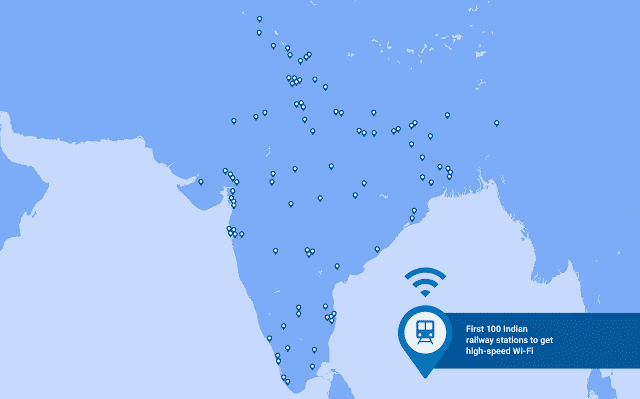

# 谷歌宣布计划在印度 400 个火车站安装 Wi-Fi 技术

> 原文：<https://web.archive.org/web/http://techcrunch.com/2015/09/27/google-announces-plan-to-put-wi-fi-in-400-train-stations-across-india/>

# 谷歌宣布计划在印度 400 个火车站安装 Wi-Fi

今天，谷歌首席执行官桑德尔·皮帅[分享了一项新计划](https://web.archive.org/web/20230129231858/http://googleblog.blogspot.com/2015/09/bringing-the-internet-to-more-indians.html)的细节，该计划旨在让更多的印度居民上网。他指出，在他的祖国，仍有超过 10 亿人没有联网。

钥匙？印度的火车系统。并计划每天为 1000 万铁路乘客提供 Wi-Fi。而且(开始)是免费的。皮查伊分享了谷歌的计划，同时分享了他自己使用钦奈中央车站到达[学校](https://web.archive.org/web/20230129231858/http://www.iitkgp.ac.in/)的故事。

> 我们希望帮助下一个 10 亿印度人上网，这样他们就可以访问整个网络，以及所有的信息和机会。不只是使用任何旧的连接，而是使用快速宽带，这样他们就可以体验最好的网络。这就是为什么，今天，在印度总理纳伦德拉·莫迪访问我们的美国总部之际，根据他的数字印度倡议，我们宣布了一个在印度 400 个火车站提供高速公共 Wi-Fi 的新项目。

印度总理纳伦德拉·莫迪访问了所有大型科技公司，脸书是其中之一。每个公司似乎都有自己的想法，如何扩大互联网的可用性，谷歌的肯定是独特的。

这是 2016 年底前首批 100 个将接入 Wi-Fi 的火车站的地图:

谷歌将与印度铁路公司(T2)和铁路公司(RailTel)就该计划展开合作。

皮查伊概述了为什么仅仅 100 个站点就能加快让更多印度居民上网的进程:

> 即使只有前 100 个站在线，这个项目也将为每天经过的 1000 多万人提供 Wi-Fi。从潜在用户数量来看，这将使其成为印度最大的公共 Wi-Fi 项目，也是世界上最大的项目之一。它的速度也很快，比大多数印度人今天的速度快很多倍，允许旅行者在等待时播放高清视频，搜索他们的目的地，或者下载一些视频，一本书或一个新游戏，为未来的旅程做准备。最重要的是，这项服务将免费开始，其长期目标是使其能够自我持续，以便在未来与 RailTel 和更多的合作伙伴一起扩展到更多的车站和其他地方。

这是桑德尔·皮帅作为谷歌首席执行官的第一个重大举措，谷歌也将于本周在 T2 举办一个大型硬件活动。他指出“我希望这个 Wi-Fi 项目能让所有这些事情变得简单一点。”这个项目，以及其他类似于 [Android One](https://web.archive.org/web/20230129231858/https://techcrunch.com/2014/06/25/android-one/) 项目的项目，应该能够帮助下一代印度居民上网并保持上网。