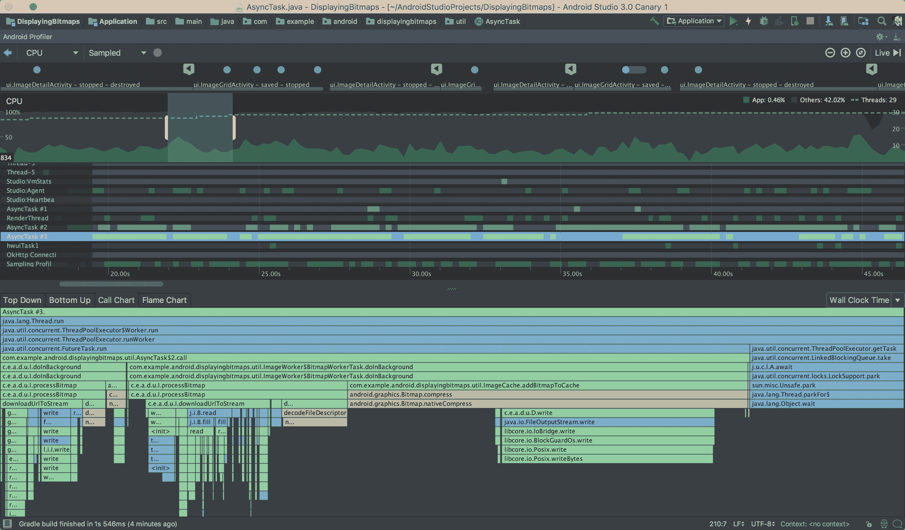
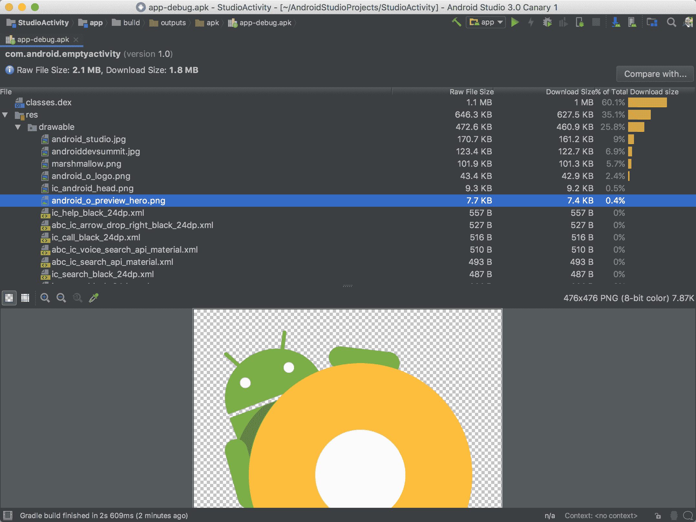

# 谷歌宣布 Android Studio 3.0 的首个预览版，强调速度和智能

> 原文：<https://web.archive.org/web/https://techcrunch.com/2017/05/17/google-announces-the-first-preview-of-android-studio-3-0-puts-emphasis-on-speed-and-smarts/>

绝大多数 Android 开发者使用的是谷歌自己的 [Android Studio](https://web.archive.org/web/20221007133430/https://developer.android.com/studio/index.html) 集成开发环境(IDE)。谷歌提供了 Android Studio 3.0 的初步外观。这些即将到来的功能中的大部分现在都可以在 Android Studio [早期发布频道](https://web.archive.org/web/20221007133430/https://developer.android.com/studio/preview/index.html)中获得。

正如谷歌产品管理总监斯蒂芬妮·萨阿德·卡斯伯特森(Stephanie Saad Cuthbertson)告诉我的那样，自 Android Studio 四年前推出以来，该公司一直在增加对它的投资。卡斯伯特森指出，此次发布的主题是“速度和智能”。这意味着 IDE 本身现在允许开发人员更快地编写他们的应用程序*和*它帮助开发人员更好地配置他们的应用程序，使它们也更快。

实际上，这意味着 Android Studio 现在拥有一整套分析工具，可以帮助开发人员更好地诊断他们应用程序中的性能问题。这使得开发人员可以为他们的应用程序配置 CPU、内存和网络活动，并在时间轴上查看所有这些的详细信息，时间轴会自动映射到应用程序中的触摸事件、按键和其他事件。

谷歌关注的另一个领域是加快复杂项目的构建时间。在这个版本中，Gradle 的构建速度明显加快了。该团队对使用超过 100 个模块的项目进行了测试，Cuthbertson 指出，对于这些高度复杂的项目，构建时间可能从几分钟到几秒钟不等。

Android Studio 3.0 还将包括一个功能，可以更容易地调试任何 APK，无论它是用 Android Studio 的 Java 编写的，还是用其他工具编写的，还是用 C++等语言编写的(APK 是谷歌用于打包 Android 应用程序的格式)。它还具有改进的 APK 分析器，可以帮助开发人员优化其 apk 的大小，例如，通过减少图像和其他可压缩资产的文件大小等。

在这个版本中，Android Studio 现在还提供对即时应用程序的支持，这是谷歌的一种格式，允许开发人员将他们的应用程序分成更小的部分，可以单独运行，并在几秒钟内从搜索结果页面加载。要做到这一点，开发人员必须将他们的应用程序分成不同的模块 Android Studio 现在支持这一点。

值得注意的是，直到现在，即时应用程序的访问权——以及应用程序的分发权——只对少数开发者开放。这个项目现在对所有开发者开放。

该版本中的其他新功能包括支持 Java 8 语言功能和 API，改进的布局编辑器，支持 Android O 和 XML 字体以及可下载字体中的自适应图标，支持 Android Things，Android O(目前处于测试阶段)的更新系统映像，模拟器中的 Google Play 商店支持以及模拟器中的 Android Wear 旋转控件支持。

谷歌今天还宣布，它正在把 Kotlin 变成编写 Android 应用程序的一流语言。Android Studio 3.0 的第一个预览版已经包含了对这种新语言的全面支持。