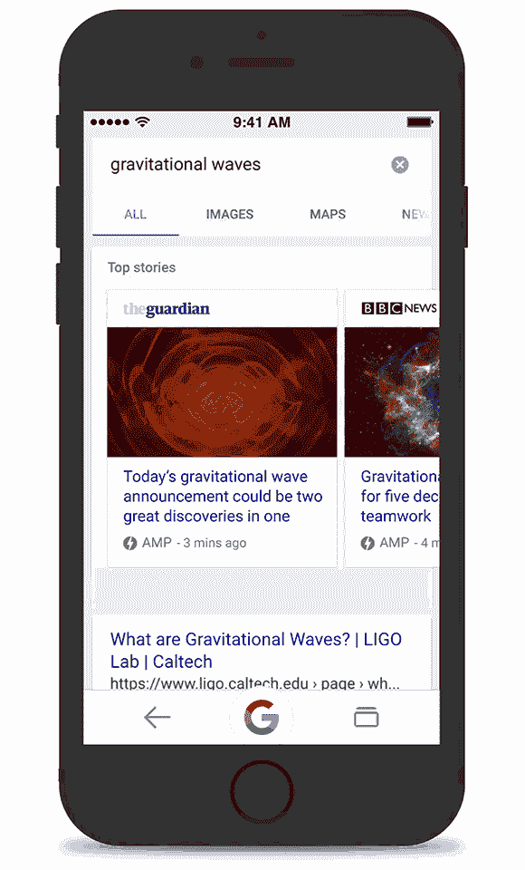

# iOS 版谷歌应用获得放大器和键盘快捷键支持 

> 原文：<https://web.archive.org/web/https://techcrunch.com/2016/05/27/google-app-for-ios-gets-support-for-amp-and-keyboard-shortcuts/>

# iOS 版谷歌应用支持 AMP 和键盘快捷键

谷歌今天发布了其 iOS 版[谷歌应用的更新版本。通常，这些都是小更新，但今天的版本给应用程序带来了一些有趣的新功能。](https://web.archive.org/web/20221230044917/https://itunes.apple.com/us/app/google-app-search-made-just/id284815942?mt=8)

这些新增功能中最直接有用的是支持将 AMP 页面快速加载到应用程序中。谷歌之前在本月早些时候的 I/O 开发者大会上取笑了这次发布，今年早些时候 AMP 整合到谷歌新闻和搜索中。就像在这些服务上一样，你可以通过寻找文章旁边的闪电图标来找到 AMP 页面。

就速度而言，谷歌还表示，该应用程序现在的加载速度提高了 10%。这听起来并不令人印象深刻，可能也很难被注意到，所以谷歌决定在这个数字上附加一个额外的统计数据。该公司在今天的公告中写道:“无论你是否能注意到差异，这些小小的改进今年将为应用用户节省总计 650 万小时。”。

iOS 应用程序现在还可以让你在 Now cards 中观看体育精彩视频，如果你在 iPad 上使用键盘，谷歌现在也可以让你在应用程序中使用键盘快捷键。

我既不是 iPad 用户，也不是体育迷，所以这些更新对我来说并不那么令人兴奋。不过，谷歌最近添加的新功能确实突出了谷歌本地搜索中我最喜欢的一个新功能。现在，本地搜索结果会立即向您显示出现在搜索结果页面上的商店、餐馆和其他企业的最繁忙时段。到目前为止，你必须点击展开结果才能看到这些信息，因此，相当多的人可能不知道它的存在。