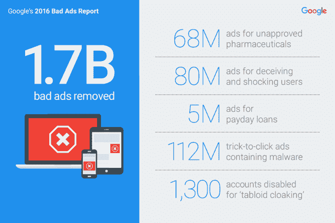

# 2016 年，谷歌删除了 17 亿条虚假广告，是 2015 年的两倍多 

> 原文：<https://web.archive.org/web/https://techcrunch.com/2017/01/25/google-bad-ads-2016/>

当谈到其庞大的广告网络(互联网上最大的广告网络)被用于邪恶目的时，谷歌一直处于枪口之下，但这家搜索巨头打算利用其技术来解决这个问题。今天，该公司发布了关于如何打击其网络上的垃圾邮件、机器人和其他有问题的“广告”的最新更新，并表示 2016 年它删除了 17 亿条违反其政策的广告。

作为一个背景点，这是谷歌一年前记录的两倍多，它说。

谷歌对席卷互联网的假新闻问题并不陌生，假新闻很可能影响了许多人们认为的“事实”，而事实上这些“事实”可能并不真实。除了[指责](https://web.archive.org/web/20230131044331/http://www.theverge.com/2016/12/6/13850230/fake-news-sites-google-search-facebook-instant-articles)其新闻优化的搜索格式将不可靠的网站提升到与合法新闻来源相同的水平，这个搜索巨头还被迫[更新其政策](https://web.archive.org/web/20230131044331/https://www.nytimes.com/2016/11/15/technology/google-will-ban-websites-that-host-fake-news-from-using-its-ad-service.html?_r=0)，因为其广告网络被不可靠的“新闻”网站用来推广他们的故事并给他们更多的可见性。

该公司在 2016 年改变了其跟踪误导性或掠夺性广告的政策。这包括 7 月份出台的禁止发薪日贷款广告的政策，该政策导致五个百万广告被禁止。

谷歌表示，它也一直在改进技术，以更快地发现和禁用欺诈广告。举例来说，你可能已经注意到，现在“点击技巧” 广告在你进入它们所链接的网站之前会有系统警告，因为它们可能会导致恶意软件链接 。为什么这些广告没有被完全删除是另一个问题，但无论如何，谷歌表示，2016 年，其系统“检测并禁用了总计 1.12 亿个 广告 “点击技巧”，是前一年的六倍。

除了处理不道德的广告，如未经批准的药品——这个问题在中国严重影响了百度——发薪日贷款和假冒商品，以及欺骗性产品，谷歌表示，它将重点关注 clickbait 广告。该公司将 clickbait 称为“小报伪装”，也就是说，将广告包装成类似小报的令人震惊的新闻，以吸引眼球。这种例子在世界各地都不难找到。

这家搜索巨头声称，它关闭了 1300 个进行此类诈骗的账户。这似乎不是一个巨大的数字，但它只是需要几个坏演员做了很多破坏。一个典型的例子是，去年 12 月被抓获的 22 名“斗篷人”负责提供广告，这些广告在一周内被在线观看了 2000 多万次。

坏消息是，这场斗争仍在继续。谷歌解释说，小报掩盖正在“越来越受欢迎”，因为这是一种非常有效的在线吸引注意力的方法，就像一些网站在病毒/震惊新闻的支持下崛起一样。

“虽然我们在 2016 年比以往任何时候都删除了更多的不良广告，但这场战斗并没有就此结束，”谷歌表示，广泛应对这一威胁。

“随着我们投资于更好的检测，骗子们投资于更精心的尝试来欺骗我们的系统。继续寻找并对抗它们，对于创建一个我们都喜欢的可持续、开放的网络至关重要。”