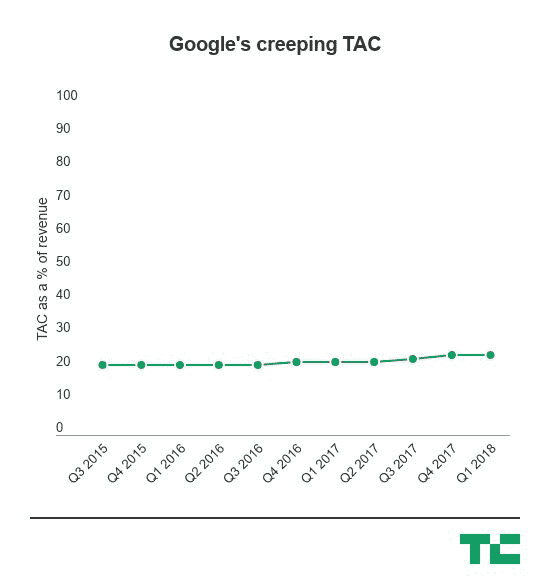
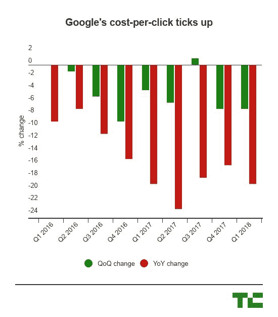

# 谷歌收入 315 亿美元，再次超出预期 

> 原文：<https://web.archive.org/web/https://techcrunch.com/2018/04/23/google-beats-expectations-again-with-31-15b-in-revenue/>

谷歌的母公司 Alphabet 今天下午公布了第一季度的另一个相当稳健的表现，因为它或多或少继续保持其业务的大幅增长——甚至比一年前的今天增长得更快。

谷歌表示，今年第一季度其收入同比增长 26%，至 311.6 亿美元。去年第一季度，谷歌表示，从 2016 年的 Q1 到 2017 年的 Q1，其收入增长了 22%。所有这些都有点令人费解，但最终结果是，随着越来越多的网络浏览转移到移动设备上，尽管每次点击成本(粗略地说，一个广告的价值)持续下降，但谷歌实际上比一年前增长得更快。去年，谷歌表示，第一季度实现收入 247.5 亿美元。

Alphabet 的“其他赌注”——它的边缘项目，如自动驾驶汽车和气球——再次显示出一些额外的健康，因为收入增加了，而亏损减少了。这是一个好迹象，因为它希望探索搜索以外的选择，但最终它仍然只占谷歌整体业务的一小部分。这也是谷歌在与优步达成和解后报告业绩的第一个季度，谷歌在和解中获得了该公司的一部分，因为它结束了其 Waymo 自动驾驶部门与优步之间的争吵。

这是最终的记分卡:

*   **收入:**311.6 亿美元，相比华尔街预期的 303.6 亿美元，同比增长 26%。
*   **收益:**调整后每股 9.93 美元，相比之下华尔街每股 9.28 美元
*   **其他收入**:43.5 亿美元，高于去年在 Q1 的 32.7 亿美元
*   其他赌注:1.5 亿美元，高于 2017 年 Q1 奥运会的 1.32 亿美元
*   其他赌注损失:5.71 亿美元，低于去年第一季度的 7.03 亿美元
*   **TAC 占收入的百分比** : 24%
*   **有效税率** : 11%，低于 Q1 2017 年的 20%

最终，它比华尔街想要的要差一拍，并且得到了非常谷歌式的回应。投资者原本预计收入 303.6 亿美元，每股收益 9.35 美元。谷歌的股票在盘后交易中上涨了约 2%，这对谷歌来说增加了超过 100 亿美元的价值，因为它正在与微软和亚马逊竞争，以追赶苹果，成为世界上市值最高的公司。谷歌在延长交易时段的涨幅高达 5%，不过后来持平

谷歌的流量获取成本(TAC)占其收入的比例似乎也保持稳定。对于该公司的观察人士来说，这是一个有点棘手的问题，随着越来越多的网络浏览转向移动，这对投资者来说也是一个潜在的负面信号。在过去几年里，它的增长非常缓慢，但现在占其总收入的 24%左右。

从本质上来说，谷歌是一家广告公司，将从其所有资产的数十亿用户身上赚钱。但随着一切都转向移动设备，这些广告的实际价值将随着时间的推移而下降，因为移动浏览有一套不同的行为。谷歌的业务一直是用越来越多的印象来抵消每次点击的成本——事实上，这一次似乎维持现状。

虽然谷歌的广告业务仍在稳步发展，但收入来源的多元化对该公司来说将变得越来越重要，因为它可以对冲广告收入面临的任何潜在威胁。在一场大规模丑闻之后，用户数据发生了一些混乱，多达 8700 万脸书用户的信息最终被政治研究公司剑桥分析公司(Cambridge Analytica)获得。这种围绕用户隐私的反弹最终可能会打击谷歌，谷歌通过 Gmail 和搜索等产品主导了信息在网络上的大部分传播。

但这仍然需要相当大的成本。它对谷歌云(或 GCP)等工具进行了重大投资，但财报中的一个项目显示，其“购买的财产和设备”同比增长了一倍多，达到约 73 亿美元，高于今年第一季度的 25 亿美元。当然，这可能包含很多东西，但如果谷歌要运行一个可以与 AWS 或微软 Azure 竞争的云平台，它仍然必须实际购买服务器。

所有这些都流入了它的“其他收入”流，从去年在 Q1 的 32 亿美元增长到今年第一季度的 43.5 亿美元。亚马逊的云业务已经是每年超过 100 亿美元的业务，这种先发优势对它很有好处，因为它开始了企业在云服务器上运营的巨大转变。但这也给谷歌带来了巨大的商机，谷歌将继续在这方面投资。