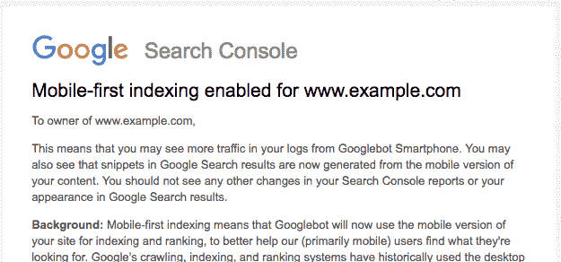

# 谷歌开始推出移动优先索引技术

> 原文：<https://web.archive.org/web/https://techcrunch.com/2018/03/26/google-begins-to-roll-out-its-mobile-first-index/>

谷歌今天早上宣布，经过一年半的测试和实验，其“移动优先”的网络索引现在开始推出。早在 2016 年，Google first [就详细介绍了其改变搜索索引运行方式的计划](https://web.archive.org/web/20221209062041/https://webmasters.googleblog.com/2016/11/mobile-first-indexing.html)，解释了其算法最终将如何转变为使用网站内容的移动版本来索引其页面，以及理解其结构化数据并在谷歌搜索结果中显示网站的片段。

2017 年 12 月，[谷歌表示，它已经开始将少数网站](https://web.archive.org/web/20221209062041/https://techcrunch.com/2017/12/20/googles-mobile-first-search-index-has-rolled-out-to-a-handful-of-sites/)过渡到移动优先索引，但拒绝透露哪些网站已经进行了迁移。

移动优先索引意味着谷歌将使用移动版本的网页“进行索引和排名，以更好地帮助我们的用户——主要是移动用户——找到他们想要的东西，”该公司在一篇博客文章中写道。

通过“主要是移动的”，谷歌指的是这样一个事实，即现在使用谷歌搜索的大多数人都是通过移动设备进行的，并且从 2015 年开始[就已经这样做了。](https://web.archive.org/web/20221209062041/https://adwords.googleblog.com/2015/05/building-for-next-moment.html)

谷歌还解释说，它将有一个搜索结果索引，而不是一个独立于其主索引的移动优先索引。换句话说，它将开始关注移动网页来索引网络，而不是桌面版本。

手机友好性一直是决定网站排名的众多因素之一，但不是唯一的因素。例如，谷歌说，有时候非移动友好页面仍然有最好的信息，并且会出现在更高的位置。

然而，谷歌已经开始在几个方面优先考虑移动网站。例如，早在 2015 年，它[就开始提升手机友好网页](https://web.archive.org/web/20221209062041/https://webmasters.googleblog.com/2015/04/rolling-out-mobile-friendly-update.html)在移动搜索结果中的排名，最近它表示正在增加[一个使用页面速度](https://web.archive.org/web/20221209062041/https://webmasters.googleblog.com/2018/01/using-page-speed-in-mobile-search.html)来帮助确定页面移动搜索排名的信号。从 2018 年 7 月开始，下载速度慢的内容将被降级。

虽然谷歌今天声称，移动友好的索引不会直接影响内容的排名，但它指出，以这种新的方式对网站的移动友好内容进行索引可能会帮助网站在移动搜索结果中“表现更好”。

今天，谷歌并没有将所有网站都转移到新的移动优先的索引上——这只是第一波。

具体来说，谷歌选择了那些已经遵循移动优先索引最佳实践的网站。它将更喜欢手机版的网页，而不是自己的快速加载的 AMP 页面。

谷歌表示，那些被转移的网站将通过搜索控制台得到通知，并将开始看到智能手机 Googlebot 的访问量增加。转变之后，谷歌将在其搜索结果和谷歌缓存页面中显示该网站页面的移动版本。

谷歌告诉那些还没有移动优化的网站的站长们不要惊慌。“如果你只有桌面内容，你将继续出现在我们的索引中，”谷歌的声明保证。

该公司没有具体说明移动优先索引的推出将于何时完成。