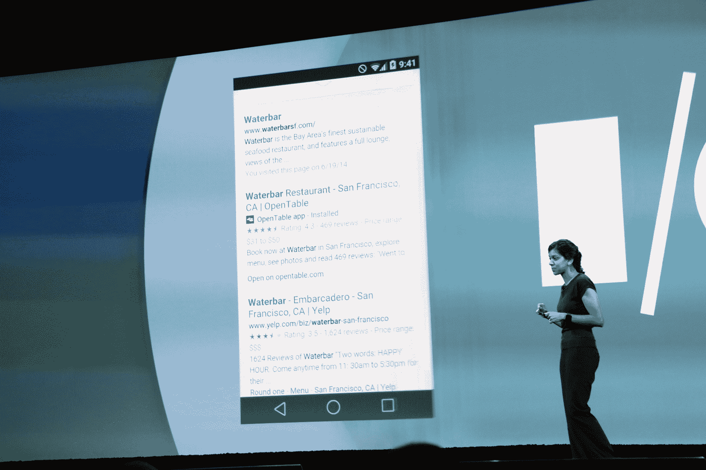

# 谷歌模糊了 Android TechCrunch 上的网络应用和本地应用之间的界限

> 原文：<https://web.archive.org/web/https://techcrunch.com/2014/06/25/google-blurs-the-line-between-web-and-native-apps-on-android/>

今天在谷歌 I/O 大会上，Chrome 产品管理总监 Avni Shah 介绍了新版本的 Chrome，该版本将在下一次 Android 更新中推出，名为 Android L。

正如所料，我们得到了几个功能更新。但它不仅仅是一个更好的 Chrome 版本。谷歌发出了一个更清晰、更深刻的信息。该公司希望将本地应用与网络标签融合在一起。据我们所知，原生应用的终结可能比我们想象的更近。

在 Android L 中，重新设计的应用切换器看起来很像 iOS 7 上的 Safari。它在一个卡片抽屉里向你展示你最近的应用。但它也显示了本地应用程序和活跃的网页标签。每个 web 选项卡都具有与应用程序相同的价值。它是巨大的。

同样，谷歌正在将其应用索引 [API](https://web.archive.org/web/20221208054930/https://beta.techcrunch.com/2013/10/31/android-4-4-kitkat-app-indexing/) 扩展到所有安卓应用。在今天之前，该公司与选定的公司合作。例如，当你在谷歌中搜索一部电影时，搜索结果中可能会有一个深层链接，可以在这个电影页面上打开 IMDb 应用程序。这是从网络到本地应用的无缝过渡。

知道了这些，想象一下 Android L 会是什么样子。你打开手机，在主屏幕上用语音搜索在谷歌上搜索一些东西。它推出了 Chrome。你点击第一个搜索结果，它就会启动一个本地应用。你切换应用程序来阅读你之前在 Chrome 上找到的这篇文章。

在网络和本地应用之间来回切换。过一会儿，你甚至不会注意到你是在网络上还是在本地应用程序中。

为什么这个变化有意义？谷歌一直首先是一个网络开发者。该公司首先凭借其搜索引擎获得成功。但即使是它的后续热门产品也是网络应用，如 Gmail、谷歌日历或谷歌驱动(T4 的谷歌文档)。可以说，在开发网络应用方面，谷歌仍然是王者。

但更重要的是，谷歌的绝大部分收入仍来自网络广告。该公司希望人们花更多的时间在网上看谷歌广告。下一季度收益不会有变化。至少现在还没有。

因此，无论是技术还是商业，谷歌的未来都在网络上。还是。据我采访的多位 HTML5 和 web 开发倡导者称，Android 最终可能会成为一个底层操作系统，其上有 web 应用。正如我们所知，这实际上将是原生应用的终结。

多家公司已经尝试过了——Palm 和 WebOS，Mozilla 和 Firefox OS。它们都失败了，原因是一系列缺陷——片上系统不够强大，web 运行时不够高效，web 开发人员不够有才华。

这主要取决于时机。现在，谷歌缓慢但肯定地转向这种新的应用模式是有意义的。现在，片上系统有可能运行成熟的笔记本电脑。谷歌孜孜不倦地改进 JavaScript 和 HTML 渲染引擎。当然，有成千上万有才华的网络开发人员在为谷歌工作。

推广网络应用是一个漫长的过程，可能需要数年时间。但是今天是朝着这个方向迈出的第一步。

