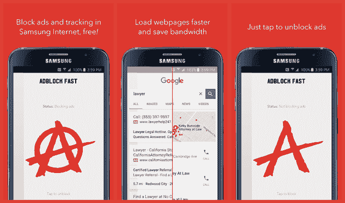
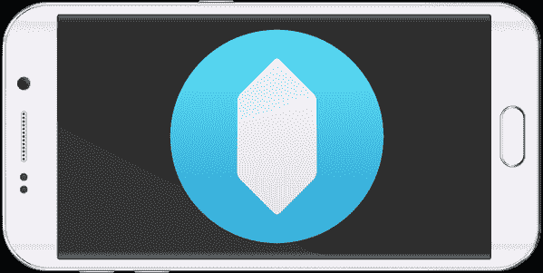

# Google Boots 广告拦截器来自 Google Play 

> 原文：<https://web.archive.org/web/https://techcrunch.com/2016/02/03/google-boots-ad-blockers-from-google-play/>

本周早些时候，三星推出了支持广告拦截的新版移动设备网络浏览器——三星互联网浏览器。第三方开发者迅速做出反应，推出了与浏览器配合使用的广告屏蔽移动应用。现在，这些开发者发现他们的应用程序被从 Google Play 上撤下，他们的更新被拒绝。原因？谷歌似乎不希望广告拦截器作为独立应用程序在其 Google Play 商店中发布。

如果你错过了:[几天前](https://web.archive.org/web/20221007192355/https://beta.techcrunch.com/2016/02/01/following-apples-move-samsung-rolls-out-ad-blocking-to-android-devices/#.s2agxy:3qI0)，三星在其移动网络浏览器中引入了广告拦截功能。该功能的工作原理很像苹果在 Safari 中对广告屏蔽的支持[，随着 iOS 9 的发布而来的](https://web.archive.org/web/20221007192355/https://beta.techcrunch.com/gallery/everything-you-need-to-know-about-ios-9s-new-content-blockers/)。具体来说，三星推出了一个新的[内容拦截器扩展 API](https://web.archive.org/web/20221007192355/http://developer.samsung.com/technical-doc/view.do?v=T000000278L) ，它允许第三方开发者构建移动应用，一旦安装，将允许那些通过三星的浏览器浏览移动网络的人阻止广告和其他可能减慢网页速度的内容，如跟踪器。

显然，谷歌——恰好也是广告行业的一员——并不喜欢这项新功能。

三星发布声明后，首批推出的第三方广告拦截器之一是 [Adblock Fast。该应用迅速成为 Google Play“生产力”类别中的顶级免费应用，但此后被禁止在 Google Play 中使用。](https://web.archive.org/web/20221007192355/https://log.rocketshipapps.com/you-can-now-block-ads-in-android-278e94c89be2#.l4swe0gik)

据 Rockship Apps 创始人兼首席执行官布莱恩·肯尼什(Brian Kennish)称，谷歌的应用审查团队通知他，该应用因违反 Android [开发者分发协议的“第 4.4 条”而被移除。](https://web.archive.org/web/20221007192355/https://play.google.com/about/developer-distribution-agreement.html#prohibited)

这一部分通知开发者他们不能发布干扰*“任何第三方的设备、服务器、网络或其他财产或服务，包括但不限于安卓用户、谷歌或任何移动网络运营商。”*

如果这段文字听起来有点宽泛和模糊，那是因为它确实如此。这也让谷歌能够对行业的变化做出反应，就像这次一样。

肯尼什说，谷歌的应用审查团队告诉他，他可以在修改他的应用程序后重新提交，这样就不会“以未经授权的方式干扰另一个应用程序、服务或产品。”

肯尼什指出:“从周一开始，我们一直试图通过他们的公共渠道联系谷歌，我昨天一整天都在试图通过私人渠道联系……但我们还没有得到任何人类的官方回应——只有自动回复。”

他怀疑 Adblock Fast 是第一个从谷歌应用商店下架的，因为它在排行榜上攀升如此之快，达到了 4.25 的评分。肯尼什说，这款应用在被删除时已经有大约 5 万次安装。

此外，该公司本可以通过推出提供更好用户体验的更新来引起谷歌的注意。(有些人没有意识到它只在三星的 4.0 浏览器上工作，并留下了 1 星评论。此次更新旨在更好地突出应用程序的要求。)

同时，截至发稿时，其他广告拦截器仍在运行，包括 [Crystal](https://web.archive.org/web/20221007192355/https://play.google.com/store/apps/details?id=co.crystalapp.crystal&utm_source=global_co&utm_medium=prtnr&utm_content=Mar2515&utm_campaign=PartBadge&pcampaignid=MKT-AC-global-none-all-co-pr-py-PartBadges-Oct1515-1) 和 [Adblock Plus(三星浏览器)。](https://web.archive.org/web/20221007192355/https://play.google.com/store/apps/details?id=org.adblockplus.adblockplussbrowser)然而，这种情况可能不会持续太久。

Crystal 的开发者迪恩·墨菲也刚刚提交了一份更新，但由于上述同样的原因，该更新被谷歌的应用审查团队拒绝了。同样，谷歌引用开发者协议的第 4.4 节作为停止更新上线的原因。

墨菲解释说:“我已经对更新拒绝提出上诉，因为我认为我是因为‘干扰’三星互联网浏览器而被拒绝的，引用了三星针对内容阻止功能的开发人员文档。”"我仍在等待他们的答复。"

Adblock Plus 告诉我们，它的新应用——三星浏览器的扩展——仍在运行，他们还没有从谷歌那里听到它被删除的消息。然而，据联合创始人兼首席执行官 Till Faida 称，他们也没有尝试更新应用程序。

从我们对情况的了解来看，谷歌将继续支持可以在自身内部屏蔽广告的移动浏览器，要么通过内置功能(如 Adblock Plus 浏览器)，要么通过扩展(如 Firefox、Javelin、Dolphin 浏览器等)，但只有当这些扩展通过 Google Play 上的 apk(可下载应用程序)分发时。

或者更简单的说:屏蔽广告的浏览器 app 没问题；广告拦截应用不是。

目前还不清楚为什么 Crystal 和 Adblock Plus(三星浏览器)没有从 Google Play 中退出。但取消开发者更新应用程序的能力与完全删除有着相似的效果，这既是向单个应用程序开发者，也是向更广泛的开发者社区发出了一个信号。

记者联系到谷歌的一位发言人，请其置评，但他仅发表了以下声明:

“虽然我们不对具体的应用发表评论，但我们可以确认，我们的政策旨在为用户和开发者提供出色的体验。”

鉴于目前的情况，三星似乎需要重新评估其广告拦截功能的实施方式。要么它需要建立对非 APK 扩展的支持，要么它需要找到另一种方式让开发者在 Google Play 之外分发他们的 APK 文件，比如在一个自托管的应用商店。