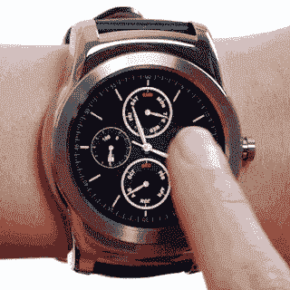
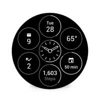
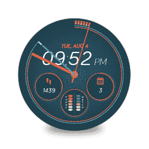

# 谷歌为 Android Wear TechCrunch 带来了交互式手表面部和内置的谷歌翻译支持

> 原文：<https://web.archive.org/web/http://techcrunch.com/2015/08/20/google-brings-interactive-watch-faces-and-built-in-google-translate-support-to-android-wear/>

# 谷歌为 Android Wear 带来了交互式手表面部和内置的谷歌翻译支持

如今，Android Wear 的表盘变得更加有趣了。开发者总是能够在他们的表盘上显示大量信息，但用户无法与之互动。然而，从今天开始[，你将能够安装](https://web.archive.org/web/20230129220453/http://officialandroid.blogspot.com/2015/08/android-wear-stay-connected-with.html)[交互式手表表面](https://web.archive.org/web/20230129220453/https://play.google.com/store/apps/details?id=com.pujie.wristwear.pujieblack)，允许你从手表表面上点击一下，获取更多信息并启动应用程序(开发者将能够[构建它们](https://web.archive.org/web/20230129220453/http://android-developers.blogspot.com/2015/08/interactive-watch-faces-with-latest.html))。

此外，此次更新中的新功能是[内置对谷歌翻译](https://web.archive.org/web/20230129220453/http://googletranslate.blogspot.com/2015/08/watch-your-language-44-of-them-actually.html)的支持，即使你的手机上没有[谷歌翻译](https://web.archive.org/web/20230129220453/https://translate.google.com/)，它也能工作。

Android Wear 上的谷歌翻译支持 44 种语言，并与手表中的内置麦克风配合使用。你只需对着手表说话，转动手腕，翻译就出来了。翻译将自动识别说的是什么语言。

对于新的手表面孔，谷歌已经与许多开发人员合作测试这一新功能。

以 [Bits](https://web.archive.org/web/20230129220453/https://play.google.com/store/apps/details?id=com.ustwo.watchfaces.bits) 手表表盘为例，在屏幕中央显示小圆圈，上面有未读邮件的数量、当地温度、日期等信息。当你点击其中任何一个时，表盘会发生变化，并使这些圆圈成为焦点。这比在你的手表上浏览一堆 Google Now 通知要容易得多。

谷歌还与[安德玛](https://web.archive.org/web/20230129220453/https://play.google.com/store/apps/details?id=com.ua.record)合作，打造了一个以健身为中心的互动手表界面，而 [Together](https://web.archive.org/web/20230129220453/http://www.android.com/wear/together) 手表界面非常适合那些想与伴侣分享照片和表情符号的情侣们。

总的来说，Google Play 商店目前[有](https://web.archive.org/web/20230129220453/https://play.google.com/store/apps/collection/promotion_30019d7_wear_interactive_watchfaces)超过 20 个互动手表界面。

Android Wear 的这一更新现已作为所有 Android Wear 手表的无线更新推出(除了我的 Moto 360，因为不到一年后，它就不能再充电了)。此次更新还为 LG G Watch R 带来了 Wi-Fi 支持。

值得注意的是，它看起来像本周早些时候该公司推出的新款[三星 Gear S2](https://web.archive.org/web/20230129220453/https://techcrunch.com/2015/08/19/heres-samsungs-answer-to-the-apple-watch/#.yijeuy:Y9ye) ，看起来也将具有类似的交互式手表表面。[预告视频](https://web.archive.org/web/20230129220453/https://youtu.be/nwn8qMaNoJk)展示了一些高度互动的手表表面，当时的假设是它必须运行 Tizen 而不是 Android Wear，因为这些类型的手表表面在 Android Wear 上是不可能的。