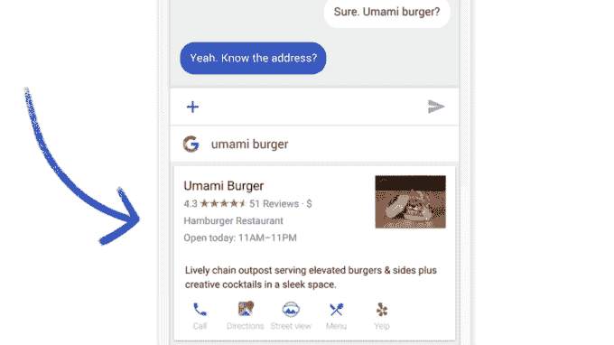
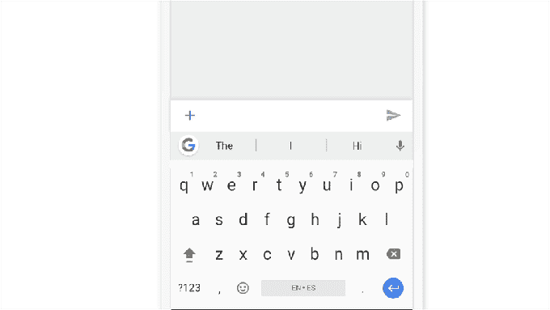

# 谷歌将其升级的键盘应用 Gboard 引入 Android 

> 原文：<https://web.archive.org/web/https://techcrunch.com/2016/12/16/google-brings-its-upgraded-keyboard-app-gboard-to-android/>

谷歌今天正式[宣布](https://web.archive.org/web/20221208233137/https://blog.google/products/search/gboard-now-on-android/)将为安卓用户将其谷歌键盘应用更名为“ [Gboard](https://web.archive.org/web/20221208233137/http://goo.gl/gboard/android) ”，这是其更新的键盘应用的名称，该应用拥有完全集成的谷歌搜索引擎、表情符号和 GIF 搜索等功能。本周早些时候，一些[媒体](https://web.archive.org/web/20221208233137/http://www.theverge.com/2016/12/12/13922300/gboard-google-ios-keyboard-android-support)[网站](https://web.archive.org/web/20221208233137/http://arstechnica.com/gadgets/2016/12/gboard-for-android-offers-emoji-search-google-search-gif-search-and-more/)和[博客](https://web.archive.org/web/20221208233137/http://searchengineland.com/google-launches-gboard-keyboard-features-android-devices-265318)已经注意到了键盘的安卓发布，他们也注意到了应用程序带来的一些新功能。

大约六个月前，Gboard 第一次在 iOS 上推出，作为一种给谷歌一种更好的方式来将其搜索引擎集成到用户的设备上。谷歌没有把它放在一个单独的应用程序中，而是把搜索捆绑到人们最常用的屏幕上——他们的键盘。

在 Android 上，Gboard 包括了与其 iOS 前身相同的功能集，因为它的大部分变化更多的是添加波兰和解决一些用户关注的问题，而不是彻底改革核心体验。

在新的应用程序中，你现在可以点击谷歌标志开始搜索——这一调整使谷歌搜索的访问变得更加明显。

像这样内置搜索的好处是，搜索结果可以很容易地从键盘上共享。当你想与你的朋友分享一个企业的地址、天气、航班时间、新闻文章、餐馆信息等信息时，这就很方便了，而不必启动一个单独的应用程序来挖掘这些信息。Gboard 还会根据你可能会觉得非常有用或超级恐怖的聊天来预测可能的搜索。

例如，该公司解释说，如果你正在和朋友聊天气，应用程序可能会提供“天气”预测，然后你可以通过点击分享。

和 iOS 版本一样，这款应用也内置了 GIF 和表情符号搜索功能。这里的一个巧妙之处在于，谷歌可以更快地找到合适的表情符号。不需要滚动，你可以只搜索你想要的(例如“猴子”)。

Android 应用程序附带的一个新功能是在屏幕上始终显示数字行的选项——这是用户对键盘布局的抱怨之一。该应用程序还增加了对多种语言的支持，这将有助于双语用户的搜索和应用程序的预测。

如果这是您偏好的文本输入模式，您也可以选取打开滑动输入。该应用程序提供了一系列标准的键盘功能，如文本预测、自动更正和语音输入。

Gboard 将支持 100 多种语言[，今天它将在所有市场](https://web.archive.org/web/20221208233137/http://goo.gl/gboard/android)推出，更多语言将会及时加入。