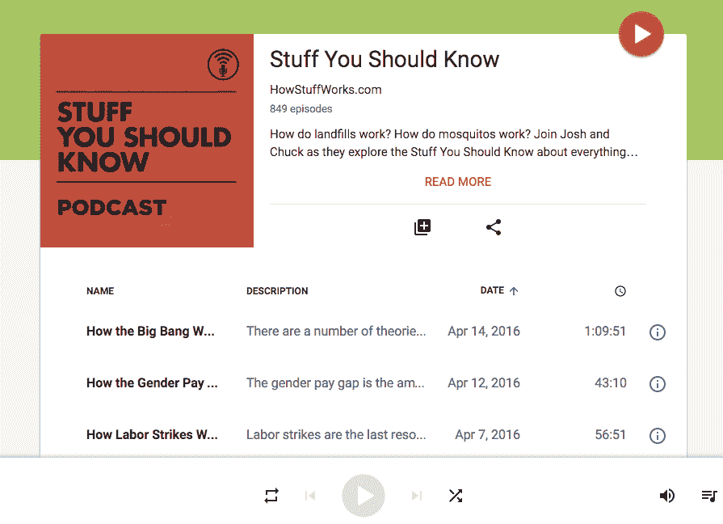
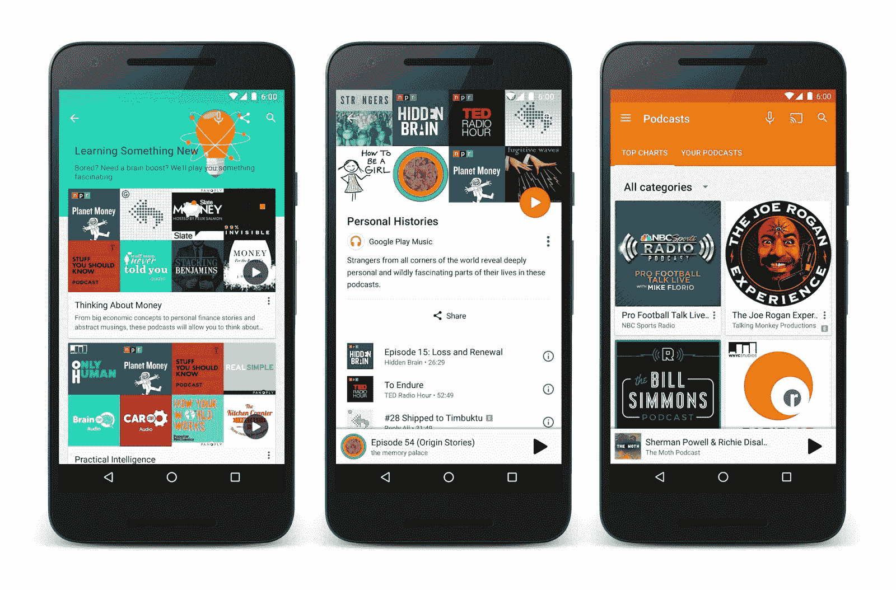

# 谷歌将播客引入 Google Play 音乐 

> 原文：<https://web.archive.org/web/https://techcrunch.com/2016/04/18/google-brings-podcasts-to-google-play-music/>

# 谷歌将播客引入 Google Play 音乐

谷歌今天[宣布](https://web.archive.org/web/20221202142347/http://officialandroid.blogspot.com/2016/04/welcome-to-google-play-music-podcast.html)将(最终)在美国和加拿大的[谷歌播放音乐](https://web.archive.org/web/20221202142347/https://play.google.com/music)服务中引入播客。这样，它就跟随了 Spotify 等服务的脚步，Spotify 最近推出了测试版的播客支持，当然还有 iTunes，iTunes 是首批支持播客的音乐播放器之一[早在 2005 年](https://web.archive.org/web/20221202142347/https://www.apple.com/pr/library/2005/06/28Apple-Takes-Podcasting-Mainstream.html)。

去年 10 月，谷歌为美国的播客用户推出了一个门户网站，这些播客用户希望将他们的节目放到谷歌音乐播放器上。不过，当时它并没有宣布在应用程序中为听众播放播客的功能将于何时上线。到二月份，一些 Google Play 音乐用户[开始在他们的应用程序中看到](https://web.archive.org/web/20221202142347/https://beta.techcrunch.com/2016/02/03/google-plays-podcast-platform-launch-appears-imminent/)一个播客部分(可能是因为 Google 正在测试这项功能)，所以今天的发布并不令人感到意外。

值得注意的是，谷歌并没有创建一个标准的播客目录，而是专注于一种类似于音乐上下文播放列表的体验。该公司在今天的声明中写道:“类似于我们的上下文音乐播放列表，你现在可以根据你正在做的事情、你的感受或你感兴趣的内容来收听播客。你当然也可以搜索[具体显示](https://web.archive.org/web/20221202142347/https://goo.gl/app/playmusic?ibi=com.google.PlayMusic&isi=691797987&ius=googleplaymusic&link=https://play.google.com/music/m/Iy7ltzd4ghvrrmilysh7y52qzkq?t%3DRadiolab)；一旦你找到你喜欢的节目，你可以通过自动下载新节目或者选择在新一集到来时得到通知来订阅它。

想要加入谷歌计划的播客们仍然可以前往[谷歌音乐播客门户](https://web.archive.org/web/20221202142347/https://play.google.com/music/podcasts/publish?u=0)添加他们的节目。

该公司花了很长时间才在自己的应用程序中引入这一功能。虽然苹果很久以前就开始将播客客户端与 iOS 捆绑在一起，但谷歌总是将这个市场留给第三方应用，如 [Pocket Casts](https://web.archive.org/web/20221202142347/http://www.shiftyjelly.com/pocketcasts) 。然而，随着播客越来越受欢迎，谷歌显然也想分一杯羹。这一举措肯定会帮助该公司让更多的人至少尝试播放音乐。

