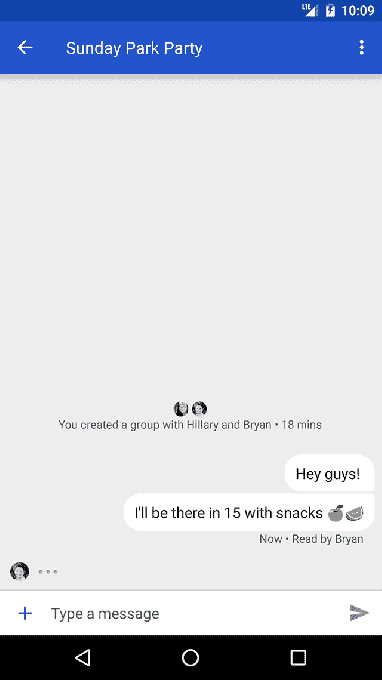
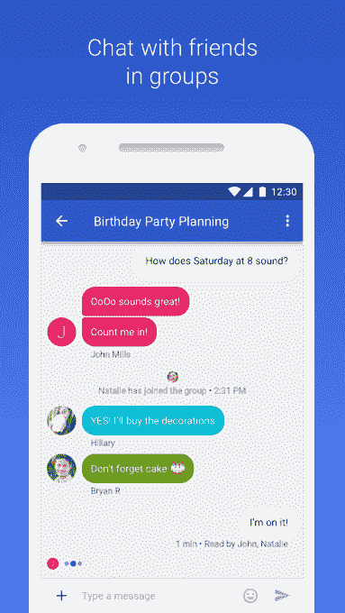

# 谷歌在 Sprint  上为安卓手机带来了短信的下一代升级产品 RCS

> 原文：<https://web.archive.org/web/https://techcrunch.com/2016/11/04/google-brings-rcs-the-next-gen-upgrade-to-sms-to-android-phones-on-sprint/>

正如今年早些时候承诺的那样，谷歌将为 Android 设备带来 RCS——丰富的通信服务，是 SMS 标准的升级。该计划的第一个运营商合作伙伴是 Sprint，该公司从今天开始向其使用 Android 设备的客户推出 RCS 消息。一旦启用，RCS 将为 Android 用户提供增强的短信体验，包括更好的群聊、高分辨率照片共享、阅读回执和打字指示等功能。

早在 2015 年 9 月[收购 RCS 提供商 Jibe Mobile](https://web.archive.org/web/20230313195359/https://techcrunch.com/2015/09/30/google-acquires-jibe-mobile-to-help-adopt-new-standard-for-carrier-messaging/)时，谷歌就宣布了向这个方向发展的计划。谷歌表示， [Jibe 云平台](https://web.archive.org/web/20230313195359/https://jibe.google.com/jibe-platform/)将为 Sprint 上的新服务提供动力。

Sprint 用户将通过谷歌在他们的 Android 设备上重新设计的 [Messenger](https://web.archive.org/web/20230313195359/https://play.google.com/store/apps/details?id=com.google.android.apps.messaging&hl=en) 应用程序升级他们的标准短信体验，前提是他们使用 Android KitKat 或更高版本，并将 Messenger 设置为他们的默认短信应用程序。

那些使用 Sprint 的 LG 和 Nexus 手机的用户将通过应用更新自动升级到 RCS，而其他人可以通过从 Play Store 下载 Messenger 应用来手动更新他们的设备。

谷歌新推出的 Pixel 品牌智能手机预装了 Messenger，因此如果用户在 Sprint 网络上使用未锁定的设备并安装了 Messenger，它也可以访问 RCS。

谷歌表示，从明年开始，Sprint 的所有新 Android 设备都将预装 Messenger，作为默认的 SMS 和 RCS 消息应用。

对于在 Sprint Android 手机上获得新消息体验的消费者来说，他们将能够利用与苹果 iMessage 或其他第三方消息应用程序相媲美的功能。例如，虽然今天的彩信支持群发消息，但您不能做人们现在期望的一些事情，如命名群组、添加新成员或离开现有群组。这将随着 RCS 的出现而改变。

此外，Sprint 用户将能够分享比彩信大 100 倍的图像和视频，将知道消息是否已发送或阅读，并将在有人给你写信时看到打字指示。

根据 GSMA 的说法，RCS 作为一项技术，自 2007 年就已经存在，但它只在全球 49 家运营商中推出。然而，该组织表示，Sprint 是第一个推出新的 RCS profile 计划的公司——其他的推出都涉及该标准的旧版本。

这也是谷歌首次在世界任何地方推出 RCS 支持。(当然，现在谷歌拥有的 Jibe 平台以前支持旧版本的 RCS。)

虽然在某种程度上被定位为谷歌可以与 iMessage 竞争的一种方式，但 RCS 的问题是它没有被普遍采用。与可以在任何苹果设备上使用的 iMessage 不同，RCS 是由运营商提供的，它不能在旧的 Android 智能手机上使用。换句话说，这次发射的影响——至少现在——是有限的。

谷歌表示，它计划在“未来几个月”与其他运营商合作推出 RCS，但不会透露具体是哪些运营商，也不会透露具体时间。

[gallery ids="1411727，1411728，1411729，1411730"]

与此同时，此举似乎让谷歌的通讯雄心更加扑朔迷离。毕竟，谷歌如今在哪里下注呢？

为了利用 RCS，受支持设备上的 Android 用户必须使用[谷歌的 Messenger 应用](https://web.archive.org/web/20230313195359/https://play.google.com/store/apps/details?id=com.google.android.apps.messaging&hl=en)作为他们的默认客户端。但是，与此同时，谷歌继续提供其在[的 Hangouts 聊天和通话应用程序](https://web.archive.org/web/20230313195359/https://play.google.com/store/apps/details?id=com.google.android.talk&hl=en)，并且由于其集成的人工智能助手，它正在将[的新 Allo 应用程序宣传为消息传递的未来。](https://web.archive.org/web/20230313195359/https://techcrunch.com/2016/09/20/allo-brings-googles-smarts-to-messaging/) [Allo 还预装在谷歌新推出的 Pixel 智能手机 Pixel 和 Pixel XL 上](https://web.archive.org/web/20230313195359/https://techcrunch.com/2016/10/04/google-pixel/)。(Hangouts 可以设置为默认短信 app，Allo 不能)。

Allo 确实可以跨平台工作——其视频同行 Duo 也是如此——但它们都是较大即时通讯市场的较晚进入者，WhatsApp、Facebook Messenger 等第三方应用程序目前在该市场占据主导地位。

而且，在与 iMessage 竞争方面，谷歌根本没有同样的基础设施。

通过拥有整个平台——从硬件到软件——苹果能够在任何苹果设备上将用户锁定在自己的 iMessage 生态系统中。现在，它甚至在这个平台上运行一个新的应用商店。

谷歌也许能够说服更多的运营商在未来推出 RCS，但这需要时间。这项技术不会像 iMessage 在苹果的世界中那样处于前沿和中心，因为受支持设备的用户必须升级他们的应用程序，切换他们的默认设置，和/或从旧的 Android 手机升级才能使用它。与此同时，RCS 和非 RCS Android 设备之间的碎片化将继续存在，更不用说谷歌自己越来越多的替代消息应用程序，它似乎无法停止创造。