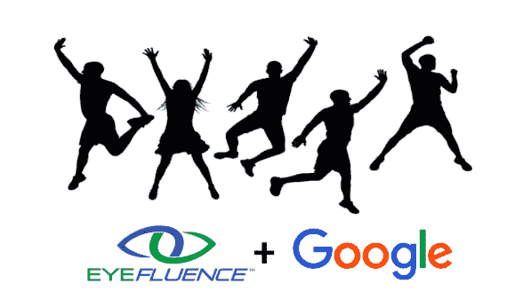

# 谷歌收购眼球追踪初创公司 Eyefluence

> 原文：<https://web.archive.org/web/https://techcrunch.com/2016/10/24/google-buys-eyefluence-eye-tracking-startup/>

# 谷歌收购眼球追踪初创公司 Eyefluence

谷歌想知道你正在寻找的每一个地方。

今天，Eyefluence 宣布被谷歌收购。这家成立于 2013 年的眼球追踪界面初创公司已经从包括英特尔投资、Jazz Venture Partners、摩托罗拉解决方案风险投资和 NHN 投资在内的投资者那里筹集了 2160 万美元的资金。交易条款没有披露。

Eyefluence 今天在一篇由 [Mattermark](https://web.archive.org/web/20230312022851/https://mattermark.com/google-acquires-eyefluence-signaling-continued-interest-vrar/) 首先发现的[博客文章](https://web.archive.org/web/20230312022851/http://eyefluence.com/eyefluence-joins-google/)中悄悄分享了这一消息:

> 今天，我们很兴奋地宣布 Eyefluence 团队将加入谷歌！通过我们的力量结合，我们将继续推进眼睛互动技术，以更大的规模扩展人类的潜力和同理心。我们期待着我们共同创造的改变生活的创新！

随着谷歌下个月推出其 Daydream View 耳机的 Daydream 虚拟现实平台，人们已经开始关注其下一代耳机的努力。

眼球追踪是未来虚拟现实头戴设备的一项非常重要的技术。该领域的其他公司，如 SMI 和 Tobii，已经致力于使用眼睛作为在界面上发出注意信号的方法，但 Eyefluence 完全致力于使用眼睛手势来导航菜单和进行选择。

Eyefluence 使佩戴头戴式虚拟现实或增强眼镜的用户能够将他们的眼睛用作鼠标，仅通过眼球运动进行选择。眼球追踪还有其他更具技术性的使用案例，如 foveated rendering，它允许高密度显示器根据您在显示器上的实际焦点位置，选择性地选择屏幕区域以较低的分辨率显示图像。

该领域的其他公司包括 [Fove](https://web.archive.org/web/20230312022851/http://www.getfove.com/) ，该公司将于下月初开始预订其带有眼球追踪传感器的 VR 头戴设备。

对于大多数近距离看过 Eyefluence 令人印象深刻的技术的人来说，这次收购真的不是一个巨大的惊喜。上个月，我[在 Disrupt SF 与 Eyefluence 首席执行官吉姆·马尔格拉夫聊了聊他对人机交互未来的想法，他有一些大胆的想法。](https://web.archive.org/web/20230312022851/https://techcrunch.com/2016/09/14/the-future-of-human-computer-interaction-will-be-multimodal/)