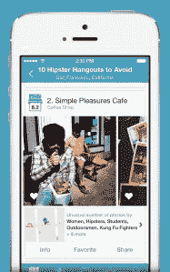

# 谷歌收购 Jetpac 为视觉搜索提供背景技术

> 原文：<https://web.archive.org/web/https://techcrunch.com/2014/08/15/google-buys-jetpac-to-give-context-to-visual-searches/>

# 谷歌收购 Jetpac 为视觉搜索提供背景

谷歌刚刚收购了 Jetpac 的团队，Jetpac 是一款利用公共 Instagram 数据来确定最幸福或最醉城市的应用。Jetpac 于 2012 年在 iPad 上推出社交旅行指南，但后来[将重点](https://web.archive.org/web/20230109053417/https://techcrunch.com/2013/12/05/social-travel-app-jetpac-ditches-facebook-pivots-to-instagram-based-city-guides-for-at-a-glance-recommendations/)转移到其 iphone 应用程序 Instagram 驱动的数据“Jetpac 城市指南”

谷歌最有可能使用 Jetpac 团队来改进使用照片数据的位置信息搜索。谷歌已经宣布[它使用计算机视觉和机器学习](https://web.archive.org/web/20230109053417/https://techcrunch.com/2013/05/23/google-starts-using-computer-vision-to-let-you-search-your-google-photos/)让你搜索自己的照片，比如日落、食物和鲜花。Jetpac 的首席技术官 Pete Warden 是一名计算机视觉专家，是谷歌收购的最佳人选。

Jetpac 的系统寻找视觉线索，如有胡子的图片数量，以确定时尚风格或某个位置有多少潮人。这提供了关于照片拍摄区域的独特上下文信息。例如，它可以告诉你一家咖啡店是否真的像评论所说的那样冷，或者帮你找到 30 多岁的恋爱中的女人的酒吧。这不仅仅是 Yelp 或谷歌地图评论，而是关于在给定位置实际发生的事情的视觉信息。

Jetpac 还实现了从手机摄像头的视频中实时识别本地物体。这项技术可能会增强谷歌眼镜。

Jetpac 将在未来几天内从 App Store 下架该应用，并于 9 月 15 日停止支持。收购背后的细节和金额目前还没有公布。