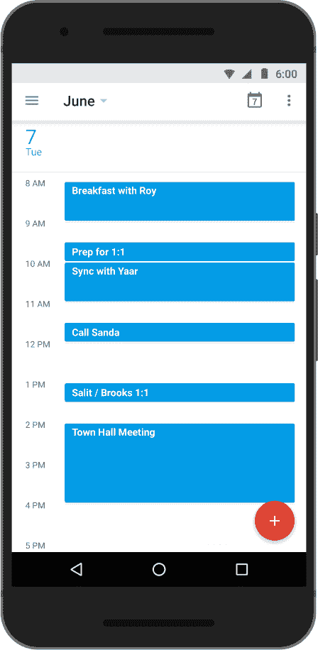

# Android 版谷歌日历让安排移动会议变得更加容易

> 原文：<https://web.archive.org/web/https://techcrunch.com/2016/04/27/google-calendar-for-android-makes-scheduling-meetings-on-the-go-easier/>

# Android 版谷歌日历让安排移动会议变得更加容易

 尽管许多公司都试图解决这个问题，安排会议仍然是一件麻烦事。如果你在工作中使用[谷歌或者在桌面上使用](https://web.archive.org/web/20230316050754/https://www.google.com/work/)或 Edu，你可能已经熟悉谷歌如何让你找到整个组织的会议时间(尽管这个功能[有点隐藏](https://web.archive.org/web/20230316050754/https://support.google.com/calendar/answer/37161?co=GENIE.Platform%3DDesktop&hl=en))。

[今天](https://web.archive.org/web/20230316050754/https://gmail.googleblog.com/2016/04/google-calendar-for-android-find-time.html)，谷歌也将同样的“找时间”工具[引入安卓](https://web.archive.org/web/20230316050754/https://play.google.com/store/apps/details?id=com.google.android.calendar&hl=en)。

与桌面上的工作方式类似，谷歌 Android 日历现在可以让你找到会议中所有参与者的工作时间，它会根据它认为对所有参与者最方便的时间自动排列这些时间。

谷歌表示，这也应该可以跨时区工作，如果没有适合每个人的时间，它会找出哪个冲突的会议最容易重新安排(因为每个人都喜欢你重新安排会议……)。

当然，所有这一切只对那些人们已经共享他们的时间表的组织有效，它也不会帮你找到和组织外的人见面的时间。

然而，正如谷歌所言，在旅途中安排会议现在正成为常态，如果你是谷歌应用程序的用户，现在将这一功能引入移动设备会更容易。该公司表示，目前只在 Android 上推出这一功能，但也计划在不久的将来将其引入 iOS 应用程序。

如果你不是谷歌用户，而是使用 Outlook 或类似的桌面日历工具，你可能也很熟悉这个功能。不过，据我所知，Outlook 的移动应用目前还不提供这项功能。然而，微软正在努力解决这个问题，通过 [Invite](https://web.archive.org/web/20230316050754/https://blogs.office.com/2015/09/24/invite-the-easiest-way-to-organize-meetings-on-the-go/) ，它正在测试一款移动应用，旨在使其类似于跨组织安排会议。