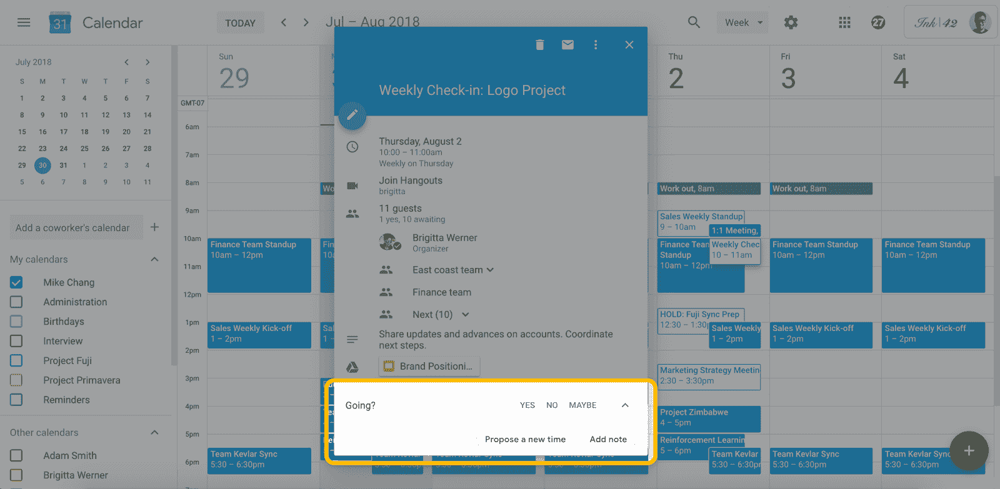

# 谷歌日历让重新安排会议更容易 

> 原文：<https://web.archive.org/web/https://techcrunch.com/2018/07/30/google-calendar-makes-rescheduling-meetings-easier/>

# 谷歌日历使重新安排会议更容易

没有人真的喜欢开会——少数喜欢开会的人可能是你不想与之开会的人。所以，当你忙完了，决定重新安排一些任务时，通常的寻找新的会议时间的过程就开始了。谢天谢地，谷歌日历团队已经听到了你沮丧的叹息，并开发了一个新工具，让重新安排会议变得更加容易。

从两周后的 8 月 13 日开始，每位来宾都可以提议一个新的会议时间，并附上给组织者的更新消息，以解释他们的原因。组织者然后可以检查并接受或拒绝该新的时间段。如果其他来宾公开了他们的日历，组织者还可以在新的并排视图中查看其他与会者的空闲时间，以找到新的时间。

这里有点奇怪的是，这仍然主要是一个手动功能。为了找到会议时段，谷歌已经[利用](https://web.archive.org/web/20221209100822/https://blog.google/products/calendar/save-time-with-smart-scheduling-in-google-calendar/)的一些机器学习智能来寻找最佳时间。这项新功能似乎没有采用相同的算法来为重新安排的会议建议日期和时间。

这项新功能将跨 G Suite 域工作，也适用于 Microsoft Exchange。不过，值得注意的是，这一新选项不适用于超过 200 名与会者的会议和全天活动。