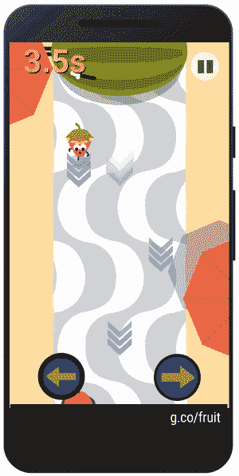

# 谷歌用涂鸦水果游戏庆祝奥运

> 原文：<https://web.archive.org/web/https://techcrunch.com/2016/08/04/google-celebrates-olympics-with-doodle-fruit-games/>

# 谷歌用涂鸦水果游戏庆祝奥运

 奥运会本周开幕，为了庆祝，谷歌将在接下来的七天里每天在 iOS 和 Android 的谷歌应用中推出一个[新的互动涂鸦](https://web.archive.org/web/20230308173520/https://www.youtube.com/watch?v=0iAXasoA-PI)(之后的十天都可以使用)。

因此，如果你不能去里约(考虑到所有的[问题](https://web.archive.org/web/20230308173520/http://www.theatlantic.com/science/archive/2016/08/a-cheap-easy-fix-to-rios-sewage-problem/494354/)城市[目前](https://web.archive.org/web/20230308173520/https://www.theguardian.com/sport/2016/aug/04/rio-2016-olympic-torch-skirts-riots-and-drug-gang-clashes-in-host-city) [面临](https://web.archive.org/web/20230308173520/http://graphics.wsj.com/threat-of-zika-at-the-rio-olympics/))，你现在可以通过模拟奥运十项全能来引导一堆美味的水果，其中最大的威胁实际上是被一个过于咄咄逼人的甜瓜压倒。甚至水果游戏也很危险。

谷歌希望你会发现这些水果确实很“诱人”(是的——谷歌写的，但我相信当你玩苹果游戏时，它会有意义)。在我看来，有自行车比赛(你在 BMX 自行车上玩椰子)，水球，蜘蛛跨栏，椰子和菠萝打网球，等等。你也可以玩一个可爱的浆果，它试图避免被一个过分好斗(但奇怪的是快乐)的甜瓜变成奶昔，这并不完全体现奥林匹克精神。

很明显，谷歌的某个人很喜欢把这些放在一起。