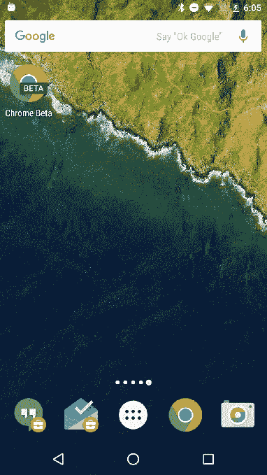

# Google Chrome For Android 将很快支持与蓝牙信标的交互

> 原文：<https://web.archive.org/web/https://techcrunch.com/2016/02/11/google-chrome-for-android-will-soon-support-interactions-with-bluetooth-beacons/>

# Google Chrome For Android 将很快支持与蓝牙信标的交互

[谷歌今天宣布](https://web.archive.org/web/20221005142511/http://blog.chromium.org/2016/02/the-physical-web-expands-to-chrome-for_10.html)它已经开始在 Android 的 Chrome 浏览器中支持物理信标。

这项功能从去年夏天开始已经在 iOS 应用程序中进行了[测试，很快将会在 Android 平台的 Chrome 49 中推出。它使用户能够选择在商店、体育场、学校等公共场所与附近的蓝牙信标互动并接收内容。](https://web.archive.org/web/20221005142511/http://blog.chromium.org/2015/07/exploring-physical-web-with-chrome-for.html)

支持最初来自 Android 版 Chrome 的测试版，所以它最初只会影响应用程序的总用户群，但随着时间的推移，它会扩展到稳定版。

物理信标为公司提供了一种不同的营销方法，这种方法今天才刚刚被认识到。谷歌的博客文章已经强调了许多例子，包括学校如何使用信标分发课堂笔记，信标如何在 CES 上部署以取代营销手册，以及金州勇士队如何通过空中向球迷传递精彩视频。现在这只是表面现象，在 Chrome 中为 iOS 和 Android 启用 beacon 交互是开启未来机遇的重要一步。

信标可能会成为 2016 年的热门话题，有许多科技公司在硬件和软件方面开创了这一概念。Estimote，据传该公司正在与零售巨头 Target 合作，[最近完成了 1070 万美元的首轮融资](https://web.archive.org/web/20221005142511/https://beta.techcrunch.com/2016/01/15/beacon-technology-company-estimote-raises-10-7-million-series-a/#.c8ubks:E7b6)，而软银支持的漩涡网络[去年筹集了 1800 万美元的 C 轮融资](https://web.archive.org/web/20221005142511/https://beta.techcrunch.com/2015/04/23/swirl-series-c/)，以及 2014 年从科技巨头高通剥离出来的灯塔公司[Gimbal，也在其中。](https://web.archive.org/web/20221005142511/http://in.reuters.com/article/us-qualcomm-retail-idINBREA4000I20140501)

不过，这都是来自今天的谷歌。为了进一步推进连接现实世界和网络世界的努力，[谷歌设立了](https://web.archive.org/web/20221005142511/http://googleresearch.blogspot.com/2016/02/announcing-google-internet-of-things.html)物联网技术研究奖试点项目。

谷歌表示，由于互操作性、用户隐私和管理交互方面的困难，它正在邀请大学研究人员通过 4 到 8 周的实验参与试点。潜在的申请者必须在二月底之前提交他们的提案以供审查。全部细节在谷歌研究博客[这里](https://web.archive.org/web/20221005142511/http://googleresearch.blogspot.com/2016/02/announcing-google-internet-of-things.html)。