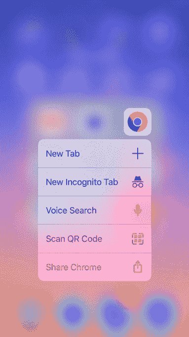

# 谷歌 Chrome 拥有自己的二维码和条形码扫描仪

> 原文：<https://web.archive.org/web/https://techcrunch.com/2017/02/02/google-chrome-gets-its-own-qr-code-barcode-scanner/>

# 谷歌 Chrome 拥有自己的二维码和条形码扫描仪

这里还有一个你可以从 iPhone 上删除的应用:你只是偶尔使用的二维码和条形码扫描仪。随着今天一个更新的推出，谷歌的 Chrome 移动浏览器可以替代这项工作。该应用程序现在包括内置的扫描功能，您可以通过应用程序图标上的 3D Touch 来访问，也可以在 spotlight 中搜索“QR”。

虽然这些快捷方式仅指二维码扫描，但 Chrome 也可以扫描传统的产品条形码。这样做会把你带到有问题的商品的谷歌搜索结果页面，在那里你可以查看价格，阅读评论等等。

尽管有相反的传言，二维码并没有完全消亡——如果有什么不同的话，它们已经开始卷土重来，这要归功于受欢迎的应用程序，如 [Snapchat](https://web.archive.org/web/20230318152421/https://techcrunch.com/2015/05/04/snapcode/) 、Kik 和 [Messenger](https://web.archive.org/web/20230318152421/http://mashable.com/2016/04/08/messenger-codes/) ，以及食品标签。甚至亚马逊现在也在一些包装上贴上二维码，就像其婴儿产品的 [Elements 品牌](https://web.archive.org/web/20230318152421/https://www.amazon.com/Amazon-Elements-Wipes-Sensitive-Resealable/dp/B00M4M2UF0?th=1)一样。

尽管如此，这并不是那种你必须经常做的事情，以证明手头有一个条形码扫描应用程序是正确的。

由于二维码的采用有限，智能手机制造商一直不愿将二维码扫描功能完全集成到他们的操作系统中，即使它只是相机或搜索工具的一个简单附件。例如，iPhone 的二维码阅读器隐藏在钱包应用程序中，用于扫描优惠券、登机牌、机票等。这假定这些是二维码的主要用途，但是，实际上，这只是二维码能做的有限的一部分。

通过将扫描功能捆绑到 Chrome 中，您无需使用单独的应用程序，就可以拥有功能更强大的条形码扫描仪。该更新现已在 iPhone 上发布。