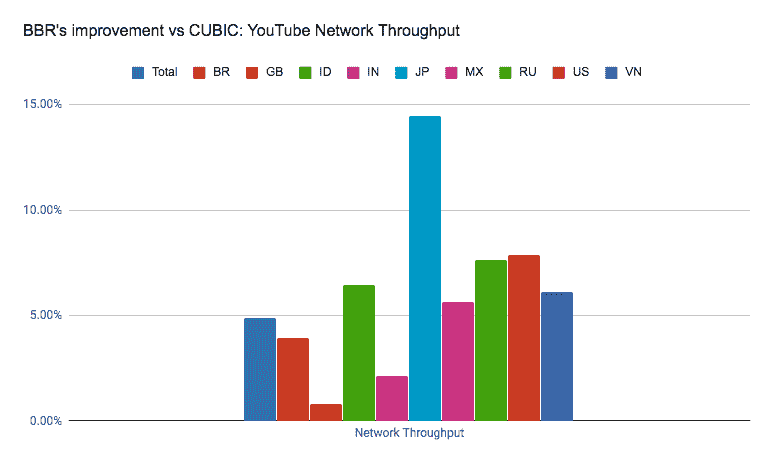
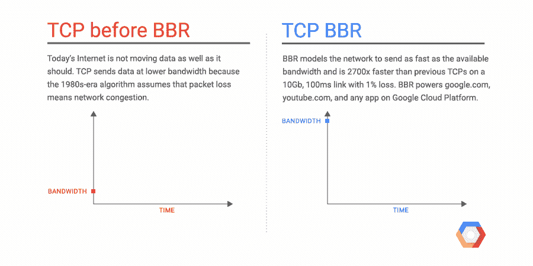

# 谷歌云获得新的网络算法，提高互联网吞吐量 

> 原文：<https://web.archive.org/web/https://techcrunch.com/2017/07/20/google-cloud-gets-a-new-networking-algorithm-that-improves-internet-throughput/>

# 谷歌云获得一种新的网络算法，提高互联网吞吐量

谷歌今天[宣布](https://web.archive.org/web/20221017154737/https://cloudplatform.googleblog.com/2017/07/TCP-BBR-congestion-control-comes-to-GCP-your-Internet-just-got-faster.html)TCP BBR，一种新的拥塞控制算法，它已经被用来在全球范围内将来自 google.com 和 YouTube 的网络吞吐量提高了大约 4 %(在一些国家超过 14 %),现在也可用于其云平台用户。

这里的总体想法是改进现有的互联网流量拥塞控制算法，这种算法自 20 世纪 80 年代以来就已经存在，并且通常只考虑分组丢失(当网络缓冲区填满时，路由器将丢弃任何新的分组)。这些算法决定了给定设备向网络发送数据的速度，以避免网络过载。当这些系统意识到一些数据包没有到达最终目的地时，它们开始以更慢的速度发送数据，这在理想情况下可以减少拥塞。有各种各样的算法来解决具体如何做到这一点(以及如何随着时间的推移再次加速)，但在核心上，它们都倾向于遵循相同的模式。

代表“ **B** ottleneck **B** 和宽度和 **R** 往返传播时间”的 BBR 采取了不同的方法。它不仅关注数据包丢失，还关注网络实际传输数据的速度。“对于给定的网络连接，它使用网络传输速率和往返时间的最新测量结果来建立一个显式模型，其中包括该连接最近可用的最大带宽和最近的最小往返延迟，”谷歌解释道。利用这些数据，BBR 可以决定发送数据的速度。

其结果是一种算法，可以在任何给定的时间发送更多的数据(而不会导致损失)，特别是在长途链路上。谷歌表示，它的一个基准测试显示吞吐率提高了 2700 倍，但这显然是一个边缘案例，是一个合成基准测试。

该公司去年在一篇论文中首次公开谈论了 BBR [，并自那以后开源了该协议。Google 也将其贡献给了 Linux 内核 TCP 栈。](https://web.archive.org/web/20221017154737/http://delivery.acm.org/10.1145/3010000/3009824/p58-cardwell.pdf?ip=50.39.97.90&id=3009824&acc=OA&key=4D4702B0C3E38B35%2E4D4702B0C3E38B35%2E4D4702B0C3E38B35%2E5945DC2EABF3343C&CFID=787455573&CFTOKEN=69693722&__acm__=1500502475_7b652819aa9cf1ead8e44bc4b4ae9e24)

