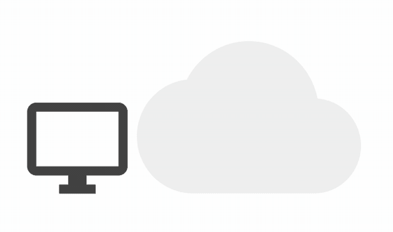
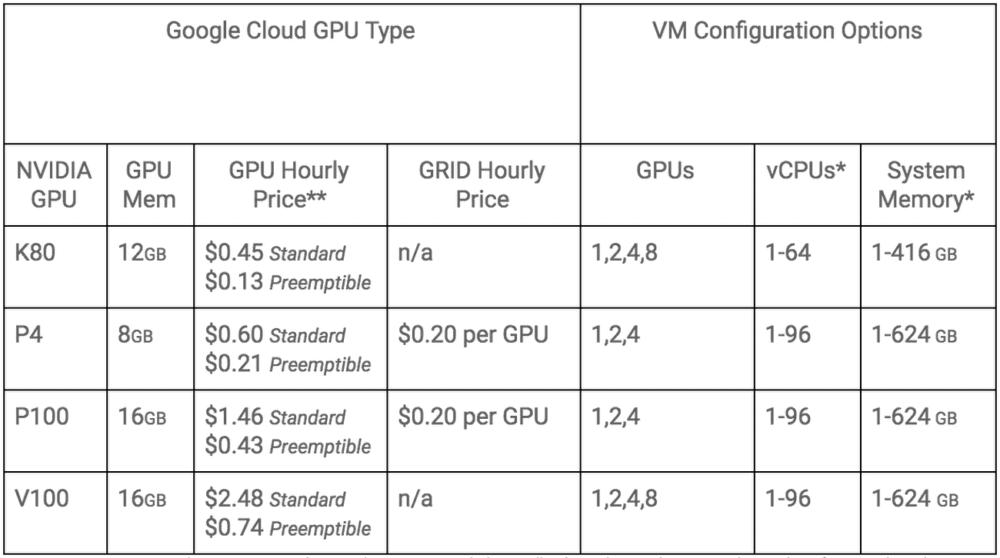

# 谷歌云获得对英伟达特斯拉 P4 推理加速器的支持 

> 原文：<https://web.archive.org/web/https://techcrunch.com/2018/08/06/google-cloud-gets-support-for-nvidias-tesla-p4-inferencing-accelerators/>

# 谷歌云获得对英伟达特斯拉 P4 推理加速器的支持

如今，没有一个不支持 GPU 的云平台是完整的。毕竟，没有其他方法可以支持现代高性能和机器学习工作负载。通常，这些产品的重点是建立机器学习模型，但今天，谷歌[推出了对](https://web.archive.org/web/20230130100805/https://cloud.google.com/blog/products/gcp/introducing-nvidia-tesla-p4-gpus-accelerating-virtual-workstations-and-ml-inference-compute-engine)[英伟达 P4 加速器](https://web.archive.org/web/20230130100805/http://images.nvidia.com/content/pdf/tesla/184457-Tesla-P4-Datasheet-NV-Final-Letter-Web.pdf)的支持，该加速器专门专注于推理，以帮助开发者更快地运行他们现有的模型。

除了这些机器学习工作负载，谷歌云用户还可以使用 GPU 来运行需要快速显卡的远程显示应用程序。为了做到这一点，GPU 支持 [Nvidia Grid](https://web.archive.org/web/20230130100805/https://www.nvidia.com/en-us/design-visualization/grid-vpc-vapps/) ，该公司的系统使服务器端图形对登录远程桌面的用户更敏感。

因为 P4s 配备了 8GB 的 DDR5 内存，每秒可以处理高达 22 万亿次整数运算，所以这些卡可以处理几乎任何你扔给它们的东西。因为买一辆车至少要花 2200 美元，如果不是更多的话，按小时出租可能不是最糟糕的主意。

在谷歌云上，P4 的标准价格为每小时 0.60 美元，如果你愿意运行可抢占的 GPU，每小时 0.21 美元。这明显低于谷歌 P100 和 V100 GPUs 的价格，尽管我们在这里谈论的也是不同的用例。

新 GPU 现已在美国中部 1(爱荷华州)、美国东部 4(弗吉尼亚州北部)、蒙特利尔(北美东北部 1)和欧洲西部 4(荷兰)上市，更多地区即将上市。