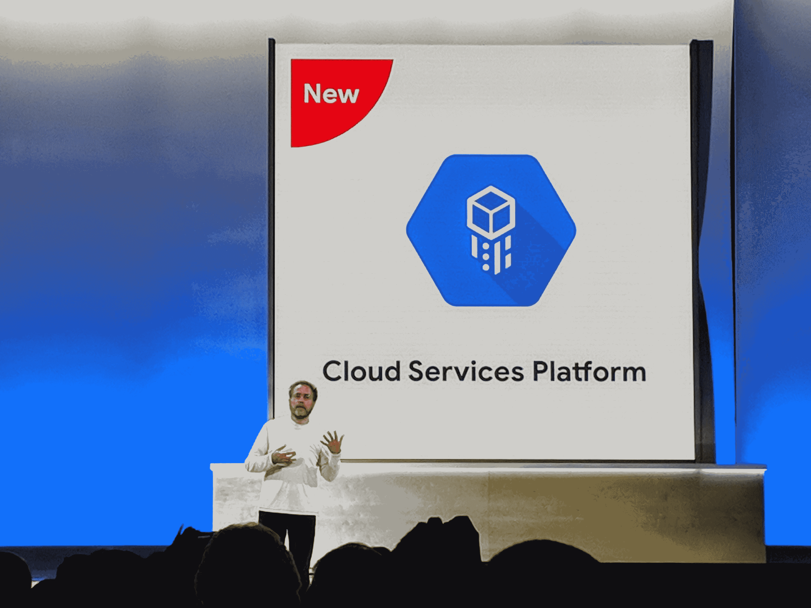

# 谷歌云凭借其新的云服务平台 全力以赴发展混合技术

> 原文：<https://web.archive.org/web/https://techcrunch.com/2018/07/24/google-cloud-goes-all-in-on-hybrid-with-its-new-cloud-services-platform/>

云并不适合所有企业，这可能是因为边缘的延迟限制、监管要求，或者是因为拥有和运营自己的数据中心来处理特定工作负载更便宜。有鉴于此，今天绝大多数企业并行使用公共云和私有云也就不足为奇了。这是微软长期以来一直押注的 Azure 云战略的一部分，谷歌也正在朝这个方向采取一些措施。

通过开源的 Kubernetes 项目，Google 推出了一个基本的构建模块，使大型企业在混合环境中运行和管理应用程序变得更加容易。然而，谷歌直到今天还没有做的是推出一个全面的解决方案，包括这种部署的所有必要部分。不过，凭借其新的云服务平台，该公司现在为企业提供一套集成的云服务，可以部署在谷歌云平台和内部环境中。

正如谷歌云工程总监陈·戈德堡(Chen Goldberg)在今天发布之前的新闻发布会上指出的那样，许多企业也只是希望能够管理自己的内部工作负载，但仍然能够访问云中的新机器学习工具。“今天，为了实现这一点，用例涉及成本、一致性、控制和灵活性之间的妥协，”她说。"这些都对预期的结果产生了负面影响."

戈德堡强调，云服务平台背后的想法是满足企业的需求，然后让它们按照自己的速度实现堆栈的现代化。但她也指出，企业想要的不仅仅是在不同环境之间转移工作负载的能力。“光有便携性是不够的，”她说。“用户希望获得一致的体验，这样他们就可以一次培训他们的团队，然后在任何地方运行，并且拥有一个适用于所有环境的行动手册。”

这一新产品的两个核心服务是 Kubernetes 容器编排工具和 Istio，这是一个相对较新但发展迅速的工具，用于连接、管理和保护微服务。Istio 即将发布 1.0 版本。

我们在这里不只是简单地谈论开源工具的集合。戈德堡指出，云服务平台的核心是“谷歌为企业定制配置并经过实战检验。”此外，它还与谷歌云中的其他服务深度集成，包括该公司的机器学习工具。

## GKE 本地

在这些新的定制配置工具中，有许多新产品，它们都是更大平台的一部分。也许其中最有趣的是 GKE 本地餐厅。Google Kubernetes 引擎 GKE 是管理云中容器的核心 Google 云服务。现在，谷歌基本上也将这项服务带到了企业数据中心。

该服务包括访问云中 GKE 的所有常用功能，包括注册和管理集群以及使用 Stackdriver 监控集群的能力，以及身份和访问管理。它还包括一条直通 GCP 市场的线路，该市场最近推出了对基于 Kubernetes 的应用程序的支持。

使用 GCP 控制台，企业可以管理其内部和 GKE 集群，而无需在不同环境之间切换。GKE 本地无缝连接到谷歌云平台环境，其外观和行为与云版本完全一样。

企业用户还可以获得专业服务和企业级支持，以帮助管理服务。

“谷歌云是第一个也是唯一一个在本地提供托管 Kubernetes 的主要云供应商，”Goldberg 说。

## GKE 政策管理

与此相关，谷歌今天还宣布了 GKE 策略管理，这意味着为 Kubernetes 管理员提供一个单一的工具来管理他们所有的集群安全策略。Kubernetes 集群在哪里运行是不可知的，但是您可以使用它将您现有的 Google Cloud 基于身份的策略移植到这些集群。这项新功能将很快在 alpha 中推出。

## 托管 Istio

谷歌推出的另一项主要新服务是 Managed Istio(以及针对 Istio 的 Apigee API Management ),旨在帮助企业管理和保护他们的微服务。[开源 Istio 服务网](https://web.archive.org/web/20230222130708/https://istio.io/docs/concepts/what-is-istio/overview/)为管理员和运营商提供了管理这些服务的工具，通过这一新的托管服务，谷歌将 Istio 的核心作为托管服务提供给 GKE 用户。

这样，用户可以访问 Istio 的服务发现机制和流量管理工具，以实现负载平衡和将流量路由到容器和虚拟机，以及从运行在这些集群上的工作负载获取遥测数据的工具。

除了这三个主要的新服务，谷歌还围绕 GKE 和无服务器计算模式推出了一些辅助工具。其中第一个是 GKE 无服务器插件，它可以通过单步部署过程轻松地在 GKE 上运行无服务器工作负载。谷歌称，这将允许开发者“瞬间”从源代码进入容器。该工具目前是预览版，谷歌正在其新的原生开源组件下提供该技术的部分内容。正是这些组件使得无服务器附件成为可能。

最后，谷歌今天还提到了一项新的全面管理的持续集成和交付服务 Google Cloud Build，尽管这项服务的细节仍然保密。

所以你有它。就其本身而言，所有这些公告可能看起来有点深奥。不过，总的来说，它们显示了谷歌在 Kubernetes 上的押注开始获得回报。随着企业选择容器来部署和运行他们的新工作负载(甚至可能将旧应用程序带入云中)，GKE 已经将谷歌云放在地图上，以便在托管环境中运行它们。现在，谷歌也有理由将其扩展到用户的数据中心。有了 SUSE、Platform 9 等大小公司的托管 Kubernetes，集装箱船开始成为一项大业务。毫不奇怪，开创这一切的公司也想分一杯羹。

