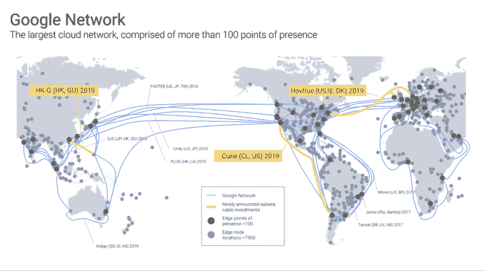

# 谷歌云基础设施将继续扩展，新增三条海底电缆 

> 原文：<https://web.archive.org/web/https://techcrunch.com/2018/01/16/google-cloud-infrastructure-expansion-to-continue-with-three-new-undersea-cables/>

# 谷歌云基础设施继续扩建，铺设三条新海底电缆

负责谷歌云部门的黛安·格林(Diane Greene)经常惊叹于她的公司在谷歌云基础设施上的投资。这是有充分理由的。在过去的三年里，自从格林上任以来，公司已经花费了 300 亿美元来加强基础设施。今天它宣布三条新的海底电缆将于明年上线。

在谷歌云平台副总裁本·特雷诺撰写的[博客文章](https://web.archive.org/web/20221209072921/https://www.blog.google/topics/google-cloud/expanding-our-global-infrastructure-new-regions-and-subsea-cables/)中，他宣布了三条海底电缆和五个新区域。

地图:谷歌

让我们从电缆开始。居里电缆以获得诺贝尔奖的科学家玛丽·居里的名字命名，是第一条由非电信公司建造的洲际电缆。根据[发布的报道](https://web.archive.org/web/20221209072921/http://www.foxbusiness.com/features/2018/01/16/google-plans-to-expand-huge-undersea-cables-to-boost-cloud-business.html)，它将从洛杉矶穿越 6200 多英里到达智利。谷歌夸口说，这将是近 20 年来第一条登陆智利的新电缆，并将服务于整个拉丁美洲的谷歌客户。

第二条电缆名为 Havfrue(丹麦语意为“美人鱼”)，将从美国东海岸延伸到丹麦，并于明年年底上线。最后一家有一个相当缺乏想象力的名字，香港有线电视。谷歌正与 RTI-C 和 NEC 合作建造这一平台，以扩大其在太平洋地区的覆盖范围。根据《华尔街日报》的报道，这是一条从香港到关岛的 2400 英里长的电缆。

“虽然我们没有加快光速，但我们已经建立了一个卓越的云网络，这是我们的云和最终用户之间良好配置的直接路径的结果，”特雷纳写道。

谷歌现在直接投资了 11 条海底电缆，并租赁了其他几条电缆的容量。去年春天，它宣布了一条从新加坡到澳大利亚的海底电缆。

除了海底电缆，该公司还宣布今年第一季度将有包括荷兰和蒙特利尔在内的五个新地区上线。另外三个位于洛杉矶、芬兰和香港的网站将于今年晚些时候上线。谷歌承诺，他们还没有完成，将有其他地区的额外公告。