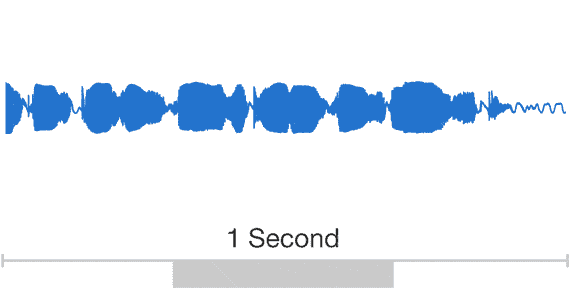
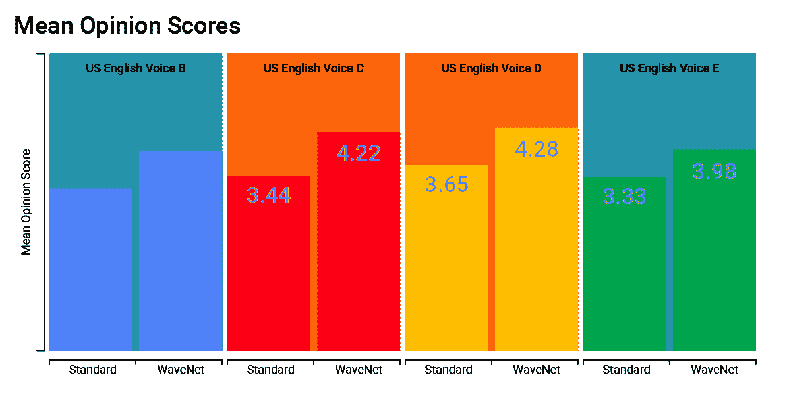

# 谷歌云为开发者推出新的文本到语音转换引擎 

> 原文：<https://web.archive.org/web/https://techcrunch.com/2018/03/27/google-cloud-launches-its-new-text-to-speech-engine-for-developers/>

# 谷歌云为开发者推出新的文本到语音转换引擎

在过去的几年中，文本到语音的合成已经取得了长足的进步，以至于许多现代系统听起来几乎就像一个真人在读文本。谷歌一直是这一开发的领导者之一，从今天开始，开发者将可以使用同一个由 T2 deep mind 开发的文本到语音转换引擎，该公司目前正在将其用于其助手和谷歌地图方向。

总之，[云文本到语音转换](https://web.archive.org/web/20221127154219/https://cloud.google.com/text-to-speech/)拥有来自 12 种语言和变体的 32 种不同声音。开发者将能够定制该服务将生成的 MP3 或 WAV 文件的音高、语速和音量增益。

然而，并非所有的声音都是平等的。这是因为新服务还提供了六种英语语音，都是使用 WaveNet 构建的，这是 DeepMind 的模型，用于从文本中创建原始音频。

与以前的努力不同，WaveNet 不基于一系列简短的语音片段进行语音合成，这往往会产生你肯定熟悉的那种机器人声音。相反，WaveNet 使用机器学习模型对原始音频进行建模，以创建听起来更自然的语音。谷歌表示，在测试中，人们认为这些 WaveNet 声音比标准声音好 20%以上。

谷歌第一次谈论 WaveNet 是在大约一年前。从那时起，它将这些工具转移到一个新的基础设施上，该基础设施位于公司自己的张量处理单元之上。这使得它生成这些音频波形的速度比以前快了 1000 倍，因此现在生成一秒钟的音频只需要 50 毫秒。

这项新服务现在对所有开发者开放。您可以在这里找到价格数据。

