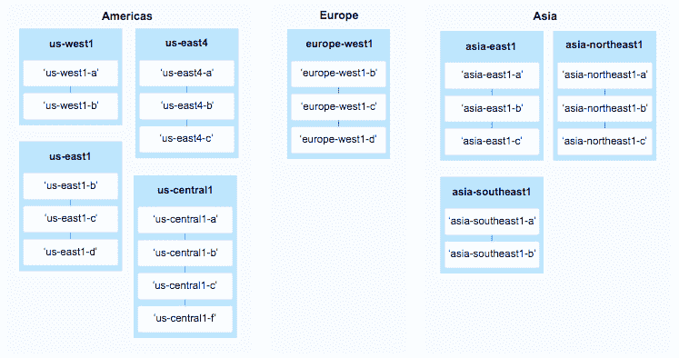

# 谷歌云平台在北美推出第四个区域 

> 原文：<https://web.archive.org/web/https://techcrunch.com/2017/05/10/google-cloud-platform-launches-its-fourth-region-in-north-america/>

# 谷歌云平台在北美推出第四个区域

谷歌的[云平台](https://web.archive.org/web/20221201071026/https://cloud.google.com/)现在在北美有四个地区。该公司今天宣布在北弗吉尼亚州推出其最新的云平台区域。这一地区被称为“us-east4”，是该公司在俄勒冈州、爱荷华州和南卡罗来纳州现有地区的补充。

在云区域方面，谷歌长期落后于其竞争对手，但该公司在去年左右加快了相当积极的步伐。该公司还计划在不久的将来在圣保罗、蒙特利尔和加州推出新业务。

至于北弗吉尼亚地区，谷歌表示，其测试显示，与使用南卡罗来纳州数据中心相比，纽约、波士顿、蒙特利尔、多伦多和华盛顿特区的客户往返延迟降低了 25-85%。新区域有三个可用区域，与谷歌目前的大多数区域相当。

值得注意的是，虽然谷歌现在提供 8 个地区，但像 AWS 和微软这样的竞争对手目前可以分别为他们的开发者提供 16 个和 34 个地区的访问权限。

