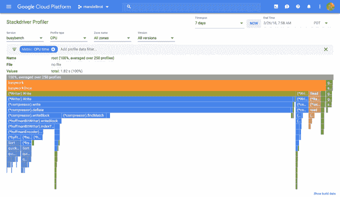
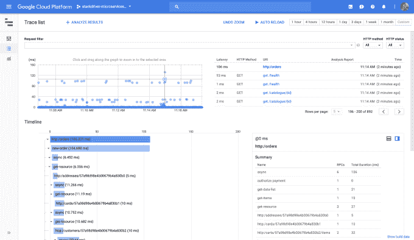

# 谷歌云解决应用性能监控问题 

> 原文：<https://web.archive.org/web/https://techcrunch.com/2018/03/28/google-cloud-tackles-applications-performance-monitoring/>

随着谷歌构建自己的云平台，它一直在不断地为自己的团队开发工具和服务，并将它们作为产品提供给客户。今天，它宣布了一套名为 [Stackdriver APM](https://web.archive.org/web/20221207182404/https://cloud.google.com/apm/) 的应用性能管理工具，为开发者在谷歌云平台上构建应用增加了一个关键因素。

谷歌在 APM 方法上做了一些不同的事情，设计它是为了让开发人员跟踪他们已经建立的应用程序中的问题，而不是把责任转移到运营上。这种想法是，构建应用程序并最接近代码的开发人员因此最适合理解来自代码的信号。

StackDriver APM 由三个主要工具组成:Profiler、Trace 和 Debugger。Trace 和 Debugger 已经可以使用了，但是通过将它们与 Profiler 放在一起，这三个工具可以协同工作来识别、跟踪和修复代码问题。

谷歌产品经理摩根·麦克林(Morgan McLean)在宣布 Stackdriver APM 的博客文章中写道:“所有这些工具都可以处理运行在任何云甚至内部基础设施上的代码和应用程序，因此无论你在哪里运行应用程序，你现在都有一个一致的、可访问的 APM 工具包来监控和管理你的应用程序的性能。”

当您将这些与 Stackdriver 监控和日志记录工具结合在一起时，您就拥有了一个完整的 APM 套件，可以与从 Splunk 到 Datadog 到 New Relic 和 AppDynamics(现在由思科拥有的[)的许多供应商进行竞争。但是谷歌产品管理副总裁 Sam Ramji 说，这些供应商既是竞争对手，也是合作伙伴，他们认为这些工具都在一起工作，帮助团队跟踪代码问题。](https://web.archive.org/web/20221207182404/https://techcrunch.com/2017/01/25/cisco-appdynamics-3-7-billion-deal-all-about-the-data/)

“我们在让核心系统对每个人可见方面做得更好。人们将继续使用他们喜欢的工具来了解生产系统的运行情况，并为他们的业务目标建立警报系统，”他说。

这一切都始于 McLean 编写的 Profiler，它允许开发人员通过运行在所有应用程序实例上的基于轻量级采样的工具来收集数据。

Stackdriver 探查器。图片:谷歌

一旦程序员发现问题，这就是跟踪的用武之地。Ramji 说，代码问题几乎总是遵循一个关键路径，他们可以使用这个工具来了解问题如何在分布式系统中传播。他们以可视化分析的形式做到这一点，真正说明了问题的本质及其对计算资源的影响。

堆栈驱动程序跟踪工具。图片:谷歌

最后，还有调试器，Ramji 特别喜欢它，因为它让他想起了 90 年代的工具，那时可以停止和启动应用程序，以查看您的计算资源哪里出现了问题。这个工具在现代环境中提供了类似的功能，允许开发人员在某些点停止代码，以帮助识别影响代码的核心问题。

这个过程真正值得注意的是，Ramji 称之为“魔术”的是，它使开发人员能够在不影响客户的情况下开始和停止代码。正如 McLean 所写的，它给了程序员“一个熟悉的生产应用程序断点式调试过程，没有负面的客户影响。”

Stackdriver APM 现已推出，它提供了一套全面的监控服务。无论谷歌是否打算在这一领域与其他公司竞争，这似乎都是最终结果。