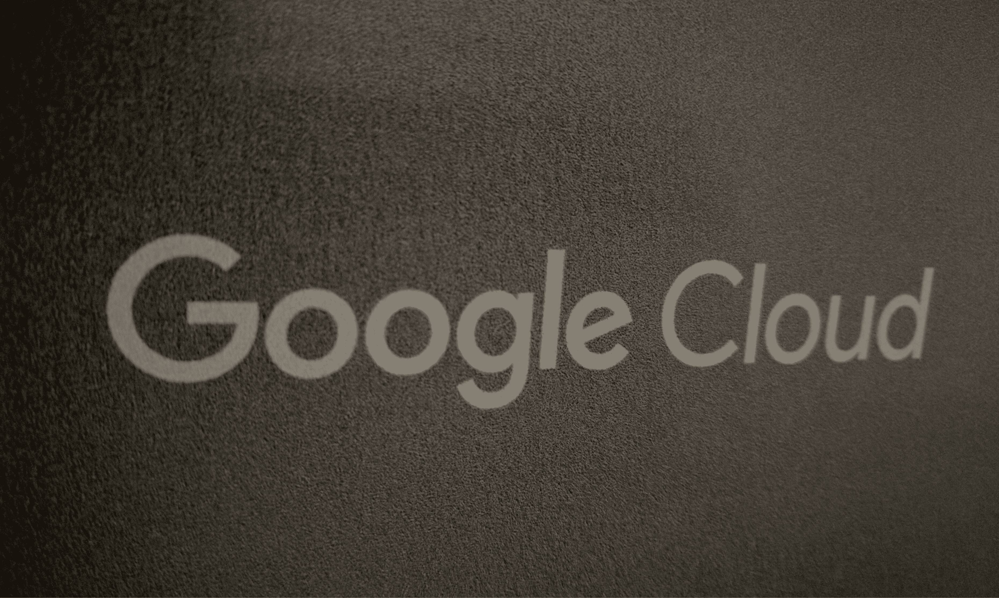
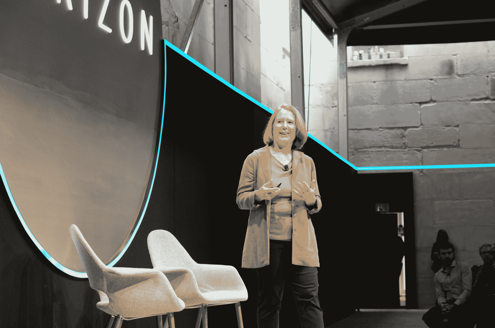

# 谷歌将其所有云服务整合在“谷歌云”品牌 TechCrunch 下

> 原文：<https://web.archive.org/web/https://techcrunch.com/2016/09/29/google-combines-all-of-its-cloud-services-under-the-google-cloud-brand/>

# 谷歌将其所有云服务整合在“谷歌云”品牌下

谷歌工作，谷歌的云平台和该公司的其他基于云的服务有了一个新名字。它们现在被合并在“谷歌云”的名字下。谷歌的黛安·格林在旧金山一个只有受邀者才能参加的小型活动上宣布了这一消息。

如果你一直在关注，今天的新闻并不完全令人惊讶。先前[报道](https://web.archive.org/web/20221206002534/https://www.theinformation.com/google-ditching-google-for-work-branding)的信息称这一改变正在进行中。

让我们困惑的是，谷歌也在[更名](https://web.archive.org/web/20221206002534/https://googleforwork.blogspot.com/2016/09/all-together-now-introducing-G-Suite.html)谷歌工作应用程序，它也属于谷歌云的保护伞。Google Apps for Work 现在是 G 套件(不确定我是否喜欢这个名字，但我想我们会习惯的)。

Google for Work/Google Cloud 这个绰号包含了广泛的产品，包括核心生产力应用程序，如 Gmail、Google Docs、Sheets 和 Slides，以及利基产品，如 Google Maps for Work 和 Google Search for Work [设备](https://web.archive.org/web/20221206002534/https://www.google.com/work/search/)。但也包括谷歌云平台云计算平台，Chromebooks，以及谷歌的企业移动服务。

正如 Greene 在今天早上的主题演讲中提到的，Google 首先考虑了 Google Enterprise 这个名称，并在内部和外部使用了一段时间。格林说，原因是当她今年早些时候加入谷歌时，该公司的客户仍然不确定谷歌是否对云认真，所以这个名字似乎很合适。然而，她认为，现在潜在客户知道谷歌对企业是认真的。

“企业号——这太像六月了，”格林说。“我们是谷歌在云中的全部力量。我们是谷歌云。这是独一无二的谷歌——一套广泛的技术、解决方案和产品。”

