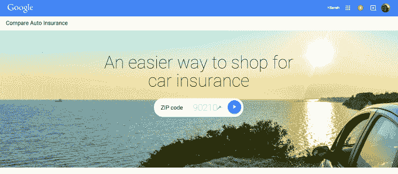
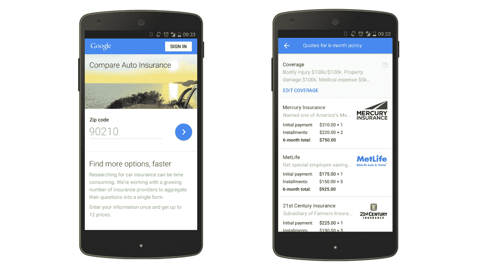
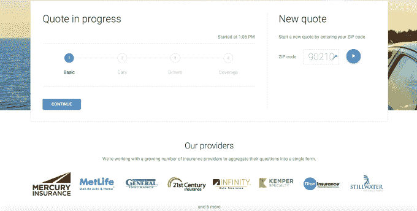

# 谷歌推出新工具向美国网络搜索者销售汽车保险 

> 原文：<https://web.archive.org/web/https://techcrunch.com/2015/03/05/google-compare-car-insurance-us/>

证实早先的报道，谷歌一直在策划一项举措来帮助在美国销售汽车保险，搜索巨头今天早上宣布，它将推出一个名为“[谷歌汽车保险比较](https://web.archive.org/web/20221205003437/http://www.google.com/compare/autoinsurance)的新功能，这是一个比较购物网站，让你比较不同保险提供商的费率。消费者使用谷歌搜索引擎搜索“汽车保险”后，比较费率的选项将开始弹出。最初，这项服务将提供给加州居民，但是[谷歌称](https://web.archive.org/web/20221205003437/http://adwords.blogspot.com/2015/03/introducing-google-compare-for-us-car.html)其他州将在今年晚些时候跟进。

输入该搜索查询的消费者将看到一个小的灰色问卷，询问他们的邮政编码和其他有关他们车辆的信息。如果他们选择填写，Google 将返回一个比较单元，列出其保险广告合作伙伴提供的保险费。或者，用户也可以去[www.google.com.com/compare](https://web.archive.org/web/20221205003437/http://www.google.com/compare)开始同样的体验并获得报价。

谷歌指出，谷歌的保险合作伙伴，包括 Mercury Insurance 和 MetLife，以及当地供应商，基于灵活的每次收购成本(CPA)模型，并补充说，付款不是排名或资格的一个因素。保险提供商也可以使用该服务来突出他们的独特之处，因为比较产品有一个字段，他们可以在其中提到他们的差异化功能，例如安全驾驶折扣或“A”级客户服务。

如今，谷歌已经在英国提供汽车和旅游保险报价，以及抵押贷款报价，并在美国运营一个信用卡比较网站，所有这些都属于“谷歌比较”品牌。然而，[最近的招聘信息暗示，谷歌希望将类似的抵押贷款比较服务引入美国](https://web.archive.org/web/20221205003437/https://gigaom.com/2015/03/02/google-compare-mortgages/)，Forrester 也在今年早些时候[表示，它预计谷歌将从加州开始，在 Q1](https://web.archive.org/web/20221205003437/http://searchengineland.com/google-results-car-insurance-look-different-soon-212508) 推出汽车保险比较服务。

auto comparison 英国网站自 2012 年起就已上线，但在美国的推出却不断被推迟。然而，弗雷斯特指出，截至今年 1 月，谷歌比较汽车保险服务有限公司[获得了在美国超过一半的州](https://web.archive.org/web/20221205003437/http://blogs.forrester.com/ellen_carney/15-01-07-is_google_buying_coverhound_the_curious_case_of_the_california_insurance_license)开展业务的许可。该公司还发现谷歌正在与总部位于旧金山的汽车保险比较初创公司 [CoverHound](https://web.archive.org/web/20221205003437/https://www.crunchbase.com/organization/coverhound) 合作，并猜测他们已经被收购——这一猜测被 CoverHound [在不久后击落](https://web.archive.org/web/20221205003437/http://blogs.wsj.com/digits/2015/01/08/google-wants-to-sell-you-auto-insurance/)。

谷歌表示，其比较技术是内部开发的，但证实它正在与“许多合作伙伴”合作，包括作为报价汇总流程一部分的 CoverHound 和 [Compare](https://web.archive.org/web/20221205003437/http://www.compare.com/) 。

向网络搜索者提供保险比较的举措可能有助于谷歌通过佣金产生额外收入，但据我们了解，美国几家主要的保险公司一直拒绝与谷歌合作开展这项新工作，包括 Progressive、State Farm、GEICO 和 Allstate 等公司。(我们问谷歌是否会列出目前的合作伙伴，但该公司拒绝了。然而，其网站列出了几个供应商的标志，包括一般保险，21 世纪保险，无限，肯珀专业，泰坦保险，斯蒂尔沃特，CSE 保险集团，以及其他。)

汽车保险比较初创公司 [The Zebra](https://web.archive.org/web/20221205003437/https://www.thezebra.com/) 的联合创始人 Joshua Dziabiak 解释说:“许多主要的运输公司都非常不愿意加入谷歌比较平台。“根据他们在英国建立的基础，运营商认为这只是一个价格比较…他们不想只在价格上进行比较，”他说。

## 谷歌无人驾驶汽车业务的更多数据？

目前还不清楚谷歌将从这个汽车保险比较网站获得多少收入，因为消费者目前可能不准备从这样的聚合网站购买。但汽车保险公司每年为私人乘客汽车保险支付 1，750 亿美元的保费，典型的保险佣金在 10%左右。(不过，其中一些可能会与 CoverHound 等合作伙伴共享。)

但对谷歌来说，比较网站可能不仅仅是一个额外的收入来源——它可能是为了收集更多关于不同保险公司如何对相同风险定价的信息。如果谷歌未来想自己承保汽车保险，它可以利用这些信息。

Forrester 分析师艾伦·卡尼(Ellen Carney)指出:“如果你想想未来无人驾驶汽车会发生什么，谷歌真的必须了解保险公司如何为风险定价，因为整个模式都将发生变化。”她补充道:“我想汽车会包含一些保险成分。”