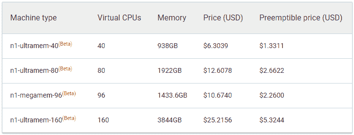

# 谷歌计算引擎现在提供高达 3844GB 内存的虚拟机

> 原文：<https://web.archive.org/web/https://techcrunch.com/2018/05/15/google-compute-engine-now-offers-vms-with-up-to-3844gb-of-memory/>

# 谷歌计算引擎现在为虚拟机提供高达 3844GB 的内存

有时候，你只需要更多的内存。当您想要运行像 [SAP 的 HANA](https://web.archive.org/web/20230324115539/https://www.sap.com/products/hana.html) 数据库这样的内存密集型企业应用程序或高性能计算工作负载时，尤其如此。到目前为止，如果你想让谷歌计算引擎运行这样的应用程序，你的选择最多是 624GB 的内存。[从今天](https://web.archive.org/web/20230324115539/https://cloudplatform.googleblog.com/2018/05/Introducing-ultramem-Google-Compute-Engine-machine-types.html?utm_source=feedburner&utm_medium=feed&utm_campaign=Feed%3A+ClPlBl+%28Cloud+Platform+Blog%29)开始，该公司将在此基础上引入三个新层，最高可达 3844GB 和 160 个虚拟计算核心。

这三种新机器被称为“n1-ultramem”，加入了谷歌现有的“n1-megamem”机器。不出所料，这种表现是有代价的。运行 40 个内核和 938GB 内存的“低端”机器一个月将花费你 3221 美元多一点。这款高端机器拥有 160 个内核和 3844GB 内存，每月 12，885.1716 美元就是你的了。

你可以在下面看到每小时的价格:

凭借这些新机器，谷歌现在可以在 [AWS 平台](https://web.archive.org/web/20230324115539/https://aws.amazon.com/ec2/instance-types/)上匹配高端内存优化选项，尽管由于更多的内核和更新的处理器，谷歌提供了略高的计算能力。

不出所料，谷歌指出这种机器的典型用例是运行 SAP HANA。该公司今天写道:“如果你因为无法为 SAP HANA 实施找到足够大的实例而推迟了向云的迁移，那么看看计算引擎吧。”“现在，当您的应用程序迁移到云时，您无需将数据库保留在本地。”

新的 ultramem 机器现在在三个[谷歌云区域](https://web.archive.org/web/20230324115539/https://cloud.google.com/compute/docs/regions-zones/)(美国中部 1、美国东部 1 和欧洲西部 1)可用，随后会有更多。