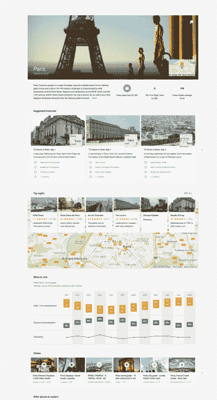

# 谷歌目的地扩展到桌面，在全球推广 

> 原文：<https://web.archive.org/web/https://techcrunch.com/2016/09/19/google-destinations-expands-to-the-desktop-rolls-out-worldwide/>

谷歌向旅游服务的进一步扩张并不仅限于通过推出新的谷歌旅行移动应用程序进行旅行规划——该公司还悄悄在谷歌网络搜索中推出了“目的地”旅行规划功能。[最初只为移动用户设计](https://web.archive.org/web/20221207204339/https://beta.techcrunch.com/2016/03/08/googles-new-destinations-feature-lets-you-plan-trips-right-from-its-search-engine-on-mobile/)，谷歌目的地专注于将寻找旅游信息的网络搜索者与目的地的更多信息联系起来，包括航班和酒店价格。

这一功能似乎让谷歌与主要旅游服务提供商展开了更直接的竞争，但谷歌尚未推出自己的住宿预订服务。相反，Destinations 将网络搜索者与 Hotels.com 或 Booking.com 等合作网站连接起来，并与谷歌航班连接起来，以比较机票价格。

在发布时，该公司表示，目的地主要是针对休闲旅行者，他们在计划旅行之前研究度假景点。这是新的谷歌旅行应用程序的前身，因为网络搜索通常是计划度假的第一步。

在目的地网站上，谷歌将根据你的搜索查询推荐最受欢迎的旅行。例如，搜索“欧洲度假”可能会显示“巴黎”、“伦敦”、“罗马”等目的地建议。它还会显示最便宜的航班、机票价格、酒店价格以及您在目的地可以进行的其他活动，如露营、航海、滑雪、徒步旅行、高尔夫、海滩、建筑等等。

你可以通过阅读来源于维基百科的信息描述来更详细地探索目的地，同时还可以了解气候、观看视频和查看游客的热门旅行日期。

该公司于今年三月首次将谷歌目的地引入移动网络，称去年移动设备上的旅游相关问题激增了 50%。

现在，这项服务也扩展到了桌面网络。谷歌拒绝对此举发表评论，但我们知道这是该服务的全球推广，此前仅在美国可用

桌面网站拥有以前只在手机上可用的所有相同功能，现在它支持英语、法语、意大利语、德语和西班牙语。