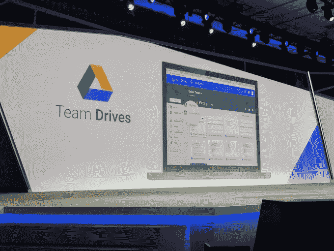
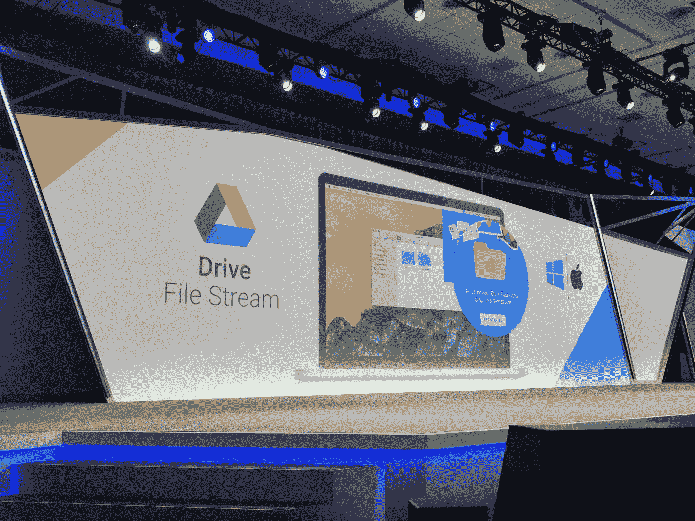

# 谷歌更新以商业用户为重点的驱动

> 原文：<https://web.archive.org/web/https://techcrunch.com/2017/03/09/google-drive-now-has-800m-users-and-gets-a-big-update-for-the-enterprise/>

谷歌今天宣布了对其在线文件存储服务 Drive 的一系列重大更新，这些更新都旨在使其对该公司的商业和企业用户更加有用。此外，该公司宣布，Drive 现在拥有 8 亿日活跃用户，这可能使其成为当今市场上最大的在线文件存储服务。

“你可能很熟悉 Google Drive，它本质上是一个个人文件存储解决方案，”谷歌工程副总裁 Prabhakar Raghavan 在今天发布之前的一次采访中说。“我们对此进行了研究，并认为基于 Unix‘ls’命令的图形用户界面并没有多大的附加值。所以我们问:如何才能真正成为企业中的一员。”

 也许这里最有趣的新闻是驱动文件流的推出。“如果你有一台 Windows 或 Mac 笔记本电脑，你不应该担心你有多少板载硬盘空间，你是否将正确的东西同步到正确的服务，所有这些都应该在幕后为你管理，”Raghavan 说。文件流将为您处理所有这一切。

然而，为了更好地支持企业，谷歌主要致力于让 Drive 成为更好的团队服务。这意味着团队驱动，例如，谷歌去年在预览版中推出的企业文件共享解决方案[，现在已经普遍可用。在持续了大约六个月的预览中，该团队发现了一些问题，特别是关于许可的问题，需要在全面推出之前解决，现在已经准备好向所有企业开放该项目。](https://web.archive.org/web/20230407083558/https://techcrunch.com/2016/11/21/google-opens-up-its-new-product-for-business-file-sharing-team-drives-to-early-adopters/)

Google Vault for Drive 现在也普遍可用，它提供工具来支持大型企业的归档和数据保留需求，尤其是在受监管的行业。Raghavan 告诉我，这是早就应该做的，但该团队正在等待更广泛的团队驱动发布，然后再将 Vault for Drive 也迁移到 GA。

通过此次更新，谷歌还将从安卓系统快速访问 iOS 和网络。Quick Access 使用该公司的机器学习智能来学习您的使用模式和跨其服务的交互，以便在正确的时间为您提供正确的文件。“当你开车来的时候，你在找一个文件。你知道它在那里，但是你想知道它是否与你共享，它是否是最近的文件，我是否应该搜索它，等等。，”Raghavan 说。“我们有足够的机器学习能力来观察你的信号，并提供我们认为你正在寻找的文件。”这项功能现在在普通的 Google Drive 和 Time Drive 中都可以使用。

