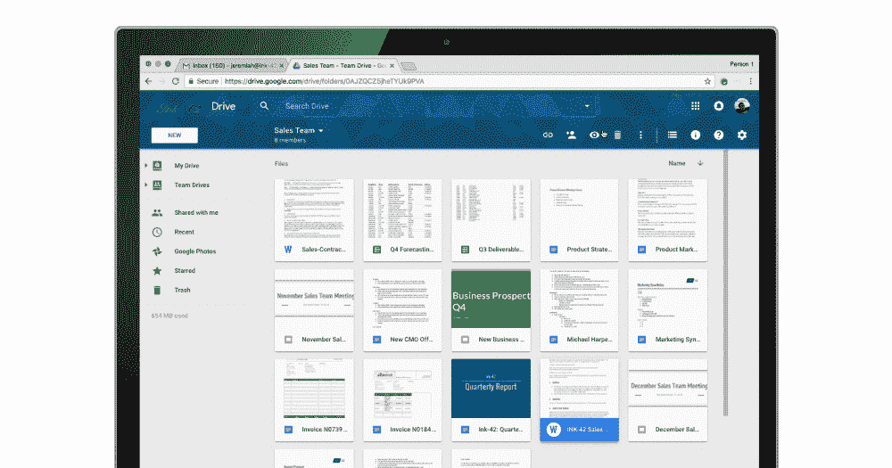

# Google Drive 现在让您可以轻松评论 Microsoft Office 文件、pdf 和图像 

> 原文：<https://web.archive.org/web/https://techcrunch.com/2018/02/07/google-drive-now-lets-you-easily-comment-on-microsoft-office-files-pdfs-and-images/>

# Google Drive 现在可以让你轻松评论微软 Office 文件、pdf 和图片

谷歌今天发布了 Google Drive 的更新，这将使团队和机构在与他们的同事和客户合作时更容易使用 G Suite 和微软 Office 的组合。

通过此次更新，Google Drive 用户现在可以在 Drive 预览窗格中轻松评论 Office 文件、pdf 和图像，而不必使用(可能需要付费)Microsoft Office 或 Acrobat Reader 等工具，也不必将它们转换为 Google Docs、工作表或幻灯片文件。这并不是你从 G Suite 或 Office 365 中获得的实时评论功能，但它仍然比必须在 Office 和 G Suite 之间不断转换文档要好。

这项功能加入了谷歌的其他举措，包括其 Outlook 的[驱动插件，旨在使 Office 和 G Suite 更具互操作性。当然，在谷歌的理想世界中，每个人都会使用 G 套件。但是，尽管谷歌在过去几年中在生产力市场上留下了印记，微软的办公工具](https://web.archive.org/web/20221207213712/https://support.google.com/a/answer/6165960?hl=en)[在大多数企业中仍然更受欢迎。对于大型企业来说尤其如此——这是一个谷歌觊觎的市场，但在很大程度上，它仍在努力争取。](https://web.archive.org/web/20221207213712/https://www.reuters.com/article/us-alphabet-gsuite/googles-g-suite-is-no-microsoft-killer-but-still-winning-converts-idUSKBN1FL3ZX)

