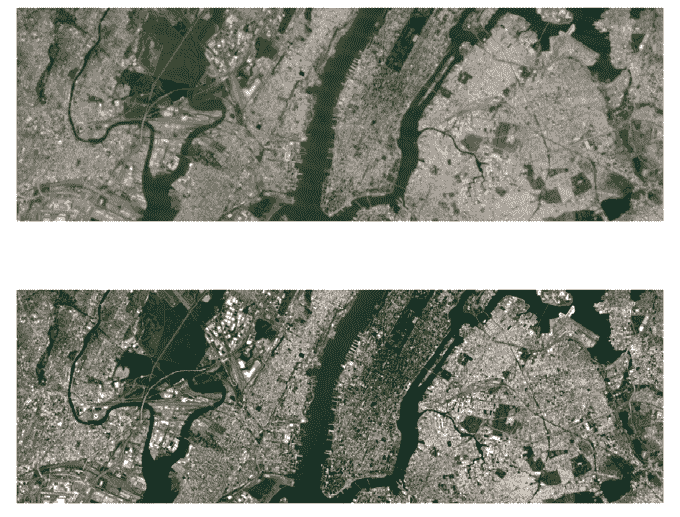

# 谷歌地球和地图获得更清晰的卫星图像

> 原文：<https://web.archive.org/web/https://techcrunch.com/2016/06/27/google-earth-and-maps-get-sharper-satellite-imagery-with-new-update/>

几年前，谷歌工程师想出了一种方法来拼接卫星图像以消除云层，给谷歌地球和谷歌地图用户一个更好、更全面的地面视图。今天，该公司重复了这一过程，但这一次使用了来自美国宇航局和美国地质调查局(USGS)的 Landsat 8 卫星的更新、更清晰的图像。

当谷歌第一次展示其从谷歌地球图像中消除条纹文物、云和其他大气影响的技术时，它使用的是 Landsat 7 的图像。

然而，Landsat 7 在 2003 年后拍摄的图像受到了 T2 硬件故障 T3 的影响，导致了数据的对角线缺失。然而，这仍然是当时可用的最佳图像，这迫使谷歌想出一种方法来消除谷歌地球上的这些差距。它通过分析大量图像来做到这一点，类似于它如何制作地球的这张全球延时图像[。](https://web.archive.org/web/20230224081613/http://googleresearch.blogspot.com/2013/06/building-visual-planetary-time-machine.html)

[gallery ids="1344413，1344416，1344415，1344412，1344417"]

现在，谷歌用 2013 年发射的地球资源卫星 8 号的图像更新了谷歌地球。今天下午，谷歌[在其谷歌地图博客](https://web.archive.org/web/20230224081613/https://maps.googleblog.com/2016/06/keeping-earth-up-to-date-and-looking.html)上宣布，新卫星能够以“更详细、更真实的颜色和前所未有的频率捕捉图像——每天捕捉的图像是陆地卫星 7 的两倍”。

像以前一样，新的谷歌地球图像也是无云的，这要归功于挖掘了近 1pb 的数据。该公司指出，这超过了 700 万亿像素，比银河系中估计的恒星数量多 7000 倍，它补充说，对这些数字感到很有趣。

结果是，谷歌地球上的图像比以前更清晰、更新。过去模糊的地方现在清晰了——例如，当你俯视纽约市时，你现在可以看到摩天大楼、建筑阴影和中央公园的棒球场等细节，这要归功于 Landsat 8。自从 1972 年开始运行的跟踪地球随时间变化的陆地卫星使其数据开放和可访问，这是谷歌能够在新图像可用时更新其地图产品的方式。

更新的地图现在在谷歌地图的[谷歌地球](https://web.archive.org/web/20230224081613/https://www.google.com/earth/)和[卫星](https://web.archive.org/web/20230224081613/https://www.google.com/maps/place/Columbia+Glacier/@61.0627392,-146.9727563,48960m/data=!3m1!1e3!4m5!3m4!1s0x56b6255e02d9248d:0x7f358b1491f13025!8m2!3d61.219722!4d-146.895278)层都是实时的。