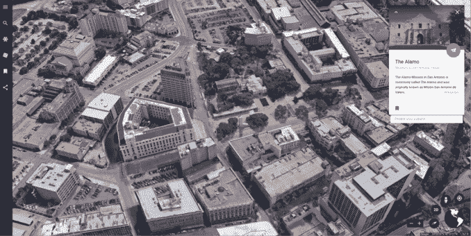

# 谷歌地球带着新的教育之旅和课程计划走进教室 

> 原文：<https://web.archive.org/web/https://techcrunch.com/2017/06/26/google-earth-comes-to-the-classroom-with-new-educational-tours-and-lesson-plans/>

# 谷歌地球带着新的教育之旅和课程计划来到教室

今年 4 月，谷歌[推出了一个经过改进的新版谷歌地球](https://web.archive.org/web/20221208034341/https://beta.techcrunch.com/2017/04/18/google-earth-for-chrome-android-gets-upgraded-with-guided-tours-more-discovery-features/)，其中包括了许多新功能，不仅通过使用地图和卫星图像来可视化地球，还允许用户通过旅游探索世界，并了解它的许多奇迹。今天，谷歌宣布将谷歌地球带入课堂。

新版 Google Earth 引入了一个名为 Voyager 的功能，提供科学家、非营利组织和其他故事讲述者和组织的导游展示。通过使用照片、360 度视频和谷歌地图街景，以及文本，这些旅行可以让你探索一个地区或多个地方。在发布会上，有来自 BBC 地球、简·古道尔、芝麻街和美国国家航空航天局等团体的参观。

在 ISTE(国际教育技术协会)会议上，谷歌今天宣布扩大其旅游阵容，包括 10 个新的故事，专门为教育用途设计。这项新工作的合作伙伴包括国家地理学会、PBS 教育、HHMI 生物互动和蓝色使命。

谷歌表示，这些故事将允许学生在课堂上使用谷歌地球探索世界，例如，通过访问哥斯达黎加热穹顶等偏远地区或与刘易斯和克拉克一起冒险。除了旅游本身，谷歌还为教师引入了课程计划和其他活动，以帮助更好地指导他们的课堂使用。

此外，Google Earth 本周将作为一项服务添加到 Google for Education 中，这意味着 it 管理员现在可以通过 Google Admin panel 管理该产品。

今天宣布了谷歌地球旅行者更新以及其他新的教育工具，包括一系列用于 Chromebooks 的 [STEM 工具](https://web.archive.org/web/20221208034341/http://g.co/EduChromebookApps) ( [Dremel 3D40 3D 打印机](https://web.archive.org/web/20221208034341/https://3dprinter.dremel.com/3d40-edu-printer-benefits)和 [littleBits 代码包](https://web.archive.org/web/20221208034341/https://shop.littlebits.cc/products/code-kit?utm_source=Google&utm_medium=Partner_blogpost&utm_campaign=launch_codekit&utm_content=20170626_code-kit-google-bundle-announce_awareness_edu))，学校可以以折扣价购买，以及用于 Cardboard 和 Daydream 的 [Expeditions](https://web.archive.org/web/20221208034341/https://edu.google.com/expeditions/?utm_source=blog&utm_medium=blog&utm_campaign=2016-gc-edu-runrate-orgsocial-other#about) 应用程序中的[自导模式](https://web.archive.org/web/20221208034341/https://www.youtube.com/watch?v=a824fnWE5S0&index=43&list=PLOU2XLYxmsIKC8eODk_RNCWv3fBcLvMMy)，允许学生和教师自行选择该应用程序提供的 600 多个虚拟实地旅行中的任何一个。