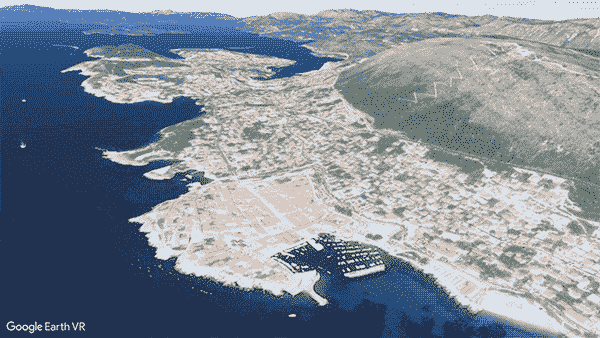

# 谷歌地球虚拟现实应用获得街景支持

> 原文：<https://web.archive.org/web/https://techcrunch.com/2017/09/14/google-earth-vr-app-gets-support-for-street-view/>

# 谷歌地球虚拟现实应用获得街景支持

Google Earth VR 今天进行了一点更新，将您的观点带到了世界探索虚拟现实应用程序的街道级别。

该应用程序将街景添加到应用程序中，以便用户可以轻松地在 3D 卫星视图和地面上的 360°相机拍摄之间转换。

导航新功能非常容易，用户可以使用 VR 控制器放大某个位置，并可以拉起镜头直接查看 360°球体。看起来你不能做太疯狂的事情，比如在照片上走来走去，但是这次更新让你更接近行动。

由于街景 VR 应用程序，Cardboard 和 Daydream 上的用户已经能够在 VR 中获得其中的一些视图，但谷歌地球 VR 目前在 HTC Vive 和 Oculus Rift 上可用。有点令人惊讶的是，该公司尚未为自己的平台发布精简版，但随着该公司准备增加合作伙伴，在新的位置跟踪系统上运行耳机，我们可能会看到像 Earth VR 这样更强大的应用程序获得支持。

5 月，谷歌[向房地产可视化初创公司 Matterport 等合作伙伴开放了](https://web.archive.org/web/20230224081611/https://techcrunch.com/2017/05/09/matterport-partners-with-google-to-bring-3d-street-view-perspectives-indoors/)街景 API，这样他们就可以直接在街景中查看他们已经创建的 360°内容。