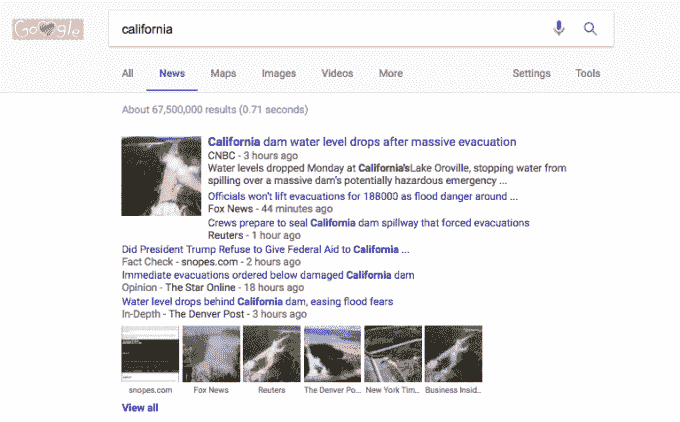

# 谷歌将事实核查新闻扩展到巴西、墨西哥和阿根廷 

> 原文：<https://web.archive.org/web/https://techcrunch.com/2017/02/15/google-expands-fact-checked-news-to-brazil-mexico-argentina/>

10 月，[谷歌宣布](https://web.archive.org/web/20221209205119/https://beta.techcrunch.com/2016/10/13/google-helps-speak-truth-to-power-adds-prominence-to-fact-checks-in-news/)它将开始在谷歌新闻垂直栏中突出显示经过事实核查的资源，让读者更容易找到与重大新闻相关的可靠事实信息来源的链接。今天，谷歌说它正在[将这一功能扩展到新的市场，包括巴西、墨西哥和阿根廷。](https://web.archive.org/web/20221209205119/https://blog.google/topics/journalism-news/expanding-fact-checking-google/)

该公司此前在美国以外推出了事实核查，去年 11 月增加了法国和德国。

谷歌表示，事实核查将在谷歌新闻、扩展的故事框以及谷歌新闻和天气 iOS 和 Android 应用程序中提供。此外，事实检查标签将在谷歌搜索的“新闻模式”中的新国家中可见。这意味着当你搜索一个给定的新闻话题时，你会看到事实核查的文章出现在主分组中，然后点击新闻选项卡。

这些文章将用标签“事实核查”来标识，它出现在 URL 的下面。这是谷歌在谷歌新闻中标记链接的几种方式之一——该公司在历史上也曾在有保证的情况下将文章标记为“深度”或“观点”。

在美国大选之后，网络信息来源的事实核查一直是一个激烈辩论的话题，党派网站和那些误报(或为了盈利而公然撒谎)的网站被认为影响了投票。“假新闻”的口号此后被桌子两边的人使用，但最令人震惊的是，特朗普总统将它作为一种[手段](https://web.archive.org/web/20221209205119/http://thehill.com/homenews/administration/313777-trump-berates-cnn-reporter-for-fake-news)来诋毁他不喜欢的新闻报道和媒体机构。

然而，事实核查资源并不是假新闻。相反，它们包含新闻故事引用的可验证的、来源于道德的事实，没有附带的旋转。

该行业近年来大幅增长。谷歌指出，现在全球有超过 [120 个组织](https://web.archive.org/web/20221209205119/https://reporterslab.org/fact-checking/)关注这个问题。

谷歌已经直接卷入其中，脸书也是如此，[它最终承认——嗯，也许它毕竟是一家媒体公司。](https://web.archive.org/web/20221209205119/http://fortune.com/2016/12/23/zuckerberg-media-company/)

[本月早些时候](https://web.archive.org/web/20221209205119/https://beta.techcrunch.com/2017/02/06/google-and-facebook-partner-for-anti-fake-news-drive-during-french-election/)，谷歌宣布 [Crosscheck](https://web.archive.org/web/20221209205119/https://blog.google/topics/google-europe/crosscheck-first-draft-newsrooms-french-elections/) ，这是一个涉及大约 20 家法国新闻编辑室和[初稿联盟](https://web.archive.org/web/20221209205119/https://firstdraftnews.com/)的项目，旨在帮助在法国选举期间核实新闻故事。谷歌还通过[数字倡议基金](https://web.archive.org/web/20221209205119/https://www.digitalnewsinitiative.com/)在全欧洲支持另外 10 个[项目](https://web.archive.org/web/20221209205119/https://www.digitalnewsinitiative.com/fund/)专注于事实核查。

想要自己的作品贴上事实检查标签的出版商可以在他们的故事中使用来自 schema.org 的 open [ClaimReview 模式。要使用这种标记，发布者必须满足所有事实检查资源共有的特定标准集。](https://web.archive.org/web/20221209205119/http://pending.schema.org/ClaimReview)[谷歌称](https://web.archive.org/web/20221209205119/https://support.google.com/news/publisher/answer/4582731#fact-checking)当出版商不遵守规定的准则时，它将从谷歌新闻中删除网站或忽略标记。