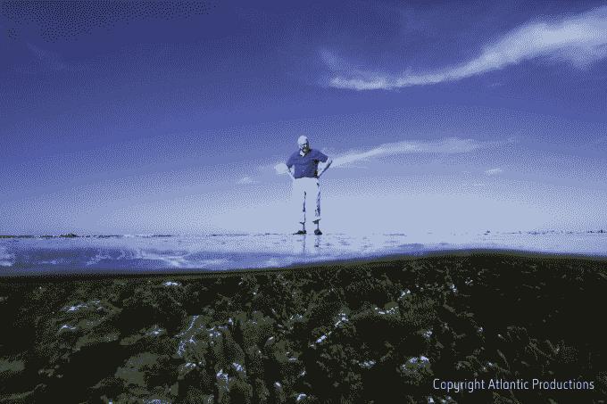

# 谷歌扩大其虚拟现实实地考察项目“探险”,推出一款适用于课堂和更多虚拟旅行的应用程序 

> 原文：<https://web.archive.org/web/https://techcrunch.com/2016/01/20/google-expands-its-vr-field-trips-program-expeditions-with-an-app-for-classrooms-more-virtual-tours/>

# 谷歌用一个教室和更多虚拟旅游的应用程序扩展了它的虚拟实地考察项目“探险”

谷歌正在扩展其 T2 探险项目，该公司努力将基于虚拟现实的实地考察带入课堂，为希望通过移动设备带学生进行虚拟探险的学校和教育工作者推出了一款专用的安卓应用。此外，谷歌表示，它将推出两个以上的“探险”——也就是说，该计划实现的虚拟体验:大堡礁和白金汉宫。

你可能还记得，[谷歌在去年春天的 I/O 大会上首次宣布了它的探险先锋计划](https://web.archive.org/web/20221209140458/https://beta.techcrunch.com/2015/05/28/google-launches-expeditions-an-app-for-shared-virtual-school-field-trips/#.s2agxy:T8EX)。当时，该公司表示将向教室发放一套工具，其中包括进行这些虚拟旅行所需的一切——如学生和老师所需的耳机和硬件。具体来说，套件[包括](https://web.archive.org/web/20221209140458/https://beta.techcrunch.com/2015/11/09/google-expands-its-vr-program-for-students-to-more-u-s-schools/)华硕智能手机和教师用平板电脑，外加一个路由器，用于连接所有设备，并在需要时离线运行探险应用。还提供了 Google Cardboard 或 Mattel 的 View-Master 虚拟现实浏览器。

硬件设备于 9 月份开始在美国发货，到 11 月份，[谷歌表示，超过 100，000 名学生](https://web.archive.org/web/20221209140458/https://beta.techcrunch.com/2015/11/09/google-expands-its-vr-program-for-students-to-more-u-s-schools/)在他们的课堂上使用了 Expeditions。

如今，该公司表示，随着该计划扩展到美国以外的国家，这一数字在全球范围内已经增长到 50 万

谷歌的虚拟实地考察是虚拟现实技术的一个更好的用例，因为它们允许学生体验他们可能永远没有机会访问的世界部分——无论是古代遗址(如马丘比丘的遗址)，峡谷或雨林等自然奇观，还是遥远的城市或地区，如南极洲。

由大卫·爱登堡爵士和 Alchemy VR 设计和制作的一个新的探险项目让学生们去澳大利亚大堡礁水下探险。

另一个由皇家收藏信托基金创建，提供白金汉宫的探险活动。谷歌表示，学生可以虚拟参观故宫，了解它的历史意义。(故宫还推出了自己的 [YouTube 360 视频，](https://web.archive.org/web/20221209140458/https://www.youtube.com/watch?v=gen0NgJjry4&feature=youtu.be)，所以任何有智能手机的人都可以虚拟参观。)

适用于手机和平板电脑的 Expeditions Android 应用程序今天推出测试版，并将向注册参与该计划的部分学校和教育工作者开放。参与者还将能够提供关于旅游的反馈，包括他们希望增加哪些功能，以及他们希望虚拟参观哪些新地方。

谷歌在为感兴趣的人提供[注册表格。](https://web.archive.org/web/20221209140458/https://docs.google.com/a/google.com/forms/d/1p0dtgldB1OeF7b9PjOesJei-IGdFahCoI_d5c2CL6ZU/viewform)