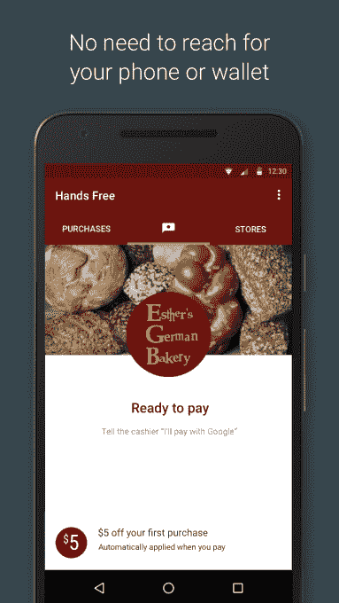

# 谷歌试验一种不用拿出手机就能支付的方式 

> 原文：<https://web.archive.org/web/https://techcrunch.com/2016/03/02/google-experiments-with-a-way-to-pay-without-taking-out-your-phone/>

谷歌今天推出了一个试点项目，引入了一种新的支付收银员的方式——包括把你的手机放在口袋里。

它被称为[免提](https://web.archive.org/web/20221115095402/https://get.google.com/handsfree/#?modal_active=none)，它是一种使用手机上的传感器将手机与销售点系统连接起来的方法。最终结果是，销售点设备已经知道你的手机的存在，当你想支付的东西，你可以通过免提。这项服务将于今天在旧金山湾区南部开始试点。

“当你想到一个用户，在许多情况下，现在的体验相当糟糕，相当笨拙，”谷歌产品管理高级总监 Pali Bhat 说。“你不希望你的手机挡道，你的钱包挡道，你不希望你的现金挡道。这些不便每天都会发生多次。”

用户基本上走到收银台，收银台可以检测到手机在该区域，并让销售点系统能够对用户的免提卡进行收费。用户告诉收银员，他们将“用谷歌支付”，并将他们的首字母缩写给收银员，收银员然后输入，交易就结束了。收银员也有一种方法来检测这个人的长相，以及是否是与谷歌个人资料相关的照片中的同一个人。

这里的目标是减少支付过程中的摩擦。这是 Android 和 Apple Pay 等工具的主要尝试:能够只用手机支付产品，而不必掏出钱包用信用卡支付。这对于谷歌和苹果这样的公司来说都是有益的，因为这有助于让支付更接近手机，并增加他们用手机上保存的信用卡向苹果或谷歌付款的机会。如果在手机上支付东西更容易，那么购买 Google Play 和 App Store 等应用和服务也更容易。

所有这些，如果成功的话，将有助于 Android Pay 继续流行。谷歌表示，在美国，每月约有 150 万新注册，其中 200 万个地点接受安卓点击支付。Bhat 说，这种工具可以与追溯到 Jellybean 的 Android 设备一起工作。

但如果这个工具听起来很熟悉，那应该是:Square 尝试开发了一种支付产品，让用户不用拿出手机就能向收银员付款。Bhat 说，这与一些地理围栏技术一起工作，而谷歌的工作略有不同，但原理或多或少是相同的——打开和关闭标签页，无需从口袋中拿出手机。我们的目标是让支付变得更加便捷，但这个应用并没有真正在 Square 上流行起来。在这种情况下，谷歌可以支持这个工具，它可以预装在 Android 设备中，但挑战仍然存在，甚至对谷歌来说也是如此。

鉴于 Android 和 Apple Pay 之间的巨大相似性，看看苹果是否会跟随谷歌进入这一领域将是一件有趣的事情。这是 Square 尝试过的东西，也许这意味着至少对这样的工具有一些需求，只要它做得正确。Bhat 说，这项技术——无论是欺诈检测还是来自谷歌地图的位置数据——都是谷歌相对于潜在竞争对手(比如，不可避免的，苹果)的优势。

“我们相信我们拥有一些非常独特的资产和技术，我们正在把它们带到桌面上，”Bhat 说。“其中之一是我们用来确保用户在商店附近的技术组合，另一个同样重要的部分是我们在安全方面所做的所有事情。我们认为这些技术非常关键，也是可以防御的。”

对于谷歌来说，使用这个工具的挑战将是双重的:让销售点服务上线，并让用户接受它。前者倾向于跟随后者，但谷歌有一套可供销售点制造商使用的 API。问题将是该产品是否已经达到足够大的规模，以证明销售点制造商将这项服务集成到他们的设备中——不仅与 Clover 等较小的销售点服务合作，还与 Ingenico 等较大的销售点服务合作。

“对我们来说，这不太关乎与其他公司的竞争，事实上，我们相信用户越多采用移动支付，对每个人都有好处，”Bhat 说。“我们思考这个问题的方式是，我们的目标是让移动支付对用户来说非常棒，不要担心任何事情，只要我们专注于用户并建立伟大的解决方案，这就是接下来的事情。”

该公司坚称这是一个试点项目——因此只能在旧金山湾区南部使用——以便收集用户反馈。这项服务在麦当劳和棒约翰的一些商店和试点地区提供。

Bhat 说:“我们的目标不是真的扩大规模，我们的目标是看看用户如何反应，商家如何体验。”“一旦我们从商家和消费者的反馈中做出所有可能的微调，我们就将开始扩大规模。在那之前，我们的目标不是让数百万的用户采用它。”