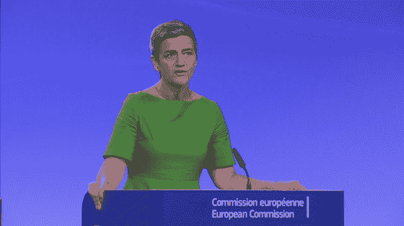

# 谷歌因购物搜索违反欧盟反垄断法被罚款 27 亿美元 

> 原文：<https://web.archive.org/web/https://techcrunch.com/2017/06/27/google-fined-e2-42bn-for-eu-antitrust-violations-over-shopping-searches/>

欧盟委员会对谷歌开出了破纪录的 24.2 亿€(约 27.3 亿美元)的罚单，原因是谷歌在 T2 的购物搜索比较服务违反了反垄断法——这被广泛认为是自 2004 年微软在 T4 做出决定以来欧洲最重大的反垄断裁决。

作为罚款金额的背景，谷歌(Alphabet)2016 年全年收入近 900 亿美元。欧盟委员会表示，罚款是根据谷歌在 13 个欧洲经济区国家的比较购物服务的收入计算的。

其调查结果指出:

*   **谷歌系统地将自己的比较购物服务放在显著位置**:当消费者在谷歌搜索引擎中输入一个与谷歌比较购物服务想要显示的结果相关的查询时，这些结果会显示在搜索结果的顶部或顶部附近。
*   **谷歌在其搜索结果中对竞争对手的比较购物服务进行了降级**:竞争对手的比较购物服务基于谷歌的通用搜索算法出现在谷歌的搜索结果中。谷歌在这些算法中加入了许多标准，结果导致竞争对手的比较购物服务被降级。有证据显示，即使排名最高的竞争对手服务平均也只出现在谷歌搜索结果的第四页，其他服务甚至出现在更靠后的位置。谷歌自己的比较购物服务不受谷歌通用搜索算法的限制，包括此类降级。

因此，欧盟委员会表示，它发现谷歌的比较购物服务在谷歌的搜索结果中更容易被消费者看到，而竞争对手的比较购物服务则不太容易被看到。

竞争委员会委员玛格丽特·韦斯塔格尔在新闻发布会上谈到这一裁决时说:“谷歌滥用其在一般互联网搜索领域的主导地位，给自己的比较购物服务带来了非法优势。它提升了自己的服务，降低了竞争对手的服务。它损害了竞争和消费者。根据欧盟反垄断法规，这是违法的。”

“这一决定要求谷歌改变其运营方式，并面对其行为的后果，”她补充道。

谷歌必须在 90 天内终止这一受到指责的行为，否则，每违反一天，将面临高达其母公司 Alphabet 全球日均营业额 5%的额外罚款。(尽管任何此类违规罚款都需要委员会做出单独决定，但将追溯到违规开始之日)。

在关于这一决定的官方声明中，维斯特格指出:“谷歌已经推出了许多创新产品和服务，给我们的生活带来了变化。这是件好事。但谷歌的比较购物服务策略不仅仅是通过让自己的产品优于竞争对手来吸引顾客。相反，谷歌滥用其作为搜索引擎的市场主导地位，在其搜索结果中推广自己的比较购物服务，并贬低竞争对手的服务。

Vestager 证实，谷歌将根据委员会的决定提出补救措施，尽管它也将面临(可能多年)监管机构的密切监控。

“该决定要求谷歌在 90 天内停止其非法行为。谷歌必须尊重一个简单的原则——它必须平等对待竞争对手和自己的比较购物服务。它必须采用同样的方法和流程，在搜索结果中定位和展示自己和竞争对手的比较购物服务，”她补充道。

“这意味着谷歌不能简单地停止它现在正在做的事情，并用其他具有相同或等效反竞争效果的做法取而代之。确保合规是谷歌的唯一责任。谷歌应该解释它打算如何这么做。我没有理由相信谷歌会不遵守。”

谷歌法律总顾问肯特·沃克·SVP 在一份声明中对委员会的决定发表评论说:“我们不同意今天宣布的结论。在考虑上诉时，我们将详细审查委员会的决定，我们期待着继续提出我们的理由。”

“当您在网上购物时，您希望快速方便地找到您想要的产品。广告商想要推销同样的产品。这就是为什么谷歌展示购物广告，以对双方都有用的方式将我们的用户与成千上万大大小小的广告商联系起来，”他补充道。

该公司表示，它将“在考虑上诉时，详细审查委员会的决定”。

维斯特格进一步指出，“任何因谷歌的非法行为而遭受损害的人都可以在国家法院前向谷歌索赔”。

今天的决定的另一个关键点是，委员会发现谷歌是互联网搜索领域的主导公司——这一发现现在将被纳入欧盟对其行为的任何其他反垄断调查。

不仅仅是其他现有的正式调查，比如与谷歌搜索广告有关的调查；在新闻发布会上，Vestager 指出，她的部门也知道与其他谷歌产品有关的投诉，如图像搜索、地图和旅游搜索。尽管她强调目前还没有对这些产品进行正式调查。

“关于谷歌可能滥用其作为搜索引擎的主导地位，为谷歌购物以外的谷歌产品提供非法优势的担忧，我想说几句，”她说。“我们一直在调查此事，今天的决定是一个先例。一个可用作分析这种行为合法性的框架的先例。”

然而，她补充说，她的部门将密切关注每个对谷歌产品存在担忧的额外市场的特定“特征、细节和差异”，以及“事实”。

“今天的决定表明，在欧洲，公司必须根据自己的价值竞争，”韦斯塔格尔说。“不管他们是在网上还是在大街上经营，不管他们是不是欧洲人。我们邀请您充分利用欧洲市场和 5 亿公民的潜力，因此也是 5 亿潜在客户。我们祝贺你的成功。

“但当你停止根据成绩竞争时，掌声也就停止了。你永远不会获得免费通行证来停止基于价值的竞争——无论是在你主导的市场，还是在其他市场。”

她补充说，正如谷歌现在被正式判定的那样，占主导地位的公司“需要更加警惕”，并有“特殊责任”确保它们不违反反垄断规则，强调这既适用于“它占主导地位的市场”，也适用于“任何其他市场”。

该案的主要原告 Foundem 的首席执行官兼联合创始人 Shivaun Raff 对欧盟委员会的决定表示欢迎，他说:“我们欢迎欧盟委员会今天宣布在谷歌搜索案中采取禁止决定。尽管€创纪录的 24.2 亿英镑罚款可能会占据头条，但禁止谷歌极其有害的搜索操纵行为要重要得多。对于消费者、企业和创新来说，没有比这更重要的竞争案例了。

“十多年来，谷歌的搜索引擎在决定我们大多数人在线阅读、使用和购买的内容方面发挥了决定性作用。如果不加以检查，这种看门人的权力就没有多少限制。谷歌可以部署其阴险的搜索操纵做法，在它选择的几乎任何在线领域霸占最大份额的流量和收入，在这个过程中悄悄地摧毁竞争、创新和消费者选择。”

欧盟委员会对谷歌的业务仍有两项未完成的正式调查——对其搜索广告行为的调查，以及它如何将其他谷歌产品与其安卓移动操作系统捆绑销售的调查(在一些欧洲市场，安卓移动操作系统占据了大约 80%的市场份额。)。

在这些正在进行的调查中，韦斯塔格对谷歌的言辞令人不寒而栗——暗示谷歌也倾向于得出反竞争行为的结论。尽管她强调还没有做出最终决定。

她说:“我们对谷歌在安卓和搜索广告方面的某些做法的另外两项未决调查也取得了良好进展。我们对这两种做法的初步结论是，它们违反了欧盟反垄断规则，这当然很重要，这只是初步结论。”

**Froogle >谷歌产品搜索>谷歌购物**

欧盟对谷歌购物服务(之前称为“Froogle”，后来称为“谷歌产品搜索”)投诉的调查可以追溯到六年多前，尽管欧盟委员会只是在 2015 年 4 月在[发布了一份正式的反对声明(SO)，并在去年 7 月](https://web.archive.org/web/20230115064431/https://techcrunch.com/2015/04/15/google-shopping-so-android-probe/)[发布了进一步的反对意见，当时它还发布了对 AdSense 的反对意见。](https://web.archive.org/web/20230115064431/https://techcrunch.com/2016/07/14/google-under-fire-again-from-europes-antitrust-regulator-over-adsense-comparison-shopping/)

第三项欧盟反垄断调查与谷歌的移动操作系统 Android 有关，并且仍在进行中。

欧盟的法律对占主导地位的公司规定了一项特殊义务，即不要滥用它们的权力试图损害现有的竞争对手或阻止新的进入者。而且，以谷歌为例，它的搜索引擎在该地区占据了绝对优势——占据了欧洲搜索市场超过 90%的份额。

谷歌购物案的原告指控该公司在其一般搜索结果中贬低竞争对手的垂直搜索服务，从而剥夺了他们的业务规模和市场准入。它还被指控将自己的购物服务放在搜索结果的显著位置。

[最初向欧盟委员会投诉谷歌操纵搜索结果是购物比较网站 Foundem 在 2009 年向欧盟委员会提出的——该网站称其服务在 2006 年推出几周后就从谷歌搜索结果中消失了，直到多年后才被重新编入索引——这明显损害了该行业。](https://web.archive.org/web/20230115064431/https://www.theguardian.com/technology/2010/nov/30/google-foundem-ec-competition-rules)

2012 年，在前任竞争专员的领导下，欧盟对这一投诉展开了正式调查，并拒绝了谷歌提出的三项和解方案。

现任竞争专员维斯特格于 2014 年上任，当时与此案相关的投诉人数超过 24 人。她接着在 2015 年发布了针对谷歌购物的[正式指控](https://web.archive.org/web/20230115064431/http://europa.eu/rapid/press-release_IP-15-4780_en.htm)，并在 2016 年发布了[补充指控](https://web.archive.org/web/20230115064431/http://europa.eu/rapid/press-release_IP-16-2532_en.htm)。

去年秋天，委员会给了谷歌一系列的延期以回应这些指控。该公司的正式回应终于在 11 月 12 日做出——当时它辩称:“我们搜索服务的发展和比价网站的表现之间根本没有有意义的关联。”

显然，委员会不同意谷歌对其行为的辩护。

在新闻发布会的问答环节中，维斯特格提到了该公司的一些观点——例如，它分析并驳斥了谷歌试图辩称的普通互联网搜索与“亚马逊世界”内的搜索存在竞争的观点。

“正是这种思路和这些论点在我们发出补充反对声明之前得到了深入研究。我们说，我们没有发现谷歌购物与亚马逊和易贝等竞争，”她说。“而原因就是因为他们不一样。在亚马逊和易贝，你可以在亚马逊和易贝的不同零售商中搜索。

“举例来说，你在谷歌购物中发现的一件事情是，你在亚马逊上找不到的一些主要品牌。因为这些品牌希望自己能接触到消费者——他们的搜索模式，他们的支付信息，他们最近购买的信息。你可以在谷歌购物上找到它们，但你无法在亚马逊世界找到它们。你也可以在与其他购物比较服务的关系中看到这一点。亚马逊可以成为谷歌购物的客户，但另一家比较购物服务公司不能成为谷歌购物的客户。”

“激烈的竞争应该是购物比较服务之间的竞争——这正是本案的要点，即谷歌利用其在一般互联网搜索中的主导地位，在这个特定市场上宣传自己，贬低购物比较服务的竞争对手，”她补充道。

今天，在一篇回应委员会裁决的博文中，谷歌继续对委员会的分析提出质疑 Walker 认为，在线购物的消费者希望“快速、轻松”地找到产品，这就是为什么它直接链接到产品，而不是购物比较服务。

“这就是为什么谷歌展示购物广告，以对双方都有用的方式将我们的用户与成千上万大大小小的广告商联系起来，”他写道。“我们认为欧盟委员会的网上购物决定低估了这种快速便捷联系的价值。虽然一些比较购物网站自然希望谷歌更突出地展示它们，但我们的数据显示，人们通常更喜欢直接带他们到他们想要的产品的链接，而不是他们必须重复搜索的网站。”

“我们认为我们目前的购物结果是有用的，是我们十年前展示的纯文本广告的一个大大改进的版本。展示包含图片、评级和价格的广告对我们、我们的广告商，尤其是我们的用户有利。只有当您的反馈告诉我们它们是相关的时，我们才会展示它们。成千上万的欧洲商家利用这些广告与亚马逊和易贝这样的大公司竞争，”他补充道。

在今天的新闻发布会上，Vestager 花了一些时间详细介绍了她对此案的处理方法，这是她从前任专员 Joaquín Almunia *，*那里继承的，在他试图与谷歌达成和解解决方案失败后。

“我选择以不同的方式推进这个案子，”她说。“在得出今天的结论之前，我们已经分析了大量的数据。这包括来自谷歌的 5.2TB 的实际搜索结果，大约相当于 17 亿次搜索查询。

“这是大量的数据。这当然是必要的——因为我们的决定必须基于确凿的证据。我们必须证明我们的观点，即使它们看起来很直观。”

例如，她指出，委员会研究了在谷歌搜索结果中占据突出位置的影响——首先分析了关于用户点击行为的研究，她说这“表明存在联系”(即突出位置和更多流量之间)。而且还要进行进一步的测试，以确定用户点击顶部结果是否是因为它更相关，而不是因为它最突出。

“我们模拟了当你交换一般结果的排名时会发生什么——这证实了同样的结果在排名更高时会获得更多的流量，”她指出。

尽管她表示，欧盟委员会尚未发现谷歌“在降级竞争对手时”意图的具体证据，但显然已经找到足够的证据，证明谷歌算法系统降级竞争对手服务的影响，以及相反推广自己的服务，从而得出结论，谷歌的行为违反了欧盟反垄断法。

“委员会发现有证据表明，在谷歌申请降级后，某些竞争对手网站的点击量突然下降了 90%以上，”维斯特格指出。"他们中的一些人适应并设法恢复了部分流量，但从未完全恢复."

“市场准入门槛很高。越多的消费者使用搜索引擎，它对广告商就越有吸引力。她补充说:“长期产生的利润可以用来吸引更多的消费者，同样，搜索引擎从消费者那里收集的数据越多，它就越有能力改善搜索结果。”

她表示，谷歌在所有提供比价购物服务的地方都实施了与价格比较服务相关的“非法行为”——最早从 2008 年开始，先是在德国和英国，然后是法国、意大利、荷兰、西班牙、捷克共和国，最后是奥地利、比利时、丹麦、挪威、波兰和瑞典；她说这个地区有 4 . 18 亿居民。

“谷歌的做法剥夺了数百万欧洲消费者竞争、真正选择和创新的全部好处，”她补充道。

据韦斯塔格尔称，在与谷歌和涉案第三方就任何需要编辑的机密“商业秘密”达成一致后，委员会的完整决定将在适当的时候在网上公布。