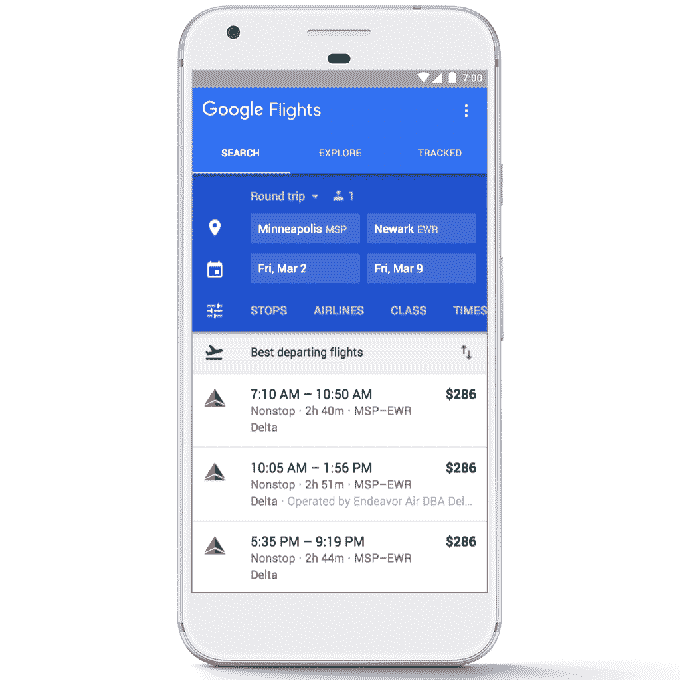

# 谷歌航班现在可以预测航班延误——在航空公司预测之前

> 原文：<https://web.archive.org/web/https://techcrunch.com/2018/01/31/google-flights-will-now-predict-airline-delays-before-the-airlines-do/>

# 谷歌航班现在可以预测航班延误——在航空公司之前

谷歌正在为其[谷歌航班](https://web.archive.org/web/20230124084236/https://www.google.com/flights/)搜索引擎推出一些新功能，以帮助旅行者解决航空旅行中一些更令人沮丧的问题——延误和更便宜的基本经济舱票价的复杂性。然而，在延误方面，谷歌航班不会只是直接从航空公司获取信息——它将利用对历史数据的理解和机器学习算法来预测航空公司自己尚未标记的延误。

谷歌解释说，数据和人工智能技术的结合意味着它可以在任何形式的官方确认之前预测一些延迟。谷歌表示，在对预测至少有 80%的信心之前，它不会在应用程序中标记这些。(当然，你仍然应该准时到达机场，但至少你知道一旦到了那里你将面临什么。)

它还会提供延误的原因，如天气或飞机晚点。

谷歌指出，你可以通过搜索你的航班号或航空公司和飞行路线来追踪你的航班状态。延迟信息将出现在搜索结果中。

今天增加的另一个新功能旨在帮助旅客了解机票价格中包含和不包含的基本经济舱票价。

这些低价机票通常是预算有限的旅行者的唯一选择，但是它们有一些限制，这些限制会因航空公司的不同而不同。

谷歌航班现在将显示与这些票价相关的限制，如使用头顶空间或选择座位的限制，以及票价的额外行李费。它最初是为美国航空公司、达美航空公司和联合航空公司在全球范围内的航班这样做的。

这些变化仅仅发生在谷歌航班为网络搜索者增加价格跟踪和交易以及酒店搜索功能的一个月后。

新增内容似乎特别针对当今的旅游初创公司和企业，比如 Hopper[刚刚增加了酒店搜索，](https://web.archive.org/web/20230124084236/https://techcrunch.com/2017/10/25/hopper-expands-its-price-prediction-technology-to-hotels-initially-in-nyc/)并使用大数据来分析机票价格和其他因素；或者是谷歌自己的旅游应用 Google Trips 的竞争对手 TripIt，[最近推出了](https://web.archive.org/web/20230124084236/http://www.androidpolice.com/2018/01/24/tripit-now-lets-know-long-airport-security-line-real-time/)安检等待时间。(鉴于谷歌已经通过谷歌地图跟踪人们的活动，了解了地区业务的繁忙时间，所以看到它接下来实施安全等待时间也就不足为奇了。)

这些功能也是谷歌机器学习和大数据能力的真实演示，特别是在预测航班延误的情况下。因为在航空公司发布官方声明之前，你不能对警报采取行动，它们很大程度上只会在你已经紧张的旅行体验上引起更多的焦虑。