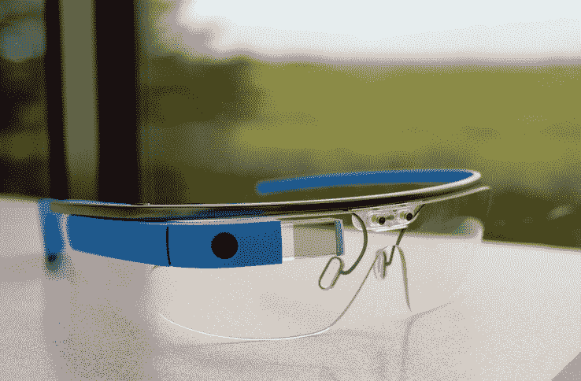

# 谷歌眼镜退出 X 实验室，团队现在向托尼·法德尔汇报

> 原文：<https://web.archive.org/web/https://techcrunch.com/2015/01/15/google-glass-exits-x-labs-as-explorer-program-shuts-down-team-now-reports-to-tony-fadell/>

# 谷歌眼镜探索者计划关闭，团队现在向托尼·法德尔报告

谷歌发言人今天向我们证实,[谷歌眼镜项目](https://web.archive.org/web/20221004163527/https://www.google.com/glass/start/)今天进入[一个新阶段](https://web.archive.org/web/20221004163527/https://plus.google.com/+GoogleGlass/posts/9uiwXY42tvc),因为该公司正在将其从谷歌 X skunkworks 中移出，并将其转变为公司内部的一个独立项目。

作为这一变化的一部分，谷歌眼镜现在将由苹果前高管、Nest 创始人托尼·法德尔(Tony Fadell)监管。就像以前一样，日常运营将由[艾薇·罗斯](https://web.archive.org/web/20221004163527/https://www.linkedin.com/pub/ivy-ross/6/a69/446)负责，而法德尔继续在谷歌内部运营 Nest。值得强调的是，玻璃不会成为 Nest 的一部分。

如果你仍然想以 1500 美元的价格购买谷歌目前版本的谷歌眼镜——很可能你不想买——那你就要抓紧时间了:谷歌将于下周一停止其浏览器项目。然而，该公司将继续向企业、开发商和教育机构销售，并计划投资于面向企业开发商和公司的 Glass at Work。

目前的眼镜用户仍然可以像以前一样使用眼镜，但他们不会收到任何新的软件更新。

至于目前正在开发谷歌眼镜应用的开发者，一位发言人告诉我们，公司仍然鼓励他们继续开发他们的应用。鉴于该计划的不确定性以及未来几个月可能出现的任何变化，许多开发人员可能会暂时搁置他们的努力，直到他们听到更多关于谷歌平台的计划。

新版谷歌眼镜可能会在今年晚些时候发布，最有可能是在谷歌年度 I/O 开发者大会前后。

正如谷歌发言人告诉我们的那样，探索者项目背后的想法总是想看看人们会如何使用这项技术。既然谷歌已经收到了相当多的反馈——有好有坏——它决定关闭该项目，以便专注于未来版本的谷歌眼镜。

谷歌眼镜最近变得相当安静，自去年夏天以来，软件更新很少。谷歌还将其营销从消费者转向商业用例。在法德尔的领导下，我们可能会看到围绕谷歌眼镜的另一个战略转变，特别是如果他将苹果的一些秘密带到这个项目中，这个项目迄今为止主要是公开开发的。

