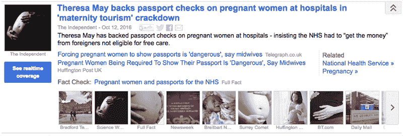

# 谷歌开始在新闻 中强调事实核查

> 原文：<https://web.archive.org/web/https://techcrunch.com/2016/10/13/google-helps-speak-truth-to-power-adds-prominence-to-fact-checks-in-news/>

# 谷歌开始在新闻中强调事实核查

今天，谷歌为其广受欢迎的谷歌新闻服务添加了一个新的“事实核查”标签。该网站从多个来源聚合流行的及时新闻，并传统地用“观点”、“本地来源”和“高度引用”等标签将它们分组现在，读者可以在热门新闻旁边看到突出显示的事实核查。

该公司将事实核查网站的日益突出列为创建这一标签的原因之一。内容创建者将能够使用一个[有限的预定义源标签集，为自己的帖子添加新的事实检查标签。](https://web.archive.org/web/20230316065228/https://support.google.com/news/publisher/answer/4582731#fact-checking)

[来自 Schema.org 的索赔审查](https://web.archive.org/web/20230316065228/http://pending.schema.org/ClaimReview)将用于汇编和组织提供事实背景的报道。模式社区为互联网上的结构化数据构建标记。该组织由谷歌赞助，但也得到了微软、雅虎和 Yandex 的支持。

美国和英国的普通读者可以在网络和移动版服务的新闻故事[的扩展视图中找到事实的金块。手指交叉新工具不会导致声称](https://web.archive.org/web/20230316065228/http://news.google.com/)[地球真的是平的](https://web.archive.org/web/20230316065228/https://flatearthscienceandbible.wordpress.com/2016/02/16/introduction-to-the-flat-earth-how-it-works-and-why-we-believe-it/)上升到我们的饲料顶端的故事。

在支持页面上，谷歌解释说，如果帖子被不当标记为事实核查，它[有权干预](https://web.archive.org/web/20230316065228/https://support.google.com/news/publisher/answer/4582731#fact-checking)。

“请注意，如果我们发现网站不符合这些标准的`ClaimReview`标记，我们可以根据自己的判断，要么忽略该网站的标记，要么从谷歌新闻中删除该网站。”

这可能无法阻止虚假新闻在谷歌新闻中出现，但会让事情变得更加困难。谷歌新闻上似乎还没有传播很多事实核查的故事。我们在快速访问该网站时找不到任何信息，但鉴于美国总统大选的及时性，我们只能期待该系统在未来几周内得到检验。