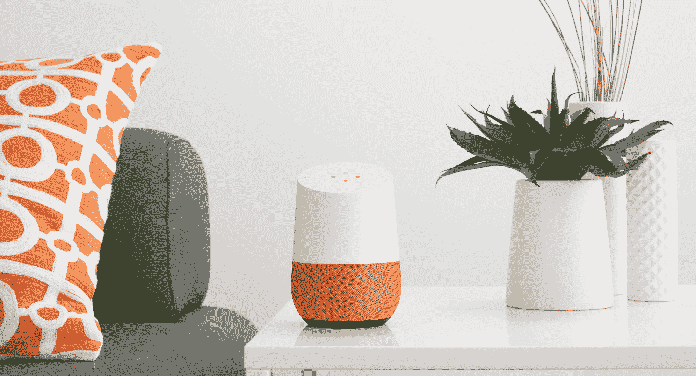
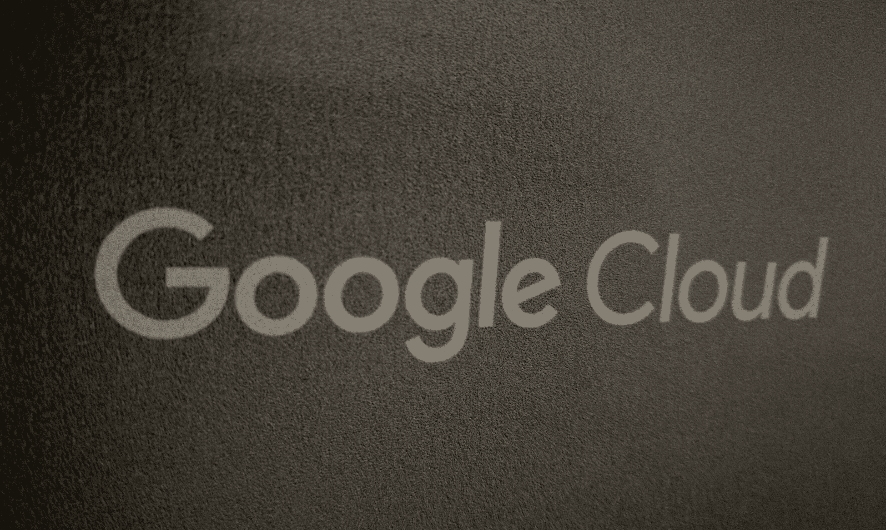

# 谷歌点击重置按钮 

> 原文：<https://web.archive.org/web/https://techcrunch.com/2016/12/22/google-hits-the-reset-button/>

八年来，谷歌总是在旧金山举办它一年中最大的活动——I/O 开发者大会。

然而，今年它把它搬到了校园旁边山景城的一个露天剧场。回过头来看，这一举动现在看来具有象征意义。从很多方面来说，2016 年是谷歌变革的一年:这是令人惊讶的[谷歌/Alphabet 重组](https://web.archive.org/web/20221007025242/https://beta.techcrunch.com/2015/10/02/google-becomes-alphabet/)后的第一个整年，也是谷歌[认真对待自己的硬件](https://web.archive.org/web/20221007025242/https://beta.techcrunch.com/events/google-hardware-2016/event-home/)、云和[企业](https://web.archive.org/web/20221007025242/https://beta.techcrunch.com/2016/09/29/google-combines-all-of-its-cloud-services-under-the-google-cloud-brand/)的一年。在整个行业，2016 年也是人工智能和机器学习的一年——谷歌在这方面非常领先。

让我们来澄清一下谷歌的失误:其 [Allo](https://web.archive.org/web/20221007025242/https://beta.techcrunch.com/tag/google-allo/) 和 [Duo](https://web.archive.org/web/20221007025242/https://beta.techcrunch.com/tag/google-duo/) 消息应用的推出仅仅导致了大规模的混乱和极少的采用；智能手表正在苦苦挣扎，谷歌将 Android Wear 2.0 的发布时间推迟到明年年初对其可穿戴设备战略没有帮助；谷歌类似乐高的智能手机项目 Project Ara 也[猝死](https://web.archive.org/web/20221007025242/https://beta.techcrunch.com/2016/09/01/google-ends-modular-phone-project-ara-though-licensing-may-be-an-option/)。

但考虑到谷歌提供的产品数量，该公司偶尔失察也就不足为奇了。让我们开始精彩的部分。

谷歌利用去年的时间来强化其产品组合，并追逐此前一直徘徊不去的潜在利润市场。硬件就是一个明显的例子。在与不同的硬件制造商合作多年来以 Nexus 品牌生产基本上是 Android 参考手机之后，谷歌今年放弃了这一努力，并以自己的名字和品牌推出了其 [Pixel 手机](https://web.archive.org/web/20221007025242/https://beta.techcrunch.com/2016/10/18/google-pixel-xl-review/)。

这本身将是一件大事，但谷歌也推出了[谷歌主页](https://web.archive.org/web/20221007025242/https://beta.techcrunch.com/2016/11/03/google-home-review/)(其亚马逊回声挑战者)[、谷歌 Wifi](https://web.archive.org/web/20221007025242/https://beta.techcrunch.com/2016/10/04/google-wifi-offers-modular-customizable-home-networking/) 、新版 Chromecast 加密狗和 [Daydream VR 耳机](https://web.archive.org/web/20221007025242/https://beta.techcrunch.com/2016/11/10/googles-daydream-view-vr-headset-is-comfy-and-uncomplicated/)。这是谷歌前所未有的硬件数量——甚至更多，因为几乎所有这些都是从头开始开发的。

如果你需要任何证据来证明谷歌对制造自己的硬件是认真的，那就再读一遍这份清单(你甚至可以把 Pixel C 平板电脑加入其中，尽管它在 2015 年末推出，并一直存在至今)。

许多这些产品和谷歌整体人工智能雄心的核心是[谷歌助理](https://web.archive.org/web/20221007025242/https://beta.techcrunch.com/2016/05/18/google-unveils-google-assistant-a-big-upgrade-to-google-now/)，谷歌努力构建一个跨产品线的对话式个人助理。

当然，该公司对机器学习和人工智能的兴趣并不新鲜，这位助手建立在多年开发谷歌知识图和其他项目(包括谷歌[建立自己的机器学习芯片](https://web.archive.org/web/20221007025242/https://beta.techcrunch.com/2016/05/18/google-built-its-own-chips-to-expedite-its-machine-learning-algorithms/))的基础上。

但在 2016 年，谷歌发现了一系列新的表面，以突出其对消费者来说实际上有意义的人工智能。虽然 Google Home 的助手不是第一个上市的，但我发现它比亚马逊目前的努力更聪明、更有用。通过 [TensorFlow](https://web.archive.org/web/20221007025242/https://www.tensorflow.org/) 和其他项目，谷歌也找到了一种方法，让开发者社区拥有工具来复制和改进自己的工作(最终也会回流到自己的产品中)。

随着谷歌在生产力领域与微软和其他公司竞争，它也开始将一些人工智能引入自己的生产力工具。这些工具以前被归入谷歌工作(或教育)应用程序的名下。今年，谷歌认为这个名字不够好，所以它选择了“G 套件”。我不喜欢这个名字，但这也显示了谷歌是如何试图重新设定期望的。

事实上，也许最能清楚显示谷歌去年经历的变化的领域是它的谷歌云部门。正如谷歌[在 9 月下旬的一次小型独家活动上宣布的](https://web.archive.org/web/20221007025242/https://atmosphere.withgoogle.com/live/horizon)，G 套件及其面向开发者和小型企业的所有产品现在都在谷歌云的保护伞之下。在内部，谷歌一直使用“谷歌企业”作为所有这些努力的名称，但不知何故决定这也不是正确的名称。

很多变化——以及谷歌在亚马逊和微软在过去几年取得巨大进展后，让其生产力工具和云平台徘徊了一段时间后，显然再次努力最终认真对待企业——归结于谷歌在 2015 年让黛安·格林(Diane Greene)加入。她的到来表明，苹果不会将这样一个利润丰厚的市场拱手让给竞争对手。

在过去的一年中，它终于开始为其云平台开放更多的数据中心，推出了一系列新的云产品(包括一系列基于机器学习的服务)以更好地与 AWS 和 Azure 竞争，将 Firebase [作为其核心开发平台](https://web.archive.org/web/20221007025242/https://beta.techcrunch.com/2016/05/18/google-turns-firebase-into-its-unified-platform-for-mobile-developers/)，以及[收购了一家培训公司](https://web.archive.org/web/20221007025242/https://beta.techcrunch.com/2016/05/02/google-acquires-synergyse-an-interactive-training-service-for-google-apps/)以帮助企业教员工如何使用~~谷歌应用~~G 套件应用。它甚至推出了低代码的企业应用开发工具。它还对 G Suite 应用程序进行了大量更新，以帮助它们对大型企业更加有用。

大多数这些都是小动作，但综合起来，它们表明谷歌已经按下了企业努力的重置按钮，并开始追逐这个市场。

Alphabet/Google reorg 可能有助于推动这些变化，但它也使事情变得复杂。Waymo，原名谷歌的自动驾驶汽车项目，[现在是 Alphabet 公司](https://web.archive.org/web/20221007025242/https://beta.techcrunch.com/2016/12/13/googles-self-driving-car-unit-spins-out-as-waymo/)，比如。不过，它似乎确实达到了自己的目的，让谷歌自己审视自己的项目，并在继续印刷几乎所有资金的广告机器之外寻找收入机会。

至于明年？Google I/O 将再次出现在 Moscone(据我所知)，但我认为 Google 还没有彻底改造自己。