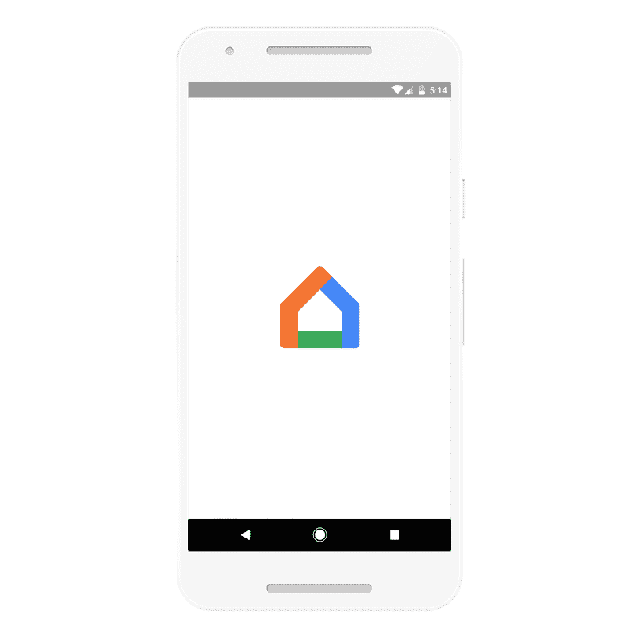

# Google Home 现在可以识别多达六种声音，并给出个性化的回应 

> 原文：<https://web.archive.org/web/https://techcrunch.com/2017/04/20/google-home-can-now-recognize-up-to-six-voices-and-give-personalized-responses/>

# Google Home 现在可以识别多达六种声音，并给出个性化的回应

Google Home 终于获得了自去年推出以来用户一直渴望的功能:它现在可以区分不同的声音，并以个性化的回复进行回复。到目前为止，你只能将一个账户连接到一个谷歌主页，这意味着你只能获得一个人的日历信息。如果你是单身或者没有室友，这完全没问题，但是当你和别人住在一起的时候，这是一个非常明显的问题。

 随着今天的更新，当你阅读这篇文章时，它应该会在美国推出(并且将在未来几个月内进入英国)，最多六个人可以共享一个 Google Home。所以现在，当你问你早上的通勤时间时，你会得到你的路线信息，而不是你配偶的。播放列表、时间表、购物清单、旅行信息以及你想向谷歌助手询问的其他各种个性化信息也是如此。

训练你的 Google Home 理解不同声音的过程非常简单。一旦这个功能可用，你会在 Google Home 应用中看到一个卡片，告诉你“多用户可用”然后，新用户可以将他们的谷歌账户与家庭联系起来，并训练助手通过说几次“OK Google”或“嘿 Google”唤醒词来识别他们，这样谷歌的神经网络就可以学习他们的声音。

虽然谷歌对此没有任何官方评论，但这项新功能也可能最终开辟一条道路，带来一些谷歌助理的功能，如创建笔记、提醒和活动，这些功能目前在 Home 上是缺失的(例如，但在 Android 上是可用的)。这些功能在一台设备上没有太大意义，尽管它天生是公用的，但只能识别单一的声音。

也许这也为谷歌在去年 I/O 开发者大会的发布视频中展示的一项功能开辟了空间:主动预警。目前，Google Home 主要是一个被动的设备，等待你的命令。例如，与助手(以及之前的 Google Now)不同，它不会提醒你什么时候该去机场。识别不同声音的能力意味着一些人可能围绕该功能的一些(尽管不是全部)隐私问题无法解决(尽管这将超出识别谁说唤醒词的范围)。

[https://web.archive.org/web/20221224145038if_/https://www.youtube.com/embed/RZNqSy-zFXo?feature=oembed](https://web.archive.org/web/20221224145038if_/https://www.youtube.com/embed/RZNqSy-zFXo?feature=oembed)

视频