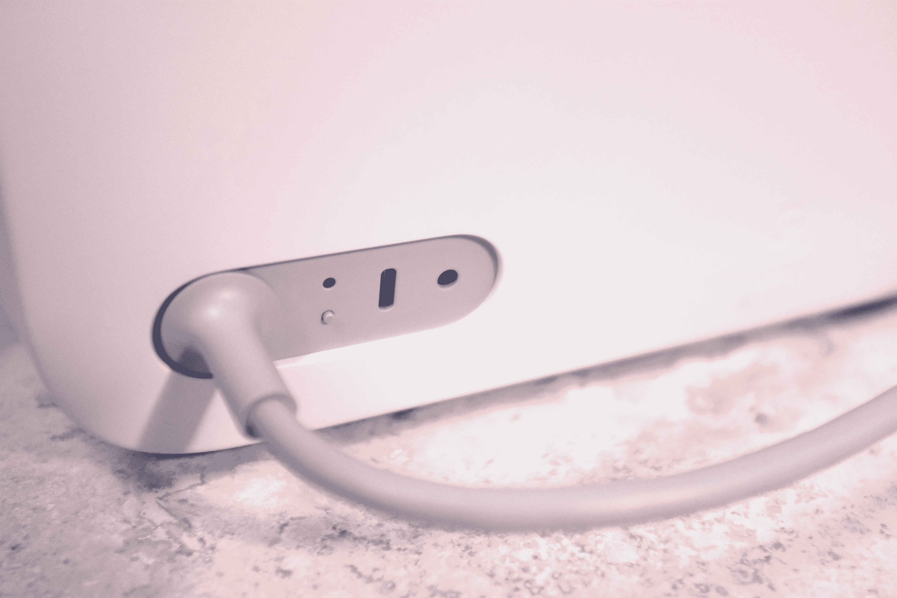
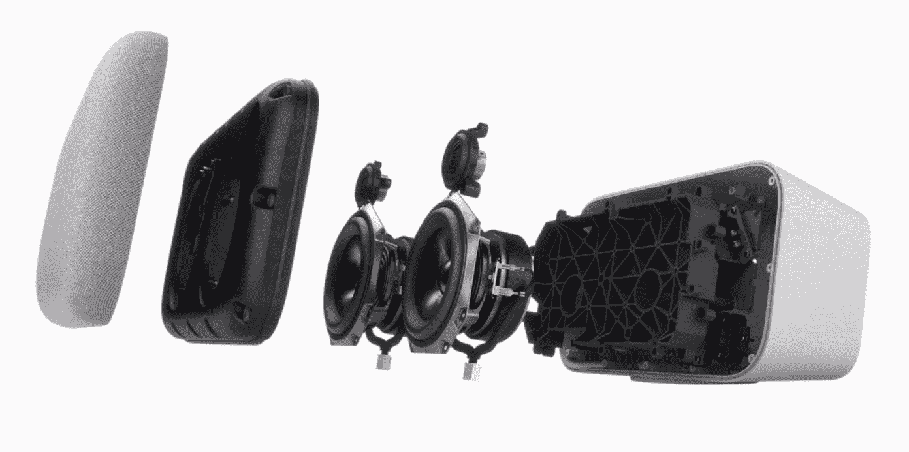
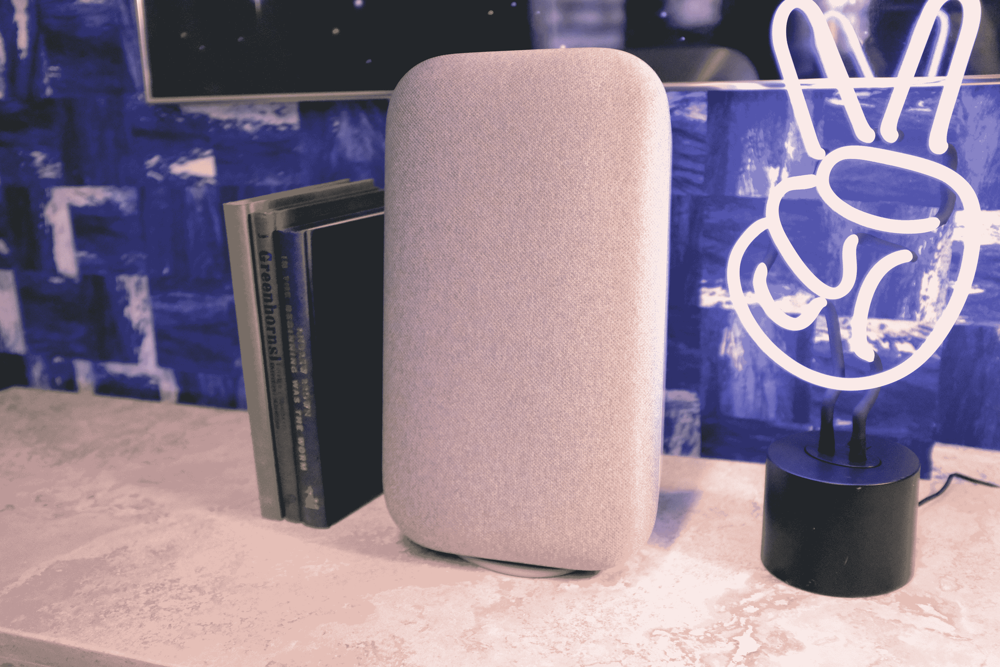

# Google Home Max 评论

> 原文：<https://web.archive.org/web/https://techcrunch.com/2017/12/21/google-home-max-review/>

购买设备或智能助手的日子很快就会结束。亚马逊和谷歌都明确表示，他们打算让各自的人工智能设备不可知，因此独立的谷歌主页或亚马逊回声的日子可能屈指可数。

Assistant 和 Alexa 已经被嵌入到从恒温器到灯具的所有东西中。为了让智能音箱继续在家庭中占有一席之地，它们首先要成为音箱，其次才是智能音箱。专有产品已经在与知名音频品牌如 [Sonos、索尼和 JBL](https://web.archive.org/web/20230307050428/https://techcrunch.com/2017/08/31/alexa-and-google-assistant-homepod-competitors-are-coming-from-sony-harman-and-more/) 竞争。因此，我们看到亚马逊、苹果和谷歌在最近几个月都朝着这个方向前进也就不足为奇了。

新的 Echo 在音频方面有所改善，但[谷歌 Home Max](https://web.archive.org/web/20230307050428/https://techcrunch.com/2017/12/11/googles-premium-home-max-smart-speaker-goes-on-sale/) 和[苹果 HomePod](https://web.archive.org/web/20230307050428/https://techcrunch.com/2017/11/17/apple-pushes-homepod-release-to-early-2018/) 为未来提供了类似的愿景，智能助理是专注于提供高质量、隆隆作响、充满房间的音频的设备的一个很好的红利。随着价格接近每件 400 美元，最好是这样。

## 刷爆

谷歌 Home Max 不在这里。它又大又重。这东西重 12 磅。我痛苦地意识到这个事实，因为我愚蠢地让谷歌把它送到我们的办公室，然后我把它扔在背包里带回家测试。我目前正在调查我们公司针对我背部肌肉拉伤的员工补偿政策。

当然，我是一个古怪的局外人(在很多方面，但现在让我们专注于这一点)。家用 Max 并不是一款便携式扬声器。事实上，如果美学在这种情况下决定了目的，它实际上是一件家具，前面覆盖着织物，与谷歌 Home 的其他产品保持一致。

从设计角度来看，Home Max 并不是一款华而不实的扬声器。像其他家居系列一样，Max 的设计与周围环境融为一体。这是一个四四方方的设计，有黑色或白色(木炭色或粉笔色，如果你愿意的话)。Max 是一款极简主义者，将按钮换成了顶部的简单触摸板，并与织物正面下方发光的四个 LED 点进行交互。这是一个好看的设备；低调，真的。

顶部的触摸面板控制音量和开关系统——尽管有时我很难让它正常工作。同样值得注意的是，设备背面有一个开关，可以禁用麦克风——这是一个关键的隐私功能，不过如果该公司像亚马逊对 Echo line 那样让它更突出一点，那就更好了。

## 回到墙边

从设计的角度来看，也许最有趣的是，谷歌在这里避开了 360 度音频。几乎所有独立的智能家居音箱都是这样制造的，HomePod 也是如此。然而，这里的想法是，大多数人不会真的把扬声器放在房间中央。我的情况就是如此。我把 Max 带回家，找了一面墙把它靠着。

像 HomePod 一样，Max 承诺根据周围环境定制音频足迹。但该系统不是试图创建周围环境的完整音频图像，而是将其音频指纹基于后墙，因为你听到的大部分声音都是反射回你的声音。

谷歌认为这项功能是“智能声音”，根据墙壁调整音频均衡。该系统利用板载麦克风聆听低音在墙壁上的反弹，并相应地调整声音设置。根据谷歌的说法，整个过程只需要几秒钟，但系统将这一过程延长到 30 秒，以便逐渐缓解到一种新的声音。

这种调整很微妙，很难察觉。而且，老实说，你可能不会经常碰到这种情况，因为这个系统移动起来很麻烦。

## 最大摇滚

Max 听起来不错。但是 399 美元好吗？一句话，没有。鉴于智能扬声器市场的发展方式，我不会对假期后不久价格下降感到太惊讶——但就目前情况而言，Max 并没有真正达到这样一个昂贵系统的预期。

但这听起来确实足够好，许多用户都会非常高兴。音频响亮清晰，低音像一个 mofo，由一对 4.5 英寸的低音扬声器提供。音频质量足够稳定，公司不需要添加低音来增强音质，但低音相当强烈。幸运的是，你可以通过 Google Home 应用根据自己的喜好调整这些设置。

整个“房间填充”体验也不是问题。诚然，我在纽约市有一套公寓，所以我的空间不是最……苛刻的，但单曲《Max》不仅仅是成功了，而且继续听起来很棒，即使是在高音量下，这让我可怜的邻居非常懊恼(但那些混蛋在搬进一位科技作家的隔壁时，知道他们签了什么)。

对于那些需要超过最大火力的人来说，购买两个将会把他们变成立体声扬声器，增强体验——当然，也将价格推高到 800 美元左右。

## 援助之手

Max 是一个音频优先的设备，但 Assistant 是该系统的亮点。某种程度上，这并不奇怪。助手不仅仅是公司的一个平台。这是该公司过去 15 年来大部分工作的顶峰。它集上下文搜索、人工智能和机器学习于一体。所有这些都有助于 Assistant 进行上下文搜索——使用其他信息来获取正确的结果，而不是瞎猜。

它在 Alexa 上占了上风，尽管它仍不完美。我对这个系统最大的烦恼是当我试图测试它的歌词功能时。这是对 Assistant 音乐功能的一个很酷的补充，你可以说“给我播放一首歌，这首歌是‘我从来没有想到它会发生在我和来自 Clapham 的女孩身上’”，它会通过挤压播放连接。

或者，就像我多次遇到的那样，它会在火车上播放“播放那首歌”，你会想把 Max 扔出窗外，因为火车是一个可怕的乐队，没有人应该听。谢天谢地，它的价格是 399 美元，重 12 磅，所以你可以把它放在一边，继续前进。

也就是说，该系统的语音识别功能非常强大，我对它识别“OK Google”和“嘿 Google”命令的能力印象深刻，即使是在以很大的音量播放音乐的时候。此外，谷歌允许你默认设置第三方音乐服务，这也值得称赞。这些设备往往是为了将用户锁定在一个特定的生态系统中。在这里，我可以开箱设置 Spotify(你也可以使用 YouTube 音乐和 Pandora)。因此，您不必指定要在给定的服务上播放歌曲。

另一方面，如果你想从 YouTube 上播放音频，你需要一个 YouTube Red 帐户。幸运的是，这款音箱附带了 12 个月的免费计划。这是谷歌对 399 美元的扬声器最起码的要求。

## 刷爆

399 美元的价格对许多人来说很难接受，尤其是越来越多的第三方推出了自己的智能助理扬声器。它说了很多，它比苹果的高级扬声器贵 50 美元。尽管家用 Max 比 HomePod 有一些明显的优势，但最重要的是它现在已经上市了。与此同时，苹果的上市时间定在明年年初。

总的来说，这是一个可靠的产品。谷歌助手很难被击败，其硬件大多是独立的。在这个价位上，它不是最出色的音频设备，但谷歌设计了开箱即用的东西，而智能声音意味着你不必做任何情商调整，即使你最终将它从当前位置移走。

如果你想进一步定制它，这也是可能的。谷歌助手应用程序比 Alexa 强大得多。但即插即用功能可能会吸引许多用户，他们只是想找一个听起来不错的系统，也可以帮助他们为早上的工作做好准备。