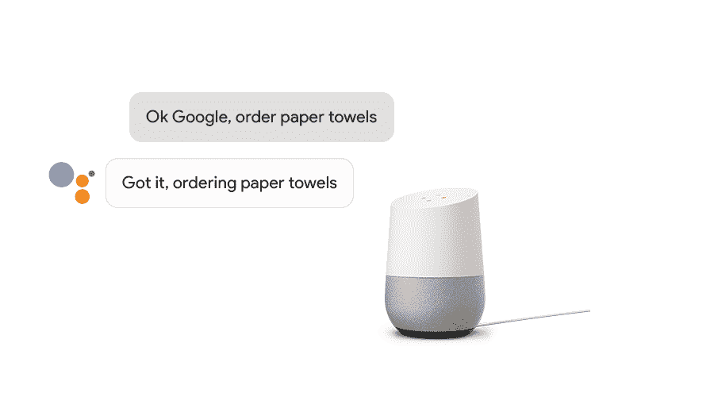

# Google Home 现在可以让你像亚马逊的 Alexa  一样通过语音购物

> 原文：<https://web.archive.org/web/https://techcrunch.com/2017/02/16/google-home-now-lets-you-shop-by-voice-just-like-amazons-alexa/>

# Google Home 现在可以让你像亚马逊的 Alexa 一样通过语音购物

Google Home 上的 Google Assistant 今天获得了一个新功能,对于拥有过亚马逊 Echo 的人来说，这个功能听起来可能相当熟悉。你现在可以在你的家[向该公司的谷歌快递合作伙伴订购](https://web.archive.org/web/20230325001259/https://www.google.com/express/u/0/promo/googlehome)卫生纸和洗发水等日常必需品。这些[的合作伙伴](https://web.archive.org/web/20230325001259/https://support.google.com/express/answer/4562192?hl=en)包括好市多、全食超市、 [Bed Bath & Beyond](https://web.archive.org/web/20230325001259/http://www.wweek.com/portland/article-16898-bed-bath-beyond-fuck-yeah.html) 、Fry’s、吉他中心、Petsmart 和 Walgreens。

确切的合作伙伴名单取决于你住在哪里，但有些在全国范围内都有。根据你居住的地区，Google Express 还可能提供当天服务(主要是在较大的城市地区)、夜间服务或仅 2 天或 3 天服务。谷歌为 Express 提供 95 美元/年(或 10 美元/月)的会员资格。否则，送货费从 4.99 美元起。

要买东西，你只需要说“好的谷歌，订购纸巾”(如果你没有谷歌之家，那么你显然也可以通过谷歌快递网站订购一个，连同一些柯克兰签名的无盐坚果)。谷歌指出，通过语音订购可以选择的商品可能与 Google Express 主页上的略有不同。

不过，要做到这一点，你必须先在 Google Home 应用中设置一种支付方式。家庭版的谷歌助手可以让你买到从 4 美元到 100 美元的任何东西。

为了推广这项新服务，在 2017 年 4 月底之前，当你从 Google Home 订购时，谷歌不会收取任何服务费。

值得注意的是，该功能仅在 Home 上的谷歌助手上提供。当我让我的 Pixel 上的助手帮我订购一些新鲜纸巾时，它给了我一个亚马逊网上商店的链接。

这项新功能填补了 Google Home 功能上的一个明显空白。亚马逊在其 Echo 设备系列上的 Alexa 在早期并不知道很多事情，但它[很快就学会了](https://web.archive.org/web/20230325001259/https://techcrunch.com/2015/05/14/amazon-echo-can-now-do-some-of-your-shopping-for-you-prime-members/)如何让你从该公司的商店订购东西。不过，谷歌不是亚马逊，大多数人也不会把它等同于网上购物体验，所以这项新服务实际上会获得多少用户还有待观察。毕竟，对于大多数购物者来说，亚马逊现在是网上购物和语音购物的代名词[。](https://web.archive.org/web/20230325001259/http://www.bloomberg.com/news/articles/2016-09-27/more-than-50-of-shoppers-turn-first-to-amazon-in-product-search)