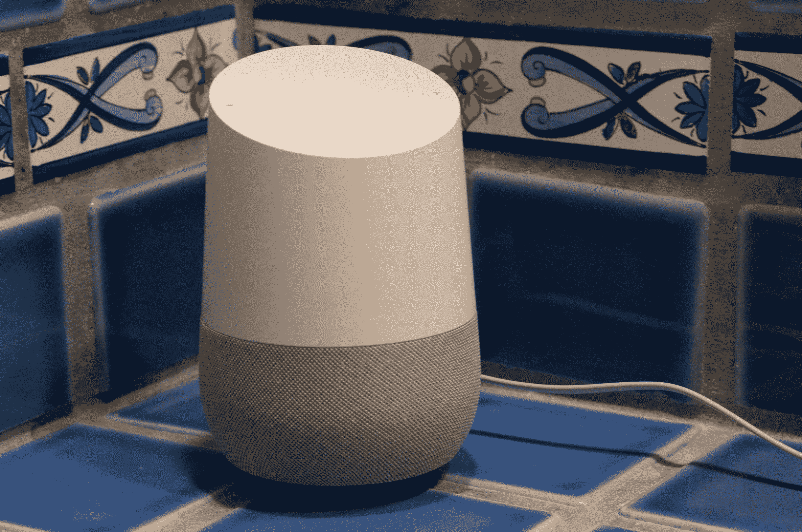

# 谷歌首页评论

> 原文：<https://web.archive.org/web/https://techcrunch.com/2016/11/03/google-home-review/>

[Google Home](https://web.archive.org/web/20230116155801/https://madeby.google.com/home/) 是一款值得回顾的有趣产品。在某种程度上，它只是一个连接互联网的麦克风和扬声器阵列，从云中提取所有智能。另一方面，这可能是谷歌在人工智能和家庭自动化领域雄心的最纯粹反映。

一旦你有了家，安装就很容易了。我几乎不记得做过这件事。Google Home 应用程序找到设备，在你的手机和你的家之间创建一个临时 WiFi 连接，将家连接到你的常规 WiFi，几声钟响后，你就完成了。如果你打算使用多个家庭，那么你也可以在应用程序中命名你的单位。从那里，你可以选择你喜欢的新闻来源和音乐服务，但实际的设置过程，不可能比这更简单。

就人工智能体验而言，Home 提供了——但这并不奇怪，因为谷歌早就领先于苹果的 Siri、亚马逊的 Alexa 和微软的 Cortana 等竞争对手。因为它的智能在云中，随着时间的推移，它只会变得更加智能(如果你把这些设备作为一项投资来考虑，这使得它们更经得起未来的考验)。当你回顾 Google Home 时，你实际上是在看三样东西:麦克风、扬声器和 Google Assistant。

我们已经写了[一点点](https://web.archive.org/web/20230116155801/https://techcrunch.com/2016/10/10/google-laughsistant/) [关于](https://web.archive.org/web/20230116155801/https://techcrunch.com/2016/10/05/not-ok-google/)[谷歌助手](https://web.archive.org/web/20230116155801/https://assistant.google.com/)，这是家庭体验的核心。不用说，它可能是目前最聪明的个人助理。你仍然可以用它无法回答的问题难倒它，但它通常会优雅地处理这些问题，至少会尝试从网页上给你读一段摘录。通常，我很惊讶它确实有答案(“离选举日还有几天？”"你能给我一份红酒牛肉的配方吗？");有时候我很惊讶它没有。

亚马逊 Echo 和谷歌 Home 等设备的问题在于，它们偶尔还是会误解你。在大多数情况下，这没什么大不了的。不过，谷歌主页似乎比我的 Echo Dot 更能理解我。

至于 Home 的其他核心功能(麦克风和扬声器)，这里也有很多好消息。很多人担心谷歌 Home 只有两个麦克风(相比之下亚马逊 Echo 有八个麦克风)。无论谷歌对他们施展了什么样的魔法，这两家公司似乎都和亚马逊的八家公司一样出色——甚至可能更好一点。把家放在我的 Echo Dot 旁边，两者都可以在我的客厅对面轻松工作。当从隔壁房间给他们打电话时，“好的，谷歌”通常比“Alexa”表现得好一点。

我注意到 Home 的另一个积极方面是，当它播放音乐或新闻时，它能很好地识别我的“OK，Google”命令。它会立刻把音乐音量调低成耳语，并倾听你的问题。

我绝不是一个音响发烧友，但谷歌的底部安装扬声器听起来就像这个尺寸的扬声器一样好。我没有注意到在最高音量下有任何重大失真(但肯定有一些)，而且，虽然你不会从家里得到翻天覆地的低音，但它仍然提供了足够好的冲击力。如果你需要更多，那么如果音乐是这些设备中最重要的功能，那么将 Echo Dot 连接到现有的音频系统可能是一个不错的选择。

至少目前，Home 的生态系统中没有 Alexa 那么多合作伙伴。就我个人而言，这对我来说不是问题。如果你有飞利浦色调灯，那么这些灯应该开箱即用。三星 SmartThings 设备和 Nest 恒温器也是如此。我的家是相当愚蠢的，所以除了 Chromecast 集成，我还没有能够尝试这个。由于它的 IFTTT 集成，你可能仍然能够控制目前不在谷歌合作伙伴列表上的设备。

目前，Home 只支持 Google Keep 来保存购物清单和笔记，尽管我很想看到它与我已经在使用的一些工具相集成，而不是切换到其他工具。不过，好消息是现有的集成工作得非常好。

至于音乐，它可以与 Google Play 音乐、YouTube 音乐、Spotify 和 Pandora 合作。你可以将默认设置为这四个中的任何一个，如果你需要播放另一个服务中的特定歌曲、电台或播放列表，你可以随时通过名称来请求。它像宣传的那样起作用。Home 还集成了 TuneIn，所以你仍然可以收听老式收音机。

你可能在家听的另一种音频内容是新闻。在那里，谷歌让你从各种来源中挑选，从 NPR 到纽西，福克斯新闻频道，美国广播公司新闻，彭博理工大学，ESPN 等等。

你会经常听到的一个统计数据是，Alexa 目前允许开发者为其平台编写“技能”。有成千上万个。Google Home 还没有对开发者开放，但在日常使用中，我并不觉得这是个大问题。目前，唯一真正的第三方“技能”是优步集成。

默认情况下，谷歌助手在处理日常任务，如要求翻译或随机信息时，已经比 Alexa 更有能力。有了 Home，你不需要安装一项新技能来获得翻译或餐厅推荐(让我们面对现实吧，Alexa 的大多数技能现在都不太好——这可能是因为开发者不能对它们收费的简单事实)。

硬件本身被比作很多东西(想到空气清新剂)。我其实很喜欢这个设计，如果你不喜欢纯白色的底座，你可以换成更鲜艳的颜色。设备本身只有一个电源端口。就是这样。没有以太网端口，也没有办法获取音频。

该设计旨在让家融入几乎任何房间，看起来仍然很现代。在这方面，它成功了。顶部的 led 环可以让你看到设备何时在听你说话(如果你想完全关闭麦克风，背面有一个静音按钮)并处理你的回答。顶部是触摸感应的，允许你设置音量。

说到底，当你在你的客厅里寻找一个语音激活、人工智能驱动的扬声器时，你目前有两个选择:Google Home 或亚马逊的 Echo 设备之一。如果今天让我选择，我会选择 Google Home。它的售价为 129 美元，比 Echo 便宜(尽管不可否认比 Echo Dot 贵)，开箱后更加智能，尽管它的生态系统中的合作伙伴可能较少，但它可以与 Chromecast 设备配合使用，从而将其功能扩展到电视。