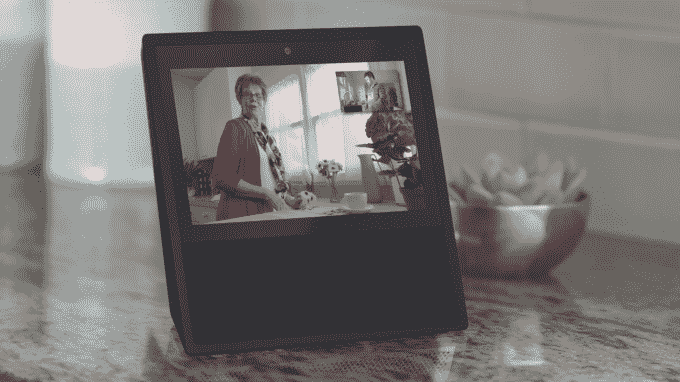
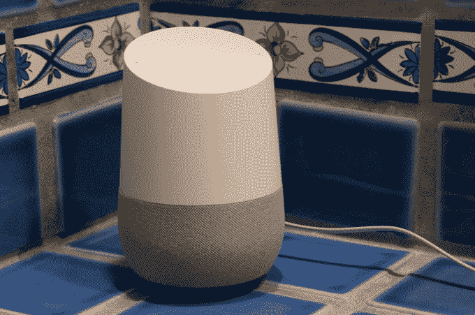

# 谷歌正在打造一款智能屏幕，与亚马逊的 Echo Show  竞争

> 原文：<https://web.archive.org/web/https://techcrunch.com/2017/09/28/google-homescreen/>

多个消息来源告诉 TechCrunch，谷歌正在为视频通话和更多内容构建桌面智能屏幕，将与亚马逊的 Echo Show 竞争。该设备可以帮助谷歌在智能家居市场的竞争中保持领先，此前亚马逊刚刚发布了一系列新的 Echos，脸书继续致力于其代号为[“Aloha”的视频通话屏幕](https://web.archive.org/web/20230307142249/https://techcrunch.com/2017/07/25/facebook-speaker/)。

两个消息来源向 TechCrunch 证实，谷歌设备的内部代号为“曼哈顿”，屏幕大小与 7 英寸的 Echo Show 相似。一个消息来源直接从一名谷歌员工那里获得信息。两家公司都表示，这款设备将提供 YouTube、谷歌助手、谷歌照片和视频通话功能。它还将充当一个智能中枢，可以控制 Nest 和其他智能家居设备。

我们的消息来源称，谷歌之前一直致力于与全尺寸电视竞争的大屏幕产品，但现在它更专注于曼哈顿的设备。我们被告知最初的目标发射日期是 2018 年年中。但由于 Echo Show，内部压力很大，要求它在 2017 年推出，尽管它可能仍会在 2018 年发布。这是因为建立 smart hub 合作伙伴关系需要大量的移动部件，此外，它还在探索与百思买 Geek Squad 和 Enjoy for home installation 建立服务合作关系的可能性。

亚马逊的 Echo Show 允许视频通话

我们的消息来源称，该设备将运行一个版本的 Android，使第三方更容易为其构建应用程序。该团队特别有兴趣看到在设备上运行的一个应用程序是网飞，尽管这尚未得到证实。

目前还不清楚这款设备的价格或具体外观。上面的图片只是 TechCrunch 基于 Echo Show 制作的实体模型。截至发稿前，谷歌没有回应置评请求，但如果有回音，我们会及时更新。谷歌确实在 10 月 4 日举办了一场硬件活动，尽管没有迹象表明我们届时会听到更多关于这款设备的消息。

## 为什么谷歌需要智能中枢屏幕

在曼哈顿设备上包含 YouTube 让人们更加清楚为什么[谷歌最近将 YouTube 从 Echo Show](https://web.archive.org/web/20230307142249/https://techcrunch.com/2017/09/26/google-suddenly-removes-youtube-access-from-the-amazon-echo-show/) 上撤下。当时，亚马逊告诉 [The Verge](https://web.archive.org/web/20230307142249/https://www.theverge.com/2017/9/26/16371292/google-youtube-amazon-echo-show) “谷歌已经选择不再在 Echo Show 上提供 YouTube，没有解释，也没有通知客户。这一决定没有任何技术上的理由”。

谷歌回应称，“亚马逊在 Echo Show 上实现 YouTube 违反了我们的服务条款，创造了破碎的用户体验”。Echo Show 没有 YouTube 可能认为至关重要的所有订阅和视频推荐。看起来谷歌愿意为 YouTube 牺牲额外的影响力来保护其完整性……尤其是当它自己控制体验的类似设备即将推出的时候。

现有的 Google Home 没有屏幕

谷歌推出智能屏幕还有很多其他原因。

*   这是让谷歌助手进入人们家庭的另一种方式，谷歌希望它成为你生活的语音操作系统。
*   这是谷歌视频聊天应用的载体，如 Duo 和 Hangouts。桌面外形可能会受到儿童和老年人的欢迎，他们可能不太习惯使用电话或传统电脑，并且会对希望在聊天时看到彼此的家庭产生吸引力。
*   它可以让谷歌成为人们越来越多的智能家居设备的中心。通常，这些小工具需要一个连接到以太网或 Wifi 的集线器或网桥，然后将连接传输到无线设备，但每个设备有不同的集线器可能会很烦人。与许多不同合作伙伴合作的谷歌制造的 omni-hub 可以简化设置，锁定谷歌作为智能家居的重要组成部分，并与亚马逊的新 Echo Plus hub 竞争。
*   它为体验谷歌照片等该公司的其他产品创造了一个新的界面，这可能会推动增长，因为人们会看到这款设备作为数码相框运行，并希望下载支持它的应用程序。这也可能是与亚马逊的区别，因为竞争对手的 Prime Photos 服务远不如谷歌照片受欢迎

从本质上讲，谷歌没有什么理由不推出这项服务。它已经拥有谷歌 Wifi 设备、谷歌家庭智能扬声器和 Chromecasts。但缺少的是屏幕和智能集线器。曼哈顿的设备将完美补充谷歌现有的产品。最后，智能屏幕将有助于公司跟上[亚马逊的回声团队，他们似乎铁了心要把谷歌甩在身后。](https://web.archive.org/web/20230307142249/https://techcrunch.com/2017/09/27/the-echosystem/)