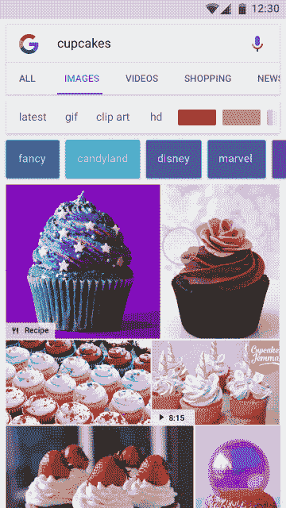

# 谷歌图片搜索更像 Pinterest，将你与食谱、产品等联系起来

> 原文：<https://web.archive.org/web/https://techcrunch.com/2017/08/01/google-image-search-gets-more-like-pinterest-by-connecting-you-to-recipes-products-and-more/>

在 Pinterest 发布更新后的第二天，[将其视觉搜索功能放在其应用程序的前端和中心](https://web.archive.org/web/20230302224248/http://www.businessinsider.com/pinterest-wants-to-be-a-search-company-evan-sharp-2017-7)，谷歌也宣布，[对其视觉搜索](https://web.archive.org/web/20230302224248/https://www.blog.google/products/search/new-badges-help-you-discover-and-take-action-image-search/)引擎进行升级。该公司今天更新了图片搜索的新功能，旨在像以前一样，将网络用户与不仅仅是一系列照片联系起来——当有更多问题的图片需要发现时，它的结果也会突出显示。例如，它会告诉你是否有可用的食谱，或者照片是否是你可以购买的东西，等等。

这些新增加的搜索结果将标有一个徽章，对您正在查看的图像进行分类，并包括阐明您可以采取的行动的文本。如果你找到了一个食谱，徽章会显示点击是否会带你到一个有这道菜的食谱的页面，或者结果页面是否包括一个视频。

其他查询可能包括你可以购买的产品或你可以分享的 gif 等物品的徽章。

该公司表示，其算法将自动识别和标记 gif，无需网站所有者采取其他进一步行动。然而，它建议出版商在食谱页面上添加[食谱标记](https://web.archive.org/web/20230302224248/https://developers.google.com/search/docs/data-types/recipes)；[购物网站的产品加价](https://web.archive.org/web/20230302224248/https://developers.google.com/search/docs/data-types/products)；和[视频标记](https://web.archive.org/web/20230302224248/https://developers.google.com/search/docs/data-types/videos)用于有视频的网站。许多出版商已经在标记他们的页面，因为它允许谷歌在其他垂直搜索领域提供更详细的信息。

例如，用这样的结构化数据标记的视频内容被用来驱动谷歌搜索结果中的视频轮播，如 AMP(谷歌的加速移动页面项目)的 Top Stories 轮播。

谷歌正在提供一个结构化数据测试工具，它将验证出版商的网页没有错误，这将允许他们在新的图片搜索中被标记。谷歌[告诉](https://web.archive.org/web/20230302224248/https://webmasters.googleblog.com/2017/08/badges-on-image-search-help-users-find.html)网站管理员，搜索控制台中的 [Rich Cards report](https://web.archive.org/web/20230302224248/https://support.google.com/webmasters/answer/6381755) 也可以提供标记的汇总统计数据。

这不是谷歌第一次通过升级图片搜索结果来回应 Pinterest，以帮助用户做更多的事情——比如购物。它最近还在移动网络和 Android 搜索应用程序上推出了“类似商品”功能，使用机器学习技术[来识别照片中的商品—](https://web.archive.org/web/20230302224248/https://webmasters.googleblog.com/2017/04/similar-items-rich-products-feature-on.html)如手袋、太阳镜和鞋子——以找到购买这些产品的地方并了解它们的价格。

今年 4 月，[它将这一功能扩展到了服饰，](https://web.archive.org/web/20230302224248/https://techcrunch.com/2017/04/13/google-makes-fashion-image-searches-more-like-pinterest/)有效地将图片搜索变成了谷歌对 Pinterest 的竞争。

Pinterest 今天强调了它通过搜索图像来帮助用户找到他们喜欢的东西的能力——通常包括你可能受到启发而购买的产品、尝试的食谱或工艺品、你想去的旅行等等。更大的目标是将一部分用户更具探索性的搜索转移到 Pinterest，从而远离谷歌，这些搜索是你在寻找想法，但没有特定产品或商品的搜索。

多年来，Pinterest 通过[方式](https://web.archive.org/web/20230302224248/https://techcrunch.com/2014/07/30/pinterest-acquires-icebergs-the-pinterest-for-creatives/)[收购](https://web.archive.org/web/20230302224248/https://techcrunch.com/2014/01/06/pinterest-visualgraph/)和技术人才提升了其视觉搜索能力，并推出了智能的面向消费者的功能，如[现场摄像搜索](https://web.archive.org/web/20230302224248/https://techcrunch.com/2017/05/09/pinterest-adds-visual-search-guides-to-its-lens-and-a-new-cto/)和其他搜索和保存工具。然后[开放了视觉搜索，作为广告商](https://web.archive.org/web/20230302224248/https://techcrunch.com/2017/05/16/pinterests-visual-search-technology-is-coming-to-its-ads/)在消费者购买周期的早期接触消费者的一种手段。

与此同时，谷歌在今年的 I/O 开发者大会上宣布推出 Google Lens 的[，准备对自己的搜索功能进行重大升级。这项技术将通过谷歌照片及其移动助手(可能在某个时候是其主要搜索应用)提供，它可以理解相机取景器中的内容，然后让你采取行动。](https://web.archive.org/web/20230302224248/https://techcrunch.com/2017/05/17/google-lens-will-let-smartphone-cameras-understand-what-they-see-and-take-action/)

但这不一定会阻止用户的注意力从 Pinterest 转移到谷歌搜索上，谷歌搜索现在与流行的视觉发现网站相关联，如食谱或时尚。

谷歌表示，升级后的带有徽章功能的图片搜索现在可以在安卓和移动网络的谷歌应用上使用。