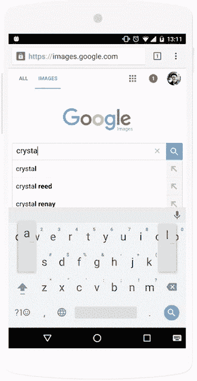
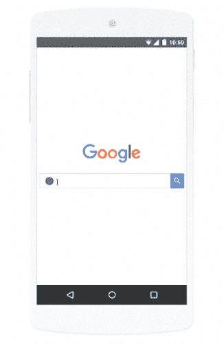

# 谷歌图片搜索现在将包括购物广告 

> 原文：<https://web.archive.org/web/http://techcrunch.com/2016/05/17/google-image-search-will-now-include-shopping-ads/>

随着今天越来越多的消费者使用他们的移动设备在线购物，经常直接绕过谷歌进入电子商务网站——尤其是亚马逊——谷歌已经开始通过推出自己的视觉购物广告来应对这一趋势。谷歌本周在其年度 I/O 开发者大会之前宣布，在图像搜索上推出购物广告。

这意味着当购物者浏览谷歌图片搜索结果时，他们现在会看到相关产品的广告，谷歌在周一的声明中解释道。这些广告出现在搜索结果的顶部，在来自网络的图片之上。

谷歌较新的过滤按钮也可以与广告一起使用，让客户缩小他们正在寻找的东西，然后被引导到销售它们的零售商。该公司表示，今天许多浏览产品图片的人对产品的价格有疑问，或者想知道在哪里可以买到。

通过此次发布，当消费者现在看到这些基于图像的广告时，他们可以点击并获得这些问题的答案，并且他们可以立即从零售商的网站上购买该产品。

该公司指出，每周至少在智能手机上搜索一次的人会将产品图片广告作为他们最常用的购物功能。它没有说的是，现在有多少在线购物者在寻求购买时完全跳过了谷歌。[最近的一项调查发现](https://web.archive.org/web/20230128092931/http://bloomreach.com/2015/10/survey-amazon-is-burying-the-competiton-in-search/)44%的购物者会直接去亚马逊，相比之下，只有 34%的人会去搜索引擎，21%的人会去特定的零售商网站。

谷歌表示，作为谷歌搜索网络的一部分，广告商的广告自动有资格显示在谷歌图片搜索上。施华洛世奇是新格式的早期采用者，计划在谷歌图片搜索中展示其珠宝。

虽然图像搜索中的购物广告是本周在线广告商最大的公告之一，但这并不是唯一与移动购物相关的新闻。该公司现在还允许零售商迎合在线购物的趋势，即顾客在网上购买，然后在当地商店提货。

从本周开始，零售商可以通过在谷歌托管的本地产品页面上添加“商店提货链接”来展示他们是否提供这一功能。美国柯尔百货公司在试点测试中使用了这一功能，并报告点击量增加了 40%到 50%。

此外，使用本地库存广告的广告商现在可以在 Google.com 的本地[知识面板](https://web.archive.org/web/20230128092931/https://support.google.com/business/answer/6331288?hl=en)中搜索到他们的库存——这是一个弹出其他信息的框，如商店营业时间和方向。

该公司还对其当天送达服务谷歌快递(Google Express)进行了简要更新，但没有谈到任何硬性数据，如参与零售商产生的总收入。

相反，谷歌表示，移动端占谷歌快递订单的一半以上，谷歌快递客户从参与商户购买的订单中，超过 50%是该商户的新客户，对于这些商户的现有客户，他们看到销售额增长了 18%。

谷歌表示，它将继续扩展这项服务，随着下个月德克萨斯州新增 2300 万用户，谷歌快递将覆盖超过 1.2 亿用户。